# Ultimate CS2 Coach — Parte 1A: Il Cervello

> **Argomenti:** Architettura neurale completa, regime di addestramento, modelli di deep learning (JEPA, VL-JEPA, LSTM+MoE), Osservatorio di Introspezione del Coach, contratto 25-dim, principio NO-WALLHACK, e panoramica dell'architettura di sistema (avvio, interfaccia desktop Qt/PySide6, architettura quad-daemon, pipeline generale).
>
> **Autore:** Renan Augusto Macena

---

### Introduzione di Renan

Questo progetto è il risultato di innumerevoli ore di preparazione, perfezionamento e, soprattutto, ricerca. Counter-Strike è il mio calcio, qualcosa di cui sono appassionato da tutta la vita, come la musica. In questo gioco ho ormai più di 10 mila ore e ci gioco dal 2004, ho sempre desiderato una guida professionale, come quella dei veri giocatori professionisti, per capire come appare realmente quando qualcuno si allena nel modo giusto, e gioca nel modo giusto sapendo cosa è giusto o sbagliato e non solo supponendolo. A questo punto la mia fiducia è legata alla mia conoscenza del gioco, ma è ancora lontana dal livello a cui vorrei giocare. Immagino che molte persone come me, in questo gioco o forse in altri, si sentano allo stesso modo: sanno di avere esperienza e conoscenza di ciò che stanno facendo, ma si rendono conto che i giocatori professionisti sono così tanto più abili e rifiniti che persino anni di esperienza non possono eguagliare una frazione di ciò che questi professionisti offrono.

Questo progetto tenta di "dare vita", utilizzando tecniche avanzate, a un coach definitivo per Counter-Strike, uno che capisca il gioco, valuti dozzine di aspetti con chiarezza e giudizio raffinato, assimili e diventi più intelligente col passare del tempo.. Il mio obiettivo finale è farlo ingerire, elaborare e imparare da tutte le partite pro di sempre, non tutti i playoff, oltre ad essere irrealistico per le dimensioni e il tempo di elaborazione, sarebbe inutile poiché il mio obiettivo è avere questo coach definitivo basato sul meglio del meglio. Il modello per il giocatore "a bassa abilità" sarà sempre l'utente, lui o lei non avrà mai demo e partite da cui questo coach possa imparare; invece, questo è un metodo di approccio completamente diverso, poiché il coach utilizzerà il suo modello di alta qualità per confrontarlo con il modello dell'utente, mostrando quanto l'utente sia realmente lontano dal livello di un giocatore professionista e, cosa più importante, adattando gli insegnamenti per aiutare l'utente a raggiungere il livello pro, adattandosi a ogni diverso stile di gioco: se sono un awper, lentamente ma inesorabilmente questo coach mi insegnerà come diventare un awper professionista, e questo vale per ogni ruolo nel gioco in cui un utente voglia diventare un professionista.

E ora con la passione che sto sviluppando per la programmazione, capendo tutta questa roba complicata sulla gestione del database, SQL, modelli di machine learning, Python, e quanto possa essere elegante, da tutti questi passaggi tecnici di implementazione, regolazione e creazione di API, e capendo cos'è quella .dll che ho visto per tutta la vita dentro le cartelle del gioco, capendo a cosa servono quei framework come Kivy per creare la grafica, imparando cosa significa realmente creare software, ho dovuto imparare ad andare su Linux (non sono decisamente un professionista, e se non avessi seguito le stesse istruzioni che ho creato mentre facevo ricerche e continuavo a lavorare su questo progetto, non ci sarei riuscito) per capire come costruire il programma, come renderlo cross-platform. Da Linux, ho costruito la versione APK (devo finire di lavorare anche su quella), e ho almeno capito i concetti più importanti della Compilazione, poi ho finito la build desktop su Windows e ho fatto tutto il resto, compilazione e packaging. In breve, spingersi al limite per capire, sfidare se stessi così tanto, su così tanti aspetti diversi che devi o assimilare non solo qualcosa ma anche le specifiche e il quadro complesso di tutto, o non arriverai da nessuna parte.

Ho usato strumenti, come Claude CLI sul terminale windows e linux, per aiutarmi a organizzare il codice e correggere gli errori di sintassi. Ho creato una cartella nella cartella del progetto contenente una "Tool Suite" composta da script Python che ho aiutato a creare e che hanno una tonnellata di funzioni utili, dal debug alla modifica di valori, regole, funzioni, stringhe a livello globale o locale del progetto in modo che da un singolo input all'interno di quello strumento, io possa cambiare tutto ciò che voglio "ovunque", persino cambiare le cose sulla dashboard grafica con gli input. Non dormo da circa venti giorni consecutivi (dal 24 dicembre 2025), sì, ma penso che ne valga la pena, e so bene che questo è solo un allenamento alla fine che ho capito come fare da solo dall'inizio alla fine, quindi ci sono certamente errori in giro. Se possa essere davvero utile, davvero funzionale, ecc., ecc., e molte altre belle cose, non lo so. Non voglio sopravvalutare quello che sto facendo. Lo sto facendo, ma ci ho messo davvero molto impegno.

Spero che qualcosa lì dentro possa essere utile.

> *Nota: Il framework UI è stato successivamente migrato da Kivy a Qt/PySide6 (marzo 2026), come documentato nella Parte 3.*

---

## Indice

**Parte 1A — Il Cervello: Architettura Neurale e Addestramento (questo documento)**

1. [Riepilogo esecutivo](#1-riepilogo-esecutivo)
2. [Panoramica dell'architettura di sistema](#2-panoramica-dellarchitettura-del-sistema)
   - Principio NO-WALLHACK e Contratto 25-dim
3. [Sottosistema 1 — Core della rete neurale (`backend/nn/`)](#3-sottosistema-1--nucleo-della-rete-neurale)
   - AdvancedCoachNN (LSTM + MoE)
   - JEPA (Auto-Supervisionato InfoNCE)
   - **VL-JEPA** (Visione-Linguaggio, 16 Concetti di Coaching, ConceptLabeler)
   - JEPATrainer (Addestramento + Monitoraggio Deriva)
   - Pipeline Standalone (jepa_train.py)
   - SuperpositionLayer (Gating Contestuale, Osservabilità Avanzata, Inizializzazione Kaiming)
   - Modulo EMA
   - CoachTrainingManager, TrainingOrchestrator, ModelFactory, Config
   - NeuralRoleHead (Classificazione Ruoli MLP)
   - Coach Introspection Observatory (MaturityObservatory — Macchina a 5 Stati)

**Parte 1B** — I Sensi e lo Specialista: Modello RAP Coach (architettura 7 componenti, ChronovisorScanner, GhostEngine), Sorgenti Dati (Demo Parser, HLTV, Steam, FACEIT, TensorFactory, FAISS)

**Parte 2** — Sezioni 5-13: Servizi di Coaching, Coaching Engines, Conoscenza e Recupero, Motori di Analisi (10), Elaborazione e Feature Engineering, Modulo di Controllo, Progresso e Tendenze, Database e Storage (Tri-Tier), Pipeline di Addestramento e Orchestrazione, Funzioni di Perdita

**Parte 3** — Logica Programma, UI, Ingestion, Tools, Tests, Build, Remediation

---

## 1. Riepilogo esecutivo

CS2 Ultimate è un **sistema di coaching basato su IA ibrido** per Counter-Strike 2 (CS2). Combina modelli di deep learning (JEPA, VL-JEPA, LSTM+MoE, un'architettura RAP a 7 componenti (Percezione, Memoria LTC+Hopfield, Strategia, Pedagogia, Attribuzione Causale, Testa di Posizionamento + Comunicazione esterna), un Neural Role Classification Head), un Coach Introspection Observatory, un Retrieval-Augmented Generation (RAG), la banca dati delle esperienze COPER, la ricerca basata sulla teoria dei giochi, la modellazione bayesiana delle credenze e un'architettura Quad-Daemon (Hunter, Digester, Teacher, Pulse) in una pipeline unificata che:

1. **Ingerisce** file demo professionali e utente, estraendo statistiche di stato a livello di tick e di partita.
2. **Addestra** più modelli di reti neurali attraverso un programma a fasi con limiti di maturità (a 3 livelli: CALIBRAZIONE → APPRENDIMENTO → MATURO). 3. **Inferisce** consigli di allenamento fondendo le previsioni di apprendimento automatico con conoscenze tattiche recuperate semanticamente tramite una catena di fallback a 4 livelli (COPER → Ibrido → RAG → Base).
3. **Spiega** il suo ragionamento tramite attribuzione causale, narrazioni basate su template, confronti tra giocatori professionisti e un'opzionale rifinitura LLM (Ollama).

Il sistema contiene **≈ 97.400 righe di Python** distribuite su ~5.270 file sorgente (429 `.py`, di cui 371 sotto `Programma_CS2_RENAN/`), che si estendono su **otto sottosistemi logici AI** (NN Core con VL-JEPA, RAP Coach, Coaching Services, Knowledge & Retrieval, Analysis Engines, Processing & Feature Engineering, Sorgenti Dati, Motori di Coaching), un Osservatorio di addestramento, un modulo di Controllo (Console, DB Governor, Ingest Manager, ML Controller), un'architettura Quad-Daemon per l'automazione in background (Hunter, Digester, Teacher, Pulse), un'interfaccia desktop Qt/PySide6 con 13 schermi e pattern MVVM (migrata da Kivy nel marzo 2026), un sistema completo di ingestione (con sottosistema HLTV dedicato: HLTVApiService, CircuitBreaker, RateLimiter), storage e reporting, una **Tools Suite** con 33 script di validazione e diagnostica (Goliath Hospital, Brain Verification, headless validator, Ultimate ML Coach Debugger), un'architettura tri-database specializzata con 19 tabelle SQLModel nel monolite più database per-match separati, e una **Test Suite** con 79 file di test organizzati in 6 categorie: analysis/theory, coaching/training, ML/models, data/storage, UI/playback, integration/misc. Il progetto ha attraversato un processo di **rimediazione sistematica in 13 fasi** che ha risolto 412+ problemi di qualità del codice, correttezza ML, sicurezza e architettura, inclusa l'eliminazione di label leakage nell'addestramento (G-01), l'implementazione della zona di pericolo visiva nel tensore vista (G-02), la calibrazione automatica dello stimatore bayesiano (G-07), e la correzione del fallback del coaching COPER (G-08). La pipeline end-to-end è stata completata il 12 marzo 2026: 11 demo professionali ingerite, 17.3M righe tick, 6.4GB database, JEPA dry-run completato con successo (train loss 0.9506, val loss 1.8248).

> **Analogia:** Immagina di avere un allenatore robot super intelligente che guarda le tue partite di calcio in video. Innanzitutto, **guarda** centinaia di partite professionistiche e le tue, prendendo appunti su ogni singola mossa (questa è la parte di "ingestione", gestita dal daemon Hunter che scansiona le cartelle e dal daemon Digester che elabora i file). Poi, **studia** quegli appunti e impara cosa fanno i grandi giocatori in modo diverso dai principianti, come uno studente che affronta i vari livelli scolastici (CALIBRARE è l'asilo, APPRENDERE è la scuola media, MATURARE è il diploma) — questo lo fa il daemon Teacher in background. Quando è il momento di darti un consiglio, non si limita a tirare a indovinare: controlla il suo **quaderno di suggerimenti**, la sua **memoria delle sessioni di allenamento passate** e cosa farebbero i **professionisti** nella tua esatta situazione, scegliendo la fonte di cui si fida di più. Infine, **spiega** perché ti sta dicendo di fare qualcosa, non solo "fai questo", ma "fai questo *perché* continui a essere colto alla sprovvista". È come avere un allenatore che ha visto ogni partita professionistica mai giocata, ricorda ogni sessione di allenamento che hai fatto e può spiegarti esattamente perché dovresti cambiare strategia. Nel frattempo, l'interfaccia desktop Qt/PySide6 ti mostra tutto in tempo reale: una mappa tattica 2D con il tuo "fantasma" ottimale, grafici radar delle tue abilità, e una dashboard che ti dice esattamente a che punto è il tuo allenatore nel suo processo di apprendimento. Il daemon Pulse assicura che il sistema sia sempre vigile con un battito cardiaco costante.

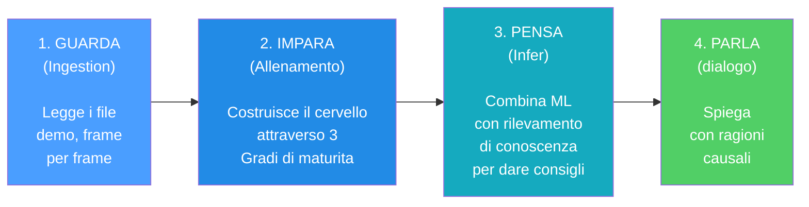

> ~5.270 source files · 97.400+ lines · 429 .py files · 8 AI subsystems + Observatory + Control Module + Quad-Daemon + Desktop UI Qt/PySide6 (13 screens) + 33 Tools · 79 test files · 19 SQLModel tables · Architettura tri-database (database.db + knowledge_base.db + hltv_metadata.db) · Indicizzazione vettoriale FAISS (IndexFlatIP 384-dim) · Internazionalizzazione i18n (EN/IT/PT) · Accessibilità WCAG 1.4.1 (theme.py) · 12 rapporti di audit comprensivi (incl. revisione letteratura 140KB, 30 articoli peer-reviewed) · 412+ problemi risolti in 13 fasi di rimediazione sistematica · Pipeline end-to-end completata (11 demo pro, 17.3M tick rows, 6.4GB DB)

---

## 2. Panoramica dell'architettura del sistema

Il sistema è suddiviso in **6 sottosistemi principali** che lavorano insieme come i reparti di un'azienda. Ogni sottosistema ha un compito specifico e i dati fluiscono tra di essi in una pipeline ben definita.

> **Analogia :** Pensa all'intero sistema come a una **grande fabbrica con 6 reparti**. Il primo reparto (Ingestione) è la **sala posta**: riceve le registrazioni grezze delle partite e le ordina. Il secondo reparto (Elaborazione) è l'**officina**: analizza le registrazioni e misura tutto ciò che contiene. Il terzo reparto (Formazione) è la **scuola**: istruisce il cervello dell'IA mostrandogli migliaia di esempi. Il quarto reparto (Conoscenza) è la **biblioteca**: memorizza suggerimenti, consigli passati e conoscenze specialistiche in modo che l'allenatore possa consultarle. Il quinto reparto (Inferenza) è il **cervello**: combina ciò che l'IA ha imparato con ciò che la biblioteca conosce per creare consigli. Il sesto dipartimento (Analisi) è la **squadra investigativa**: conduce indagini speciali come "questo giocatore è in difficoltà?" o "era una buona posizione?". Tutti e sei i dipartimenti lavorano insieme affinché l'allenatore possa fornire consigli intelligenti e personalizzati.

```mermaid
graph TB
    subgraph Acquisizione["Acquisizione (Sorgenti Dati)"]
        DEMO["File .dem"] --> FMT_ADAPT["Format Adapter<br/>(magic bytes, validazione)"]
        FMT_ADAPT --> PARSER["Parser Demo<br/>(demoparser2)"]
        PARSER --> TRADE_DET["Trade Kill Detector<br/>(192 tick window)"]
        HLTV["Crawler HLTV<br/>(CircuitBreaker, RateLimiter)"] --> PRO_DB["DB Giocatori Pro"]
        CSV["CSV Esterni"] --> EXT_DB["Migratore CSV"]
        STEAM_API["Steam Web API<br/>(retry + backoff)"] --> STEAM_PROFILE["Profilo Giocatore"]
        STEAM_FIND["Steam Demo Finder<br/>(cross-platform)"] --> DEMO
        FACEIT_API["FACEIT API<br/>(rate limited 10/min)"] --> FACEIT_DATA["Elo + Level"]
        EVTREG["Event Registry<br/>(Schema CS2)"] -.-> PARSER
    end

    subgraph Elaborazione
        PARSER --> FE["Ingegneria delle Feature<br/>(feature_base, kast, rating, feature_ruolo)"]
        PARSER --> TF["Fabbrica Tensori<br/>(mappa, vista, raster movimento)"]
        FE --> VEC["Vettorizzatore Unificato<br/>(FeatureExtractor 25-dim)"]
        VEC --> SR["Ricostruttore di Stato"]
        PARSER --> PK["PlayerKnowledge<br/>(NO-WALLHACK)"]
        PK --> TF
        TF --> SR
        FB["FrameBuffer<br/>(ring buffer 30 frame,<br/>estrazione HUD)"] -.-> TF
    end

    subgraph Addestramento
        SR --> JEPA["Pre-Addestramento JEPA<br/>(Auto-Supervisionato InfoNCE)"]
        SR --> VLJEPA["VL-JEPA<br/>(Allineamento Visione-Linguaggio)"]
        FE --> MLP["AdvancedCoachNN<br/>(LSTM + MoE, 3 esperti)"]
        SR --> RAP["Addestramento RAP Coach<br/>(Architettura 7 Componenti)"]
        EXT_DB --> ROLE_HEAD["NeuralRoleHead<br/>(MLP 5→32→16→5)"]
        JEPA --> COACH_MGR["Gestore Coach<br/>(Gating Maturità 3 Livelli)"]
        VLJEPA --> COACH_MGR
        MLP --> COACH_MGR
        RAP --> COACH_MGR
        ROLE_HEAD --> COACH_MGR
    end

    subgraph Osservatorio["Osservatorio (Introspezione Addestramento)"]
        COACH_MGR --> OBS_CB["Registro Callback<br/>(Architettura Plugin)"]
        OBS_CB --> OBS_TB["TensorBoard<br/>(9+ scalari, istogrammi)"]
        OBS_CB --> OBS_MAT["Osservatorio Maturità<br/>(5 segnali → convinzione)"]
        OBS_CB --> OBS_EMB["Proiettore Embedding<br/>(spazio credenze UMAP)"]
    end

    subgraph Conoscenza
        RAG["Base Conoscenza RAG<br/>(Sentence-BERT 384-dim)"]
        FAISS_IDX["Indice FAISS<br/>(IndexFlatIP 384-dim,<br/>ricerca sub-lineare)"]
        EB["Banca Esperienze<br/>(Framework COPER)"]
        KG["Grafo della Conoscenza<br/>(entità + relazioni SQLite)"]
        RAG --> FAISS_IDX
    end

    subgraph Analisi["Analisi (10 Motori)"]
        GT["Expectiminimax<br/>Albero di Gioco - profondità 3"]
        BM["Stimatore Bayesiano<br/>Probabilità Morte +<br/>Calibratore Adattivo"]
        DI["Indice Inganno<br/>3 sotto-metriche"]
        RC["Classificatore Ruoli<br/>6 ruoli + Consenso Neurale"]
        WP["Predittore Probabilità<br/>Vittoria - 12 feature NN"]
        MOM["Tracker Momentum<br/>Rilevamento Tilt/Hot"]
        ENT["Analizzatore Entropia<br/>Impatto utilità Shannon"]
        BS["Rilevatore Punti Ciechi"]
        UE["Utilità ed Economia<br/>Ottimizzatore acquisti"]
        ER["Analizzatore Ingaggio<br/>50+ posizioni 8 mappe"]
    end

    subgraph Coaching_Engines["Motori di Coaching"]
        CE_CORR["CorrectionEngine<br/>(top-3 correzioni pesate)"]
        CE_HYBRID["HybridEngine<br/>(ML Z-score + RAG)"]
        CE_EXPLAIN["ExplainabilityGenerator<br/>(5 assi + template)"]
        CE_LONG["LongitudinalEngine<br/>(Trend-aware coaching)"]
        CE_CORR --> CE_HYBRID --> CE_EXPLAIN
    end

    subgraph Inferenza
        COACH_MGR --> HE["Servizio Coaching 4 Livelli<br/>(COPER, Ibrido, RAG, Base)"]
        RAG --> HE
        EB --> HE
        KG --> HE
        PRO_DB --> PB["Ponte Pro / Risolutore Token"]
        PB --> HE
        GT --> HE
        BM --> HE
        DI --> HE
        RC --> HE
        CE_EXPLAIN --> HE
        FACEIT_DATA --> PB
        STEAM_PROFILE --> PB
        HE --> OLLAMA["OllamaCoachWriter<br/>(Rifinitura NL Opzionale)"]
        HE --> EXP["Livello Spiegabilità"]
    end

    subgraph Controllo["Modulo di Controllo"]
        CTRL_CONSOLE["Console di Sistema<br/>(TUI Rich, CLI)"]
        CTRL_DB["DB Governor<br/>(WAL audit, Tier 1-3)"]
        CTRL_INGEST["Ingest Manager<br/>(Thread-safe, 30min re-scan)"]
        CTRL_ML["ML Controller<br/>(Throttle, Stop)"]
    end

    subgraph Progresso["Progress & Trend"]
        PROG_LONG["Longitudinal Analysis<br/>(slope, volatility, confidence)"]
        PROG_TREND["Trend Analysis<br/>(numpy polyfit)"]
        PROG_LONG --> CE_LONG
    end

    EXP --> UI["GUI Qt/PySide6"]

    subgraph Piattaforma["Piattaforma & Accessibilità"]
        I18N["i18n<br/>(en.json, it.json, pt.json)"]
        THEME["theme.py<br/>(WCAG 1.4.1,<br/>rating_color + rating_label)"]
        PLAT["platform_utils.py<br/>(rilevamento drive<br/>cross-platform)"]
    end
    I18N --> UI
    THEME --> UI

    style JEPA fill:#4a9eff,color:#fff
    style VLJEPA fill:#3b8ae6,color:#fff
    style RAP fill:#ff6b6b,color:#fff
    style ROLE_HEAD fill:#cc5de8,color:#fff
    style HE fill:#51cf66,color:#fff
    style RAG fill:#ffd43b,color:#000
    style OBS_TB fill:#868e96,color:#fff
    style OBS_MAT fill:#868e96,color:#fff
    style OBS_EMB fill:#868e96,color:#fff
```

**Spiegazione Diagramma:** Questo grande diagramma è come una **mappa del tesoro** che mostra come le informazioni viaggiano attraverso il sistema. Il viaggio inizia in alto a sinistra con le registrazioni grezze del gioco (file `.dem`, dati HLTV, file CSV): pensateli come **ingredienti grezzi** che arrivano in cucina. Questi ingredienti passano attraverso la sezione Elaborazione dove vengono **tagliati, misurati e preparati** (vengono estratte le caratteristiche, creati i vettori). Poi raggiungono la sezione Formazione dove cinque diversi "chef" (JEPA, VL-JEPA, AdvancedCoachNN, RAP e NeuralRoleHead) imparano ciascuno il proprio stile di cucina. L'Osservatorio è l'**ispettore del controllo qualità** che osserva ogni sessione di formazione, verificando se gli chef stanno migliorando, sono in stallo o sono in preda al panico. La sezione Conoscenza è come lo **scaffale del ricettario**: contiene suggerimenti (RAG), successi culinari passati (COPER) e relazioni tra gli ingredienti (Grafico della Conoscenza). La sezione Inferenza è dove lo **capo chef** combina tutto – competenze acquisite, libri di ricette e tecniche da chef professionista – per creare il piatto finale: consigli di coaching. La sezione Analisi è come avere dei **critici gastronomici** che valutano qualità specifiche: "È troppo piccante?" (momentum), "È creativo?" (indice di inganno), "Hanno dimenticato un ingrediente?" (punti ciechi). Dietro le quinte, l'**architettura Quad-Daemon** (Hunter, Digester, Teacher, Pulse) lavora instancabilmente come il personale di cucina automatizzato: scansiona nuovi ingredienti, li prepara e aggiorna le competenze degli chef senza mai fermarsi. Tutto scorre verso il basso e verso destra fino a raggiungere l'interfaccia grafica Qt/PySide6, il **piatto** dove l'utente vede il risultato finale.

### Riepilogo flusso dei dati

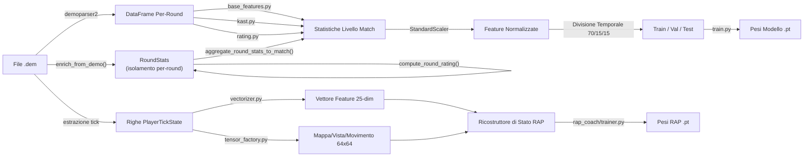

**Spiegazione diagramma:** Questo diagramma mostra le **due linee di montaggio parallele** all'interno del reparto di elaborazione. Immaginate la registrazione di una partita (file `.dem`) come un **lungo filmato**. La **linea di montaggio superiore** guarda il filmato e scrive statistiche riassuntive, come una pagella per ogni partita (uccisioni, morti, danni, ecc.). Queste pagelle vengono normalizzate (messe sulla stessa scala, come se tutte le temperature fossero convertite in gradi Celsius), divise in gruppi di studio (70% per l'apprendimento, 15% per i quiz, 15% per gli esami finali) e utilizzate per allenare il modello di allenamento di base. La **linea di montaggio inferiore** è più dettagliata: esamina il filmato **fotogramma per fotogramma** (ogni "ticchettio" del cronometro di gioco), misurando 25 informazioni su ciascun giocatore in ogni momento (posizione, salute, cosa vedono, economia, ecc.) e creando "istantanee" di 64x64 pixel della mappa. Sia i numeri che le immagini vengono inseriti nel RAP Coach's State Reconstructor, che li combina in un quadro completo di "cosa stava succedendo in questo preciso momento" - ed è da questo che impara il modello avanzato RAP Coach.

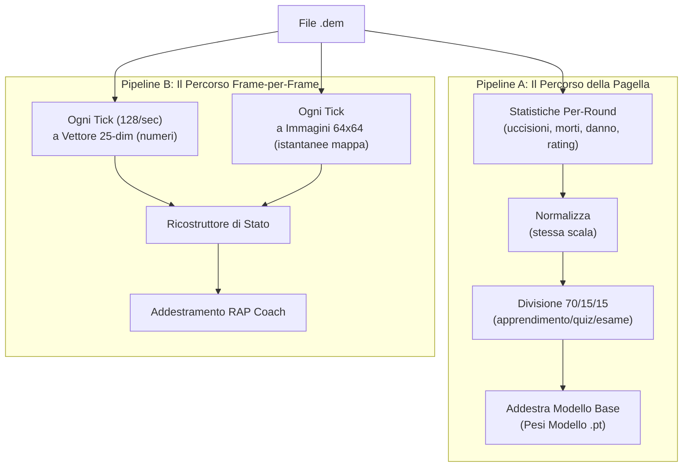

### Principio NO-WALLHACK e Contratto 25-dim

Due invarianti architetturali fondamentali attraversano l'intero sistema:

**1. Principio NO-WALLHACK:** Il coach AI **vede solo ciò che il giocatore legittimamente conosce**. Quando il modulo `PlayerKnowledge` è disponibile, i tensori generati dalla `TensorFactory` codificano esclusivamente informazioni legittime: compagni di squadra (sempre visibili), nemici in posizioni "last-known" (con decadimento temporale, τ = 2.5s), utilità propria e osservata. Nessuna informazione "wallhack" (posizioni nemiche reali non visibili) entra mai nel sistema di percezione. Quando `PlayerKnowledge` è `None`, il sistema ricade su una modalità legacy con tensori semplificati.

> **Analogia:** Il principio NO-WALLHACK è come un **esame di guida dove l'istruttore vede solo ciò che l'allievo vede**. L'istruttore non ha accesso a una telecamera esterna che mostra tutti gli ostacoli nascosti — deve valutare le decisioni dell'allievo basandosi solo sulle informazioni effettivamente disponibili all'allievo. Se l'allievo ha commesso un errore perché non poteva vedere un ostacolo dietro una curva, l'istruttore non lo punisce per questo. Allo stesso modo, il coach AI valuta il posizionamento del giocatore solo in base a ciò che il giocatore poteva ragionevolmente sapere in quel momento.

**2. Contratto 25-dim (`FeatureExtractor`):** Il `FeatureExtractor` in `vectorizer.py` definisce il vettore di feature canonico a 25 dimensioni (`METADATA_DIM = 25`) usato da **tutti** i modelli (AdvancedCoachNN, JEPA, VL-JEPA, RAP Coach) sia in addestramento che in inferenza. Qualsiasi modifica al vettore di feature avviene **esclusivamente** nel `FeatureExtractor` — nessun altro modulo può definire feature proprie. Questo garantisce coerenza dimensionale end-to-end.

```
 0: health/100      1: armor/100       2: has_helmet      3: has_defuser
 4: equip/10000     5: is_crouching    6: is_scoped       7: is_blinded
 8: enemies_vis     9: pos_x/±extent  10: pos_y/±extent  11: pos_z/1024
12: view_x_sin     13: view_x_cos     14: view_y/90      15: z_penalty
16: kast_est       17: map_id         18: round_phase
19: weapon_class   20: time_in_round/115  21: bomb_planted
22: teammates_alive/4  23: enemies_alive/5  24: team_economy/16000
```

> **Analogia:** Il contratto 25-dim è come una **lingua franca** parlata da tutti nel sistema. Ogni modello, ogni pipeline di addestramento, ogni motore di inferenza "parla" esattamente la stessa lingua con 25 parole. Se un modulo iniziasse a usare 26 parole o un ordine diverso, la comunicazione si interromperebbe. Il `FeatureExtractor` è il **dizionario ufficiale** — la sola autorità per la definizione e l'ordine delle feature.

---

## 3. Sottosistema 1 — Nucleo della rete neurale

**Cartella nel programma:** `backend/nn/`
**File chiave:** `model.py`, `jepa_model.py`, `jepa_train.py`, `jepa_trainer.py`, `coach_manager.py`, `training_orchestrator.py`, `config.py`, `factory.py`, `persistence.py`, `role_head.py`, `training_callbacks.py`, `tensorboard_callback.py`, `maturity_observatory.py`, `embedding_projector.py`

Questo sottosistema contiene tutti i modelli di rete neurale, il "cervello" del sistema di coaching. Include cinque distinte architetture di modelli, un gestore di training, un Osservatorio di Introspezione del Coach e utilità per la creazione e la persistenza dei modelli.

> **Analogia:** Questo è il **reparto cervello** della fabbrica. Contiene cinque diversi tipi di cervelli (AdvancedCoachNN, JEPA, VL-JEPA, RAP Coach e NeuralRoleHead), ognuno strutturato in modo diverso e specializzato in ambiti diversi, come ad esempio un cervello matematico, uno linguistico, uno creativo, uno per le competenze interpersonali e uno per l'identificazione dei ruoli, tutti in sinergia. Il Training Manager è come il **preside della scuola**: decide quale cervello può studiare cosa e quando, e tiene traccia dei voti di tutti. L'**Osservatorio** è l'ufficio di controllo qualità della scuola: monitora la "pagella" di ogni cervello durante la formazione, individuando segnali di confusione, panico, crescita o padronanza.

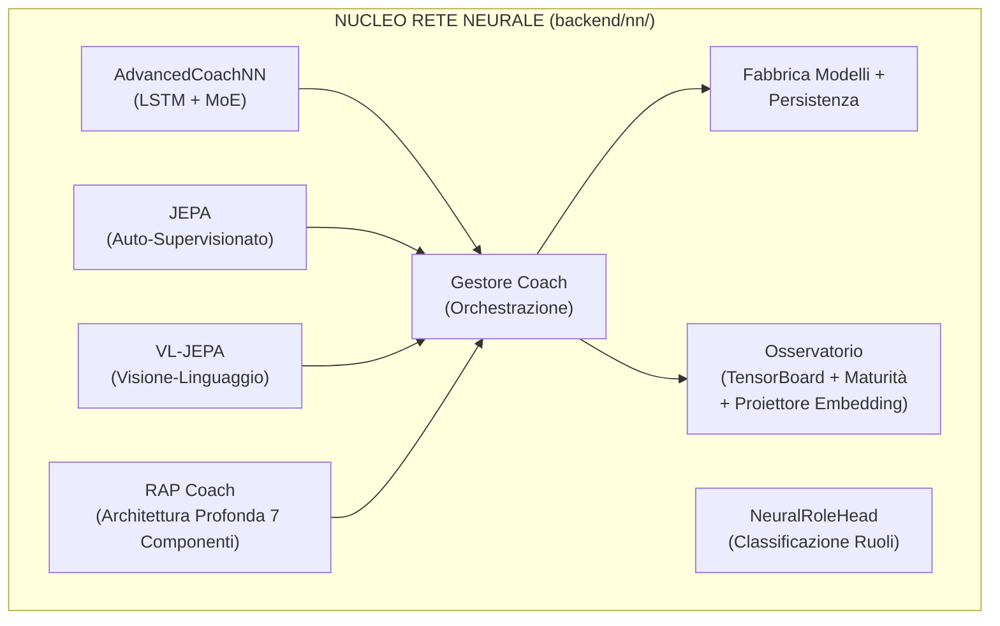

### -AdvancedCoachNN (LSTM + Mix di Esperti)

Definito in `model.py`, questo è il fondamento del coaching supervisionato.

| Componente                       | Dettaglio                                                                                                                                                                                                               |
| -------------------------------- | ----------------------------------------------------------------------------------------------------------------------------------------------------------------------------------------------------------------------- |
| **Dimensione di input**    | 25 funzionalità (`METADATA_DIM` da vectorizer.py)                                                                                                                                                                    |
| **Config**                 | Dataclass `CoachNNConfig`: `input_dim=25`, `output_dim=25` (default), `hidden_dim=128`, `num_experts=3`, `num_lstm_layers=2`, `dropout=0.2`, `use_layer_norm=True`                                      |
| **Livelli nascosti**       | LSTM a 2 livelli (128 nascosti,`batch_first=True`, dropout=0.2) con `LayerNorm` post-LSTM                                                                                                                           |
| **Testa dell'esperto**     | 3 esperti lineari paralleli (configurabili), softmax-gated tramite una rete di gate appresa                                                                                                                             |
| **Output**                 | Somma pesata degli output degli esperti → vettore del punteggio di coaching. Output_dim = METADATA_DIM (25) sia in `CoachNNConfig` che quando istanziato tramite `ModelFactory` (corretto in P1-08: `OUTPUT_DIM = METADATA_DIM = 25` in `config.py`) |
| **Bias di ruolo**          | Parametro `role_id` opzionale: `gate_weights = (gate_weights + role_bias) / 2.0` — orienta la selezione degli esperti verso conoscenze specifiche del ruolo                                                        |
| **Validazione dell'input** | `_validate_input_dim()` rimodella automaticamente 1D → `unsqueeze(0).unsqueeze(0)` e 2D → `unsqueeze(0)` per la robustezza                                                                                      |

> **Analogia:** Questo modello è come una **giuria di 3 giudici** a un talent show. Innanzitutto, l'LSTM legge i dati di gioco del giocatore come se stesse leggendo una storia: capisce cosa è successo passo dopo passo, ricordando i momenti importanti (è proprio questo che gli LSTM sanno fare bene: la memoria). Dopo aver letto l'intera storia, riassume tutto in un'unica "opinione" (128 numeri). Quindi, tre diversi giudici esperti esaminano quell'opinione e assegnano ciascuno il proprio punteggio. Ma non tutti i giudici sono ugualmente bravi in ogni tipo di performance: un esperto di danza è più bravo a giudicare la danza, un esperto di canto a cantare. Quindi una **rete di controllo** (come un moderatore) decide quanto fidarsi di ciascun giudice: "Per questo giocatore, il Giudice 1 è rilevante al 60%, il Giudice 2 al 30%, il Giudice 3 al 10%". Il punteggio finale è una combinazione ponderata delle opinioni di tutti e tre i giudici.

Ogni modulo esperto in AdvancedCoachNN: `Linear(128→128) → LayerNorm(128) → ReLU → Linear(128→output_dim)`.

> **Nota:** `_create_expert()` di JEPA omette LayerNorm — solo `Linear → ReLU → Linear`. Si tratta di una scelta progettuale deliberata: gli esperti JEPA operano su incorporamenti latenti già normalizzati, mentre gli esperti AdvancedCoachNN elaborano output LSTM grezzi che traggono vantaggio dalla normalizzazione per esperto.

**Passaggio in avanti (pseudo forward pass):**

```
h, _ = LSTM(x) # x: [batch, seq_len, 25]
h = LayerNorm(h[:, -1, :]) # prendi l'ultimo timestep → [batch, 128]
gate_weights = softmax(W_gate · h) # [batch, 3]
expert_outputs = [E_i(h) for i in 1..3]
output = tanh(Σ gate_weights_i × expert_outputs_i)
```

> **Analogia:** Ecco la ricetta passo passo: (1) L'LSTM legge le 25 misurazioni del giocatore in più timestep, come se leggesse le pagine di un diario. (2) Sceglie il riassunto dell'ultima pagina, ovvero la comprensione più recente. (3) Un "moderatore" esamina tale riepilogo e decide quanto fidarsi di ciascuno dei 3 esperti (questi pesi di fiducia sommati danno sempre il 100%). (4) Ogni esperto assegna i propri punteggi di coaching. (5) Il risultato finale è il risultato dei punteggi degli esperti mescolati insieme in base a quanto il moderatore si fida di ciascuno, compressi in un intervallo da -1 a +1 dalla funzione tanh (come una valutazione su una curva).

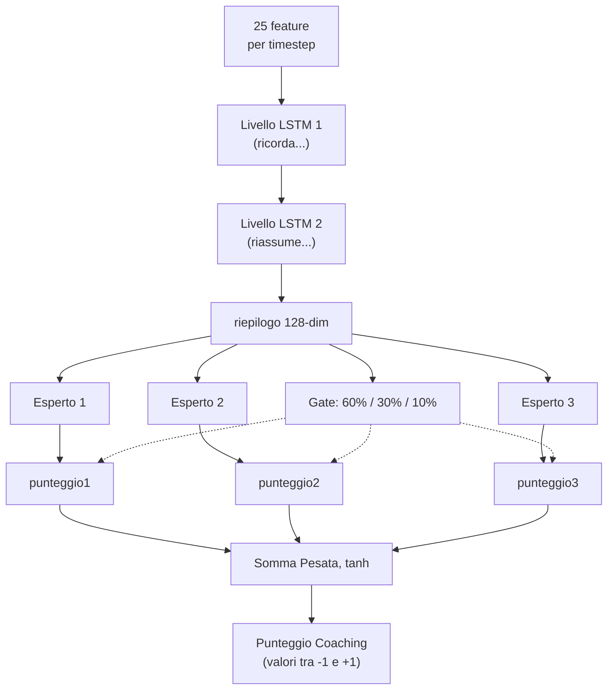

### -Modello di coaching JEPA (Architettura predittiva con integrazione congiunta)

Definito in `jepa_model.py`. Un modello di **pre-allenamento auto-supervisionato** ispirato all'I-JEPA di Yann LeCun, adattato per dati CS2 sequenziali.

> **Analogia:** JEPA è la fase di **"impara guardando"** dell'allenatore, proprio come si può imparare molto sul basket semplicemente guardando le partite NBA, anche prima che qualcuno te ne insegni le regole. Invece di aver bisogno di qualcuno che etichetti ogni giocata come "buona" o "cattiva" (apprendimento supervisionato), JEPA si auto-apprende giocando a un gioco di indovinelli: "Ho visto cosa è successo nel primo tempo di questo round... posso prevedere cosa succederà dopo?". Se indovina correttamente, sta costruendo una buona comprensione dei pattern CS2. Se indovina male, si adatta. Questo si chiama **apprendimento auto-supervisionato**: il modello crea i propri "compiti" a partire dai dati stessi.

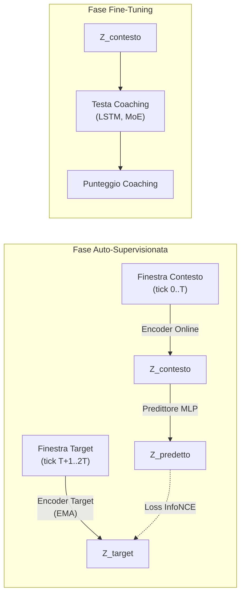

> **Spiegazione diagramma:** La fase di auto-supervisione funziona così: immagina di guardare un film e di premere pausa a metà scena. L'**Online Encoder** guarda la prima metà e crea un riassunto ("ecco cosa ho capito finora"). L'**Target Encoder** (una copia leggermente più vecchia dello stesso cervello, aggiornata lentamente) guarda la seconda metà e crea il proprio riassunto. Quindi un **Predictor** cerca di indovinare il riassunto della seconda metà usando solo il riassunto della prima metà. L'**InfoNCE Loss** è come un insegnante che controlla: "La tua previsione corrisponde a ciò che è realmente accaduto? Ed è sufficientemente diversa dalle ipotesi casuali?". Nella fase di Fine-Tuning, una volta che il modello ha acquisito una buona capacità di previsione, aggiungiamo una **Testa di Coaching** in cima: ora la comprensione acquisita guardando può essere utilizzata per fornire punteggi di coaching effettivi.

**Dettagli dell'architettura:**

| Modulo                        | Parametri                                                                                               |
| ----------------------------- | ------------------------------------------------------------------------------------------------------- |
| **Codificatore online** | Linear(input_dim, 512) → LayerNorm → GELU → Dropout(0.1) → Linear(512, latent_dim=256) → LayerNorm |
| **Codificatore target** | Strutturalmente identico; aggiornato tramite media mobile esponenziale (τ = 0.996). `EMA.state_dict()` restituisce tensori **clonati** per prevenire aliasing (un bug precedente permetteva la modifica accidentale dei pesi target attraverso riferimenti condivisi) |
| **Predictor**           | Linear(256, 512) → LayerNorm → GELU → Dropout(0.1) → Linear(512, 256)                               |
| **Coaching Head**       | LSTM(256, hidden_dim, 2 layers, dropout=0.2) → 3 esperti MoE → output controllato                     |

> **Analogia:** L'**Online Encoder** è come uno studente: trasforma i dati grezzi di gioco in un'"essenza" di 256 numeri (un riassunto compatto). L'**Target Encoder** è come il fratello maggiore dello studente che si aggiorna lentamente (EMA significa "avvicinarsi alle conoscenze del fratello minore, ma solo un pochino ogni giorno" - il 99,6% rimane invariato, solo lo 0,4% si aggiorna). Questo obiettivo lento impedisce al sistema di collassare in una soluzione banale (come prevedere sempre "tutto è uguale"). Il **Predictor** è un ponte che cerca di tradurre "ciò che ho visto" in "ciò che penso accadrà". La **Coaching Head** è l'accessorio finale che converte la comprensione in un consiglio effettivo, come passare da "Capisco il basket" a "dovresti passare di più".

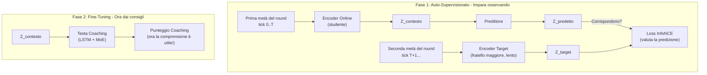

**Procedura di pre-addestramento** (`jepa_trainer.py`):

1. Carica le sequenze di `PlayerTickState` dai file SQLite demo professionali.
2. Divide ogni sequenza in finestre di contesto e target.
3. Codifica il contesto tramite il codificatore online + predittore, codifica il target tramite il codificatore del target (EMA).
4. Riduce al minimo la **perdita di contrasto di InfoNCE** utilizzando negativi in batch con similarità del coseno e temperatura τ=0,07.
5. Dopo ogni batch, esegue l'aggiornamento EMA: `θ_target ← τ·θ_target + (1−τ)·θ_online`.
6. **Monitoraggio della deriva**: Traccia gli oggetti DriftReport; attiva il riaddestramento automatico se la deriva > 2,5σ.
7. **Etichette basate sull'esito (Correzione G-01):** Il `ConceptLabeler` nell'addestramento VL-JEPA ora genera etichette dai dati `RoundStats` (esiti per round: uccisioni, morti, danni, sopravvivenza) anziché da feature a livello di tick. Questo elimina il **label leakage** — il problema precedente in cui le etichette dei concetti venivano derivate dalle stesse feature usate come input, permettendo al modello di "barare" durante l'addestramento senza apprendere effettivamente i pattern. Il metodo `label_from_round_stats(rs)` produce un vettore di 16 etichette di concetto basate su esiti misurabili. Se i dati `RoundStats` non sono disponibili, il sistema ricade sull'euristica legacy con un avviso di log una tantum.

> **Analogia:** La ricetta dell'allenamento è questa: (1) Carica le registrazioni di giocatori professionisti, fotogramma per fotogramma. (2) Per ogni registrazione, dividila in "cosa è successo prima" e "cosa è successo dopo". (3) Due codificatori esaminano ciascuna metà in modo indipendente. (4) Il sistema verifica: "La mia previsione di 'cosa è successo dopo' si è avvicinata alla risposta effettiva e non a risposte sbagliate casuali?" — questo è InfoNCE, come un test a risposta multipla in cui il modello deve scegliere la risposta giusta tra molte risposte sbagliate. (5) Il codificatore del fratello maggiore assorbe lentamente le conoscenze del fratello minore (solo lo 0,4% per passaggio). (6) Se i dati iniziano a sembrare molto diversi da quelli su cui il modello si è allenato (deriva > 2,5 deviazioni standard), scatta un campanello d'allarme: "Il meta del gioco è cambiato: è ora di riqualificarsi!"

**Decodifica Selettiva** (`forward_selective`): salta l'intero passaggio in avanti se la distanza del coseno tra l'embedding corrente e quello precedente è inferiore a una soglia (`skip_threshold=0.05`). Utilizza `1.0 - F.cosine_similarity()` come metrica di distanza e, durante l'operazione di salto, restituisce l'output precedente memorizzato nella cache. Questo consente un'efficace inferenza in tempo reale con salto dinamico dei frame: durante i momenti di gioco statici (i giocatori mantengono gli angoli), la maggior parte dei frame viene saltata completamente.

> **Analogia:** La decodifica selettiva è come una telecamera di sicurezza con **rilevamento del movimento**. Invece di registrare 24 ore su 24, 7 giorni su 7 (elaborando ogni singolo frame), si attiva solo quando qualcosa cambia effettivamente. Se due frame consecutivi sono quasi identici (distanza < 0.05 — in pratica "non è successo nulla"), il modello salta completamente il calcolo. Questo consente di risparmiare un'enorme quantità di potenza di elaborazione nei momenti lenti (come quando i giocatori mantengono gli angoli e aspettano), pur continuando a catturare ogni azione importante.

### -VL-JEPA: Architettura di Allineamento Visione-Linguaggio con Concetti di Coaching

Definito nella seconda metà di `jepa_model.py` (righe 355-963). Il VL-JEPA (**Vision-Language JEPA**) è un'**estensione fondamentale** del JEPACoachingModel che aggiunge un **meccanismo di allineamento tra embedding latenti e concetti di coaching interpretabili**. Ispirato al VL-JEPA di Meta FAIR (2026), mappa le rappresentazioni latenti in uno spazio concettuale strutturato con 16 concetti di coaching predefiniti.

> **Analogia:** Se JEPA è un allenatore che "capisce" il gioco osservandolo (apprendimento auto-supervisionato), VL-JEPA è lo stesso allenatore che ha anche imparato il **vocabolario specifico del coaching**. Non solo capisce i pattern del gioco, ma sa etichettarli con concetti come "posizionamento aggressivo", "economia inefficiente" o "scambio reattivo". È come la differenza tra un critico cinematografico che "sente" quando un film funziona e uno che sa articolare il perché: "la fotografia è eccellente, il ritmo è lento nel secondo atto, il colpo di scena è prevedibile". Il VL-JEPA traduce la comprensione latente in linguaggio di coaching specifico.

#### Tassonomia dei 16 Concetti di Coaching

Il sistema definisce `NUM_COACHING_CONCEPTS = 16` concetti organizzati in **5 dimensioni tattiche**:

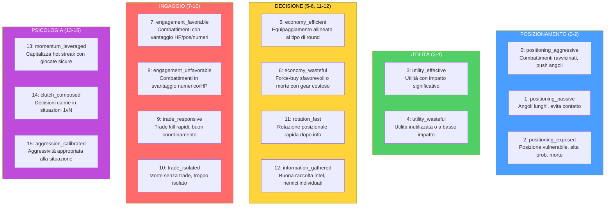

Ogni concetto è definito come un `CoachingConcept` dataclass immutabile con `(id, name, dimension, description)`. La lista globale `COACHING_CONCEPTS` e `CONCEPT_NAMES` sono le sorgenti di verità per tutto il sistema.

> **Analogia:** I 16 concetti sono come le **16 materie di una pagella scolastica del coaching**. Invece di un voto unico "sei bravo/cattivo", il VL-JEPA valuta il giocatore su 16 aspetti specifici: "In posizionamento aggressivo sei al 80%, in economia efficiente al 45%, in reattività allo scambio al 70%". Le 5 dimensioni sono i "dipartimenti" della scuola: Posizionamento, Utilità, Decisione, Ingaggio e Psicologia. Un giocatore può eccellere in una dimensione e avere lacune in un'altra — proprio come uno studente può avere ottimi voti in matematica ma scarsi in letteratura.

#### Architettura VLJEPACoachingModel

`VLJEPACoachingModel` eredita da `JEPACoachingModel` e aggiunge 3 componenti:

| Componente | Parametri | Scopo |
|---|---|---|
| **concept_embeddings** | `nn.Embedding(16, latent_dim=256)` | 16 prototipi di concetto appresi nello spazio latente |
| **concept_projector** | `Linear(256→256) → GELU → Linear(256→256)` | Proietta embedding encoder nello spazio allineato ai concetti |
| **concept_temperature** | `nn.Parameter(0.07)`, clamped `[0.01, 1.0]` | Temperatura appresa per scaling della similarità coseno |

Tutti i percorsi forward del genitore (`forward`, `forward_coaching`, `forward_selective`, `forward_jepa_pretrain`) sono **preservati immutati** via ereditarietà. Il nuovo percorso `forward_vl()` aggiunge l'allineamento concettuale.

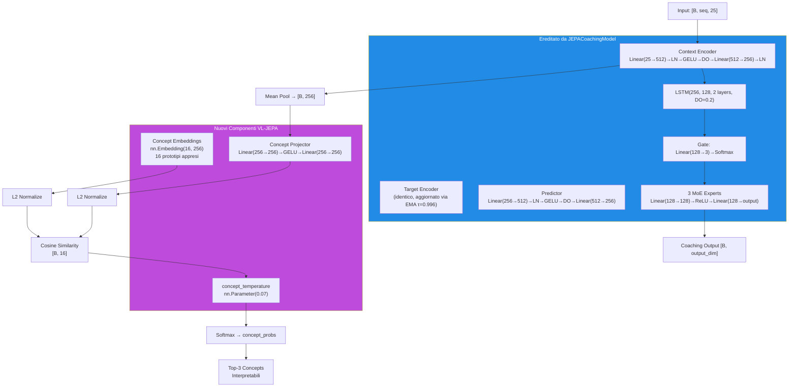

> **Analogia:** L'architettura VL-JEPA è come aggiungere un **traduttore simultaneo** a un analista che già capisce il gioco. Il `concept_projector` è l'interprete che prende la comprensione latente dell'encoder (256 numeri astratti) e la traduce nello "spazio dei concetti". I `concept_embeddings` sono come 16 **cartelli segnaletici** nello spazio latente: ognuno rappresenta un concetto di coaching e ha una posizione fissa (appresa durante l'addestramento). Il `concept_temperature` controlla quanto "netta" deve essere la classificazione: una temperatura bassa (0.01) rende le decisioni binarie ("è questo concetto o non lo è"), una temperatura alta (1.0) le rende morbide ("potrebbe essere diversi concetti contemporaneamente"). Il sistema calcola la distanza coseno tra la proiezione del giocatore e ciascun cartello, e i concetti più vicini vengono attivati.

#### Percorso Forward VL-JEPA (`forward_vl`)

```
1. Encode:        embeddings = context_encoder(x)                    # [B, seq, 256]
2. Pool:          latent = embeddings.mean(dim=1)                    # [B, 256]
3. Project:       projected = L2_normalize(concept_projector(latent)) # [B, 256]
4. Similarity:    logits = projected @ concept_embs_norm.T            # [B, 16]
5. Temperature:   probs = softmax(logits / clamp(temp, 0.01, 1.0))   # [B, 16]
6. Coaching:      coaching_output = forward_coaching(x, role_id)      # [B, output_dim]
7. Decode:        top_concepts = top-k(probs, k=3)                   # interpretabili
```

**Output `forward_vl()`:** Dizionario con 5 chiavi:

| Chiave | Forma | Contenuto |
|---|---|---|
| `concept_probs` | `[B, 16]` | Probabilità softmax per ogni concetto |
| `concept_logits` | `[B, 16]` | Punteggi di similarità grezzi (pre-softmax) |
| `top_concepts` | `List[tuple]` | `[(nome_concetto, probabilità), ...]` per il primo campione |
| `coaching_output` | `[B, output_dim]` | Predizione coaching standard (via genitore) |
| `latent` | `[B, 256]` | Embedding latente pooled dell'encoder |

**Percorso leggero — `get_concept_activations()`:** Forward solo concettuale senza testa di coaching né LSTM. Utilizza `torch.no_grad()` per efficienza massima durante l'inferenza.

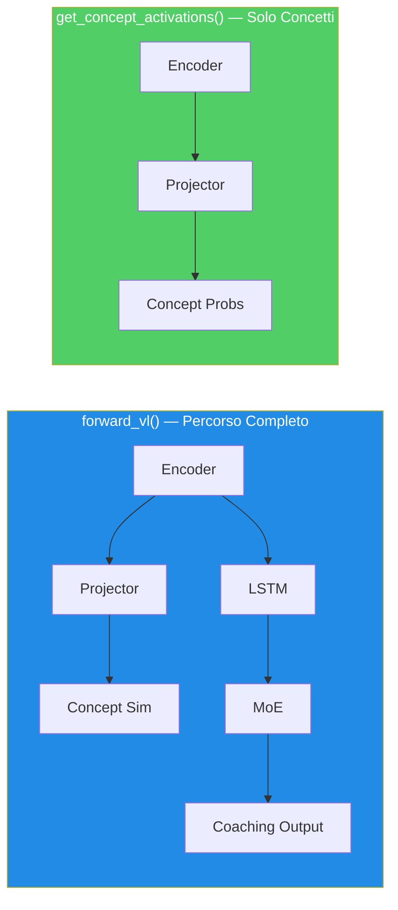

#### ConceptLabeler: Due Modalità di Etichettatura

La classe `ConceptLabeler` genera **etichette soft multi-label** (`[0, 1]^16`) per l'addestramento VL-JEPA. Supporta due modalità:

**Modalità 1 — Basata su Esiti (preferita, correzione G-01):** `label_from_round_stats(round_stats)` genera etichette da dati di **esito del round** (uccisioni, morti, danni, sopravvivenza, trade kill, utilità, equipaggiamento, round vinto). Questi dati sono **ortogonali** al vettore di input a 25 dim, eliminando il label leakage.

| Concetto | Segnale di Esito Usato |
|---|---|
| `positioning_aggressive` (0) | `opening_kill=True` → 0.8, kills≥2+survived → 0.6 |
| `positioning_passive` (1) | survived, no opening, damage<60 → 0.7 |
| `positioning_exposed` (2) | `opening_death=True` → 0.8, deaths>0+damage<40 → 0.6 |
| `utility_effective` (3) | utility_total>80 + round_won → 0.5+util/300 |
| `utility_wasteful` (4) | zero utility → 0.5, utility+lost → 0.4 |
| `economy_efficient` (5) | eco win (equip<2000) → 0.9, normal win → 0.7 |
| `economy_wasteful` (6) | high equip+loss → 0.4+equip/16000 |
| `engagement_favorable` (7) | multi-kill+survived → 0.5+kills×0.15 |
| `engagement_unfavorable` (8) | deaths+no kills+low dmg → 0.7 |
| `trade_responsive` (9) | trade_kills>0 → 0.6+tk×0.2 |
| `trade_isolated` (10) | died, not traded, no trade kills → 0.7 |
| `rotation_fast` (11) | assists≥1+round_won → 0.6+assists×0.1 |
| `information_gathered` (12) | flashes≥2+survived → 0.6 |
| `momentum_leveraged` (13) | rating>1.5 → rating/2.5, kills≥3 → 0.7 |
| `clutch_composed` (14) | kills≥2+survived+won → 0.6 |
| `aggression_calibrated` (15) | efficiency = kills×1000/equip → min(eff×0.5, 1.0) |

**Modalità 2 — Euristica Legacy (fallback con label leakage):** `label_tick(features)` genera etichette direttamente dal vettore di feature a 25 dim. Questo crea **label leakage** perché il modello può "barare" ricostruendo le feature di input anziché imparare pattern latenti. Usato solo quando `RoundStats` non è disponibile, con un avviso di log una tantum.

> **Analogia G-01:** Il label leakage è come un **esame in cui le risposte sono scritte sul retro del foglio delle domande**. Nella modalità euristica, le etichette dei concetti sono derivate dalle stesse 25 feature che il modello vede come input — il modello può semplicemente "copiare le risposte" senza capire nulla. Nella modalità basata su esiti, le etichette vengono da dati diversi (cosa è SUCCESSO nel round: uccisioni, morti, vittoria) — il modello deve effettivamente capire la relazione tra le feature di input e gli esiti per ottenere buoni punteggi. È la differenza tra studiare per capire e studiare per copiare.

**`label_batch(features_batch)`:** Wrapper che gestisce batch 2D `[B, 25]` e 3D `[B, seq_len, 25]` (media delle etichette sulla sequenza per input 3D).

**Riferimento indici feature (METADATA_DIM=25):**

```
 0: health/100      1: armor/100       2: has_helmet      3: has_defuser
 4: equip/10000     5: is_crouching    6: is_scoped       7: is_blinded
 8: enemies_vis     9: pos_x/4096     10: pos_y/4096     11: pos_z/1024
12: view_x_sin     13: view_x_cos     14: view_y/90      15: z_penalty
16: kast_est       17: map_id         18: round_phase
19: weapon_class   20: time_in_round/115  21: bomb_planted
22: teammates_alive/4  23: enemies_alive/5  24: team_economy/16000
```

#### Funzioni di Perdita VL-JEPA

**1. `jepa_contrastive_loss()` — InfoNCE (già documentata sopra)**

Formula: `-log(exp(sim(pred, target)/τ) / (exp(sim(pred, target)/τ) + Σ exp(sim(pred, neg_i)/τ)))` con τ=0.07.

**2. `vl_jepa_concept_loss()` — Allineamento Concetti + Diversità VICReg**

```python
concept_loss = BCE_with_logits(concept_logits, concept_labels)  # Multi-label
diversity_loss = -std(L2_normalize(concept_embeddings), dim=0).mean()  # VICReg
total = alpha * concept_loss + beta * diversity_loss
```

| Termine | Formula | Peso Default | Scopo |
|---|---|---|---|
| `concept_loss` | `F.binary_cross_entropy_with_logits(logits, labels)` | α = 0.5 | Allinea embedding ai concetti corretti |
| `diversity_loss` | `-std_per_dim(L2_norm(concept_embs)).mean()` | β = 0.1 | Impedisce il collasso degli embedding di concetto |

> **Analogia:** La `concept_loss` è come **verificare che lo studente associ correttamente i termini alle definizioni** — "posizionamento aggressivo" deve attivarsi quando il giocatore è effettivamente aggressivo. La `diversity_loss` è ispirata a VICReg (Variance-Invariance-Covariance Regularization): impedisce che tutti i 16 prototipi di concetto collassino nello stesso punto dello spazio latente. È come assicurarsi che i 16 cartelli segnaletici nel museo siano **tutti in posizioni diverse** — se due cartelli sono nello stesso posto, non servono a distinguere i concetti. La diversità viene misurata come la deviazione standard degli embedding normalizzati lungo ogni dimensione: una std alta significa che i concetti sono ben separati.

**Perdita totale nel training step VL-JEPA (`train_step_vl`):**

```
L_total = L_infonce + α × L_concept + β × L_diversity
```

Dove `L_infonce` è la perdita contrastiva standard JEPA e `(α × L_concept + β × L_diversity)` è il termine di allineamento concettuale.

#### Flusso Dimensionale Completo JEPA / VL-JEPA

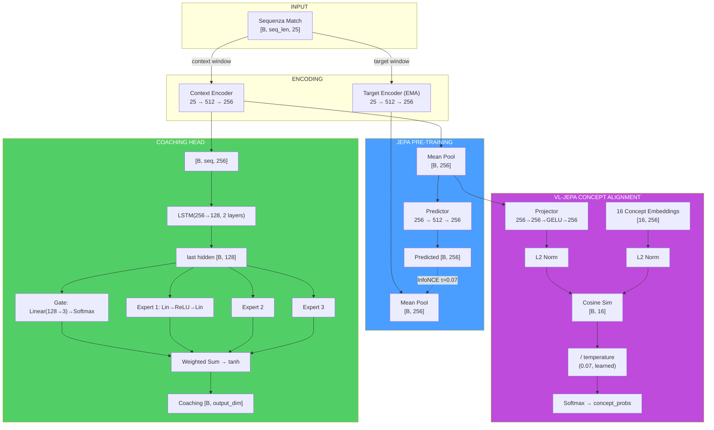

> **Analogia del flusso dimensionale:** Immagina il percorso dei dati come un viaggio di **traduzione multilingue**: i dati grezzi del gioco (25 numeri) sono come un testo in "linguaggio del gioco". L'encoder li traduce in "linguaggio latente" (256 numeri) — una rappresentazione compressa ma ricca. Da qui, il percorso si biforca: il **ramo JEPA** (auto-supervisione) verifica se il traduttore capisce la sequenza temporale, il **ramo Coaching** (LSTM+MoE) produce consigli pratici, e il **ramo VL** (concetti) traduce dal "linguaggio latente" al "linguaggio del coaching" (16 concetti interpretabili). Ogni ramo serve uno scopo diverso, ma tutti partono dalla stessa traduzione di base.

#### JEPATrainer: Addestramento con Monitoraggio Deriva

Definito in `jepa_trainer.py` (276 righe). Gestisce sia l'addestramento JEPA standard che VL-JEPA, con riaddestramento automatico basato sulla deriva.

| Parametro | Default | Scopo |
|---|---|---|
| **Optimizer** | AdamW (lr=1e-4, weight_decay=1e-4) | Ottimizzazione con decadimento dei pesi |
| **Scheduler** | CosineAnnealingLR (T_max=100) | Decadimento ciclico del learning rate |
| **DriftMonitor** | z_threshold=2.5 | Rileva drift delle feature oltre 2.5σ |
| **drift_history** | `List[DriftReport]` | Storico dei report di drift |

**Ciclo di addestramento — `train_step(x_context, x_target, negatives)`:**

1. Forward pass JEPA: `pred, target = model.forward_jepa_pretrain(context, target)`
2. **Auto-detect negativi grezzi:** Se `negatives.shape[-1] ≠ latent_dim`, i negativi sono feature grezze → vengono auto-codificati via `target_encoder` con `torch.no_grad()` (reshape `[B*N, 1, D]` → expand → encode → mean pool → reshape)
3. Loss InfoNCE su embedding normalizzati
4. Backward + optimizer step
5. **Aggiornamento EMA target encoder** (deve avvenire DOPO `optimizer.step()`)

**Training step VL-JEPA — `train_step_vl()`:** Estende `train_step` con:

1. Forward pass JEPA standard (InfoNCE)
2. Forward VL: `model.forward_vl(x_context)` → concept_logits
3. **Generazione etichette (preferenza G-01):** Se `round_stats` è disponibile → `label_from_round_stats()` (no leakage). Altrimenti → `label_batch()` (euristica legacy con avviso una tantum)
4. Concept loss + diversity loss: `vl_jepa_concept_loss(logits, labels, embeddings, α, β)`
5. Loss totale: `L_infonce + L_concept_total`
6. Backward + optimize + EMA update

**Output:** `{total_loss, infonce_loss, concept_loss, diversity_loss}`.

**Monitoraggio deriva — `check_val_drift(val_df, reference_stats)`:**

- Utilizza `DriftMonitor` dalla pipeline di validazione
- Calcola z-score per ogni feature del validation set rispetto alle statistiche di riferimento
- Se `max_z_score > 2.5`, il report segna `is_drifted=True`
- `should_retrain(drift_history, window=5)` → se la maggioranza delle ultime 5 finestre mostra drift, attiva il flag `_needs_full_retrain`

**Riaddestramento automatico — `retrain_if_needed(full_dataloader, device, epochs=10)`:**

- Se il flag `_needs_full_retrain` è attivo, resetta il scheduler e riesegue `epochs` epoche complete
- Dopo il riaddestramento, cancella il flag e lo storico drift
- Restituisce `True/False` per indicare se il riaddestramento è avvenuto

> **Analogia:** Il sistema di monitoraggio della deriva è come un **termometro automatico per le condizioni del meta-gioco**. Se i dati dei nuovi giocatori sono molto diversi da quelli su cui il modello si è allenato (ad esempio, un aggiornamento importante del gioco ha cambiato le meccaniche), il termometro rileva la "febbre" (drift > 2.5σ). Se la febbre persiste per 5 controlli consecutivi, il sistema prescrive una "cura completa" — riaddestramento totale. Questo impedisce al modello di dare consigli basati su un meta-gioco obsoleto.

#### Pipeline di Addestramento Standalone (`jepa_train.py`)

Script standalone per pre-addestramento e fine-tuning JEPA, eseguibile da CLI:

```bash
python -m Programma_CS2_RENAN.backend.nn.jepa_train --mode pretrain
python -m Programma_CS2_RENAN.backend.nn.jepa_train --mode finetune --model-path models/jepa_model.pt
```

**`JEPAPretrainDataset`:** Dataset PyTorch per il pre-addestramento:

| Parametro | Default | Descrizione |
|---|---|---|
| `context_len` | 10 | Lunghezza finestra contesto (tick) |
| `target_len` | 10 | Lunghezza finestra target (tick) |
| `match_sequences` | `List[np.ndarray]` | Sequenze di match `[num_rounds, METADATA_DIM]` |

Per ogni campione, seleziona un punto di partenza casuale nella sequenza e restituisce `{"context": [context_len, 25], "target": [target_len, 25]}`.

> **Nota (F3-25):** Il punto di partenza usa `np.random.randint()` con stato globale non seedato → finestre non riproducibili tra run. Per addestramento deterministico, usare `worker_init_fn` o un `Generator` dedicato nel `DataLoader`.

**`load_pro_demo_sequences(limit=100)`:** Carica sequenze demo professionali dal database. Estrae 12 feature aggregate a livello di match da `PlayerMatchStats`, paddate a `METADATA_DIM` con zeri.

> **⚠️ Avvertimento Critico (F3-08):** Lo script standalone usa `np.tile(features, (20, 1))` per creare 20 frame identici da un singolo vettore aggregato. Questo rende il pre-addestramento JEPA **un'operazione identità** — il modello impara semplicemente a copiare l'input, non le dinamiche temporali. Il `TrainingOrchestrator` nel percorso di produzione **non è affetto** da questo problema e usa dati per-tick reali.

**`train_jepa_pretrain()`:** 50 epoche, batch_size=16, lr=1e-4, 8 negativi in-batch. L'optimizer include SOLO `context_encoder` e `predictor` — il `target_encoder` è aggiornato esclusivamente via EMA.

**`train_jepa_finetune()`:** 30 epoche, batch_size=16, lr=1e-3, weight_decay=1e-3. Congela gli encoder e ottimizza solo LSTM + MoE + Gate.

**Persistenza:** `save_jepa_model()` salva `{model_state_dict, is_pretrained}`. `load_jepa_model()` carica con `weights_only=True` (sicurezza).

#### SuperpositionLayer — Gating Contestuale (`layers/superposition.py`)

Modulo standalone che implementa un livello lineare con **gating dipendente dal contesto**, usato all'interno del RAP Coach Strategy Layer.

```python
class SuperpositionLayer(nn.Module):
    def __init__(self, in_features, out_features, context_dim=METADATA_DIM):
        self.weight = nn.Parameter(empty(out_features, in_features))
        nn.init.kaiming_uniform_(self.weight, a=math.sqrt(5))  # P1-09: Kaiming init
        self.bias = nn.Parameter(zeros(out_features))
        self.context_gate = nn.Linear(context_dim, out_features)  # Superposition Controller

    def forward(self, x, context):
        gate = sigmoid(self.context_gate(context))  # [B, out_features]
        self._last_gate_live = gate                  # Con gradiente (per sparsity loss)
        self._last_gate_activations = gate.detach()  # Copia detached (per osservabilità)
        out = F.linear(x, self.weight, self.bias)
        return out * gate  # Modulazione contestuale
```

**Meccanismo:** L'output di ogni neurone viene moltiplicato per un gate sigmoide condizionato sulle feature di contesto (25-dim). Questo permette al modello di "accendere" o "spegnere" neuroni dinamicamente in base alla situazione di gioco.

**Inizializzazione Kaiming (P1-09):** I pesi vengono inizializzati con `kaiming_uniform_` (distribuzione Kaiming He, 2015) anziché `torch.randn()`. Questa inizializzazione garantisce che la varianza dei pesi sia proporzionale al fan-in del livello, prevenendo la scomparsa o l'esplosione dei gradienti nelle reti profonde. Il parametro `a=math.sqrt(5)` è il valore standard per livelli lineari in PyTorch.

**Design dual-tensor (NN-24):** Il gate sigmoide viene memorizzato in **due copie separate** durante ogni forward pass:

| Tensore | Gradiente | Scopo |
|---|---|---|
| `_last_gate_live` | **Sì** (mantiene il grafo computazionale) | Usato da `gate_sparsity_loss()` per backpropagation — il gradiente fluisce attraverso il gate verso `context_gate` |
| `_last_gate_activations` | **No** (detached) | Usato da `get_gate_statistics()` per osservabilità — nessun costo di memoria per il grafo |

Questa separazione risolve il conflitto tra la necessità di gradienti (per la loss di sparsità) e la necessità di osservabilità leggera (per logging e TensorBoard).

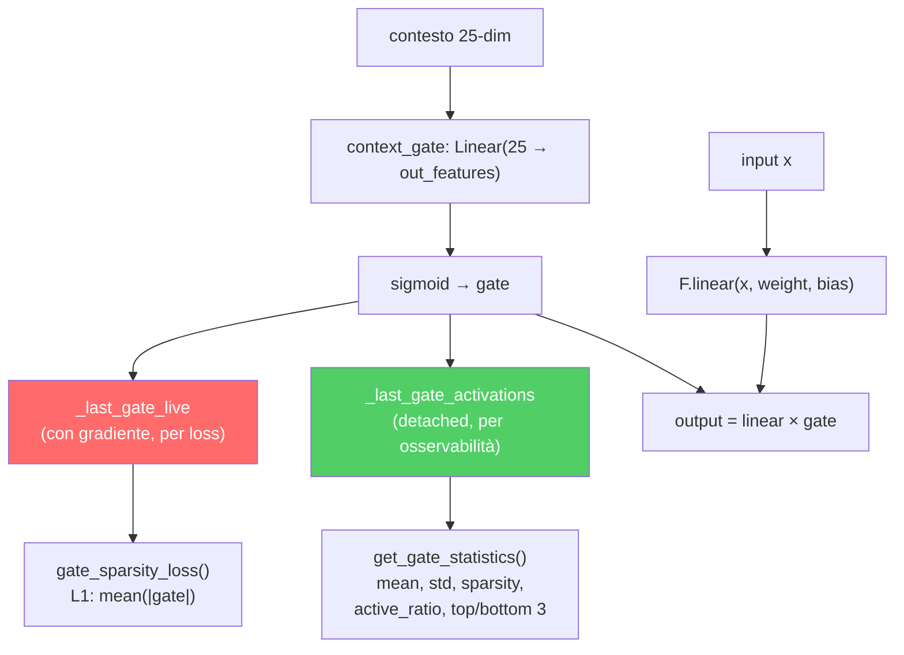

**Osservabilità integrata:**

| Metodo | Ritorno | Descrizione |
|---|---|---|
| `get_gate_activations()` | `Tensor` o `None` | Ultime attivazioni del gate (`_last_gate_activations`, detached) |
| `get_gate_statistics()` | `Dict[str, float]` | Statistiche complete del gate (vedi tabella sotto) |
| `gate_sparsity_loss()` | `Tensor` | Perdita L1 `mean(|_last_gate_live|)` per specializzazione degli esperti |
| `enable_tracing(interval)` | — | Log dettagliato del gate ogni `interval` passi |
| `disable_tracing()` | — | Ripristina intervallo di logging a 100 |

**Campi di `get_gate_statistics()`:**

| Campo | Tipo | Significato |
|---|---|---|
| `mean_activation` | float | Media delle attivazioni del gate nel batch |
| `std_activation` | float | Deviazione standard delle attivazioni |
| `sparsity` | float | Frazione di dimensioni con media < 0.1 (più alto = più sparso) |
| `active_ratio` | float | Frazione di dimensioni con media > 0.5 (più alto = più attivo) |
| `top_3_dims` | List[int] | Le 3 dimensioni del gate più attive |
| `bottom_3_dims` | List[int] | Le 3 dimensioni del gate meno attive |

**Log periodico durante addestramento:** Ogni 100 forward pass (configurabile via `enable_tracing(interval)`), logga via logger strutturato: dimensioni attive (gate_mean > 0.5), dimensioni sparse (gate_mean < 0.1) e media complessiva.

> **Analogia:** Il SuperpositionLayer è come un **mixer audio con 256 canali** dove ogni slider è controllato automaticamente in base alla "scena" attuale. In un round eco, certi canali vengono abbassati (le feature relative al full-buy sono irrilevanti). In un retake post-plant, altri canali vengono alzati. Il `gate_sparsity_loss` è come un fonico che dice: "Usa il minor numero possibile di canali alla volta — se riesci a ottenere lo stesso suono con 50 canali invece di 200, il mix sarà più pulito e interpretabile". L'inizializzazione Kaiming è come **accordare lo strumento prima di suonare** — senza una buona accordatura iniziale, anche il musicista più bravo produrrà note stonate. Il design dual-tensor è come avere **due copie del mix**: una "live" che il fonico può regolare (con gradienti), e una "registrata" che il critico può analizzare a posteriori (senza disturbare la performance in corso).

#### Modulo EMA Standalone

L'aggiornamento **Exponential Moving Average** del target encoder è implementato direttamente in `JEPACoachingModel.update_target_encoder(momentum=0.996)`:

```python
with torch.no_grad():
    for param_q, param_k in zip(context_encoder.parameters(), target_encoder.parameters()):
        param_k.data = param_k.data * momentum + param_q.data * (1.0 - momentum)
```

**Invarianti:**
- L'aggiornamento EMA avviene **sempre dopo** `optimizer.step()` — mai prima, altrimenti i gradienti non sono ancora applicati
- Il target encoder **non riceve mai gradienti** diretti — solo aggiornamenti EMA
- Il momentum 0.996 significa che il target encoder "assorbe" solo lo 0.4% dei pesi dell'encoder online a ogni passo — aggiornamento molto conservativo
- `state_dict()` del modello restituisce tensori **clonati** per prevenire aliasing accidentale

> **Analogia:** L'EMA è come un **mentore che impara lentamente dall'allievo**. L'allievo (context encoder) impara velocemente dai dati e cambia molto a ogni lezione. Il mentore (target encoder) osserva l'allievo e aggiorna le proprie conoscenze molto lentamente — solo lo 0.4% per lezione. Questo impedisce al mentore di "dimenticare" ciò che sapeva prima, creando un obiettivo stabile per l'apprendimento. Senza EMA, entrambi i cervelli cambierebbero troppo velocemente e il sistema potrebbe "collassare" — un fenomeno noto come mode collapse dove entrambi gli encoder producono lo stesso output indipendentemente dall'input.

### -CoachTrainingManager (Orchestrazione)

Definito in `coach_manager.py` (663 righe). Questo è il **cervello del processo di formazione**, che gestisce un rigoroso **ciclo di formazione a 3 livelli, basato sulla maturità**, suddiviso in 4 fasi:

> **Analogia adatta ai bambini:** CoachTrainingManager è come il **preside** che decide la classe di ogni studente e quali materie può seguire. Uno studente nuovo di zecca (CALIBRAZIONE) può frequentare solo corsi introduttivi. Uno studente che ha superato un numero sufficiente di corsi (APPRENDIMENTO) può frequentare corsi avanzati. E uno studente dell'ultimo anno (MATURE) ha accesso a tutto. Il preside impone anche una regola: "Non puoi iniziare alcun corso finché non hai partecipato ad almeno 10 sessioni di orientamento". Questo impedisce al sistema di provare a insegnare quando non ha praticamente dati da cui imparare.

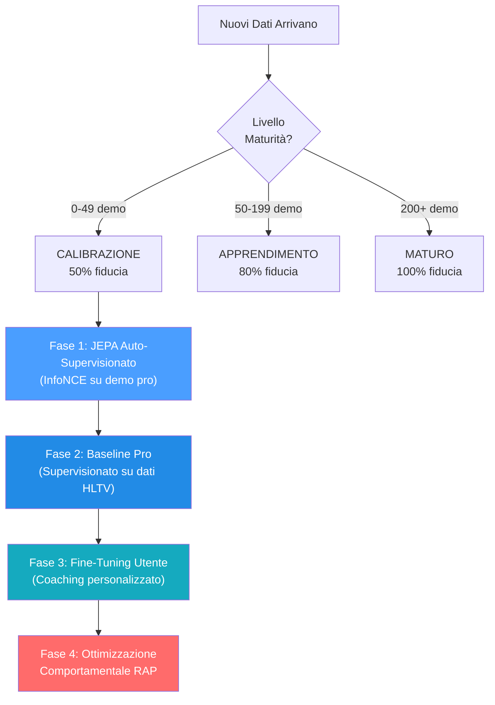

> **Spiegazione diagramma:** Pensate alle 4 fasi come agli **anni scolastici**: la Fase 1 (JEPA) è come **guardare un filmato di una partita**: lo studente guarda centinaia di partite professionistiche e impara gli schemi senza che nessuno li valuti. La Fase 2 (Pro Baseline) è come **studiare da un libro di testo**: ora un insegnante dice "ecco come si gioca bene" e lo studente studia per adeguarsi. La Fase 3 (Perfezionamento dell'utente) è come **lezioni private**: il sistema si adatta specificamente allo stile e ai punti deboli di QUESTO giocatore. La Fase 4 (RAP) è come un **corso di strategia avanzata**: il coach RAP completo a 7 componenti interviene con teoria dei giochi, posizionamento e ragionamento causale. Non è possibile accedere alla Fase 4 finché non si sono completate le Fasi 1-3, proprio come non si può studiare analisi matematica prima di algebra.

**Livelli di maturità e moltiplicatori di fiducia:**

| Livello       | Conteggio demo | Moltiplicatore di fiducia | Funzionalità sbloccate                                 |
| ------------- | -------------- | ------------------------- | ------------------------------------------------------- |
| CALIBRAZIONE  | 0–49          | 0,50                      | Euristica di base, pre-addestramento JEPA               |
| APPRENDIMENTO | 50–199        | 0,80                      | Confronto base professionale, ottimizzazione utente     |
| MATURO        | 200+           | 1,00                      | Coach RAP completo, teoria dei giochi, analisi completa |

> **Analogia:** Il moltiplicatore di fiducia è come un **punteggio di fiducia**. Quando il coach è nuovo (CALIBRAZIONE), si fida dei propri consigli solo al 50%: sa che potrebbero sbagliarsi, quindi è cauto. Dopo aver studiato più di 50 demo (APPRENDIMENTO), si fida di se stesso all'80%. Dopo più di 200 demo (MATURO), è completamente sicuro: il 100%. È come un meteorologo: un meteorologo alle prime armi potrebbe dire "Sono sicuro al 50% che pioverà", ma uno esperto con decenni di dati alle spalle dice "Sono sicuro al 100%". L'allenatore non finge mai di sapere più di quanto non sappia in realtà.

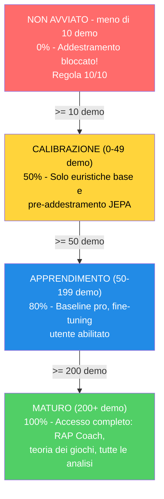

**Prerequisiti (Regola 10/10):** Richiede ≥10 demo professionali OPPURE (≥10 demo utente + account Steam/FACEIT connesso) prima di iniziare qualsiasi allenamento.

Il manager utilizza un **contratto di allenamento** rigoroso con 25 funzionalità (corrispondenti a `METADATA_DIM`).

> **Problema risolto (ex G-10):** `coach_manager.py` ora definisce `TRAINING_FEATURES` con i nomi canonici corretti per tutti i 25 indici, allineati perfettamente con `vectorizer.py`. L'asserzione `len(TRAINING_FEATURES) == METADATA_DIM` è valida e tutti i nomi sono aggiornati. Inoltre, `MATCH_AGGREGATE_FEATURES` definisce le 25 feature aggregate a livello di partita: `["avg_kills", "avg_deaths", "avg_adr", "avg_hs", "avg_kast", "kill_std", "adr_std", "kd_ratio", "impact_rounds", "accuracy", "econ_rating", "rating", "opening_duel_win_pct", "clutch_win_pct", "trade_kill_ratio", "flash_assists", "positional_aggression_score", "kpr", "dpr", "rating_impact", "rating_survival", "he_damage_per_round", "smokes_per_round", "unused_utility_per_round", "thrusmoke_kill_pct"]`. Entrambe le liste sono validate a runtime: se una delle due ha una lunghezza diversa da `METADATA_DIM`, il modulo solleva `ValueError` al momento dell'importazione.

```
health, armor, has_helmet, has_defuser, equipment_value,
is_crouching, is_scoped, is_blinded,
enemies_visible,
pos_x, pos_y, pos_z,
view_yaw_sin, view_yaw_cos, view_pitch,
z_penalty, kast_estimate, map_id, round_phase,
weapon_class, time_in_round, bomb_planted,
teammates_alive, enemies_alive, team_economy
```

> **Analogia:** Queste 25 caratteristiche sono come una **lista di controllo di 25 domande** che l'allenatore pone a un giocatore in ogni singolo momento di una partita: "Quanto sei in salute? Hai un'armatura? Un casco? Un kit di disinnesco? Quanto costa il tuo equipaggiamento? Sei accovacciato? Usi un mirino? Sei accecato? Quanti nemici riesci a vedere? Dove ti trovi (coordinate x, y, z)? In che direzione stai guardando (suddiviso in sin/cos per evitare stranezze angolari)? Sei al piano sbagliato di una mappa multilivello? Come ti sei comportato (KAST)? Di che mappa si tratta? È un round per pistola, eco, forza o full buy? Che tipo di arma stai usando? Quanto tempo è passato nel round? La bomba è stata piantata? Quanti compagni di squadra sono ancora vivi? Quanti nemici sono vivi? Qual è l'economia media della tua squadra?" Le ultime 6 domande (indici 19-24) forniscono al modello una consapevolezza tattica del contesto di gioco — queste feature hanno valore predefinito 0.0 durante l'addestramento dal database e vengono popolate dal contesto DemoFrame al momento dell'inferenza. Ogni modello nel sistema parla esattamente lo stesso "linguaggio da 25 domande" — questo è il contratto di addestramento. Se una qualsiasi parte del sistema utilizzasse domande diverse, le risposte non corrisponderebbero e tutto si interromperebbe.

**Indici target:** `[0, 2, 4, 11]` = `[avg_kills, avg_adr, avg_kast, rating]` — il modello prevede delta di miglioramento per queste 4 metriche aggregate a livello di partita.

> **Analogia:** Delle 25 feature aggregate a livello di partita, il modello si concentra sulla previsione di miglioramenti solo per 4: **media uccisioni** (stai ottenendo più eliminazioni?), **media ADR** (stai infliggendo più danni per round?), **media KAST** (stai contribuendo più spesso ai round?) e **rating** (il tuo punteggio complessivo sta migliorando?). Questi 4 sono stati scelti perché catturano le metriche di prestazione aggregate più significative secondo lo standard HLTV 2.0: le uccisioni misurano l'output offensivo, l'ADR misura l'impatto in termini di danni, il KAST misura la consistenza di contributo, e il rating è la metrica composita che li sintetizza tutti. È come un allenatore di basket che tiene traccia di centinaia di statistiche ma concentra il feedback su: punti segnati, assist, rimbalzi e la valutazione PER — i 4 aspetti più rilevanti per il miglioramento complessivo.

### -TrainingOrchestrator

Definito in `training_orchestrator.py`. Ciclo di epoche unificato, convalida, arresto anticipato e checkpoint per i modelli JEPA e RAP.

| Parametro      | Predefinito | Scopo                                                                        |
| -------------- | ----------- | ---------------------------------------------------------------------------- |
| `model_type` | "jepa"      | Percorsi verso il trainer JEPA, VL-JEPA o RAP                                |
| `max_epochs` | 100         | Limite massimo di allenamento                                                |
| `patience`   | 10          | Pazienza nell'arresto anticipato                                             |
| `batch_size` | 32          | Campioni per batch                                                           |
| `callbacks`  | `None`    | Elenco di istanze di `TrainingCallback` per l'integrazione con Observatory |

L'orchestrator si integra con Observatory tramite `CallbackRegistry`. Attiva eventi del ciclo di vita in **5 punti**: `on_train_start` (prima della prima epoca), `on_epoch_start` (inizio di ogni epoca), `on_batch_end` (dopo ogni batch di addestramento, include output di perdita e trainer), `on_epoch_end` (dopo la convalida, include modello e perdite), `on_train_end` (dopo il completamento dell'addestramento o l'interruzione anticipata). Quando non vengono registrate callback, tutte le chiamate `fire()` sono operazioni senza costi. Gli errori di callback vengono rilevati e registrati, senza mai causare l'arresto anomalo del ciclo di addestramento.

> **Analogia:** TrainingOrchestrator è come un **allenatore di palestra con un cronometro e un commentatore sportivo in diretta**. Il trainer esegue il ciclo: "Esegui un passaggio completo su tutti i dati (epoca), controlla i punteggi del quiz (validazione) e, se non hai migliorato in 10 tentativi (pazienza), fermati: hai finito, non ha senso sovrallenarsi". Salva anche la versione migliore del modello su disco (checkpoint), come quando si salvano i progressi di gioco. La nuova aggiunta è il **commentatore in diretta** (callback): se qualcuno sta ascoltando, il trainer annuncia "Addestramento iniziato!", "Epoca 5 in corso!", "Batch 12 completato, perdita 0,03!", "Epoca 5 terminata, val_loss migliorato!", "Addestramento completato!". Questi annunci alimentano la registrazione TensorBoard, il monitoraggio della maturità e le proiezioni di incorporamento dell'Osservatorio. Se nessuno sta ascoltando, il commentatore rimane in silenzio, senza alcun sovraccarico.

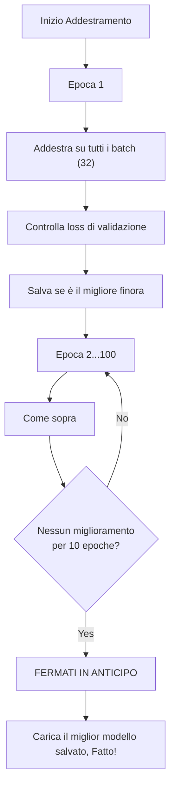

### -ModelFactory e Persistenza

**ModelFactory** (`factory.py`) fornisce un'istanziazione unificata del modello:

| Tipo Costante                    | Classe Modello          | Nome Checkpoint      | Impostazioni predefinite di fabbrica                   |
| -------------------------------- | ----------------------- | -------------------- | ------------------------------------------------------ |
| `TYPE_LEGACY` ("default")      | `TeacherRefinementNN` | `"latest"`         | `input_dim=METADATA_DIM(25)`, `output_dim=OUTPUT_DIM(25)`, `hidden_dim=HIDDEN_DIM(128)` |
| `TYPE_JEPA` ("jepa")           | `JEPACoachingModel`   | `"jepa_brain"`     | `input_dim=METADATA_DIM(25)`, `output_dim=OUTPUT_DIM(25)`       |
| `TYPE_VL_JEPA` ("vl-jepa")     | `VLJEPACoachingModel` | `"vl_jepa_brain"`  | `input_dim=METADATA_DIM(25)`, `output_dim=OUTPUT_DIM(25)`       |
| `TYPE_RAP` ("rap")             | `RAPCoachModel`       | `"rap_coach"`      | `metadata_dim=METADATA_DIM(25)`, `output_dim=10`   |
| `TYPE_ROLE_HEAD` ("role_head") | `NeuralRoleHead`      | `"role_head"`      | `input_dim=5`, `hidden_dim=32`, `output_dim=5`     |

> **Nota (P1-08):** In una versione precedente, la factory utilizzava `output_dim=4` e `hidden_dim=64` per i modelli legacy, creando un disallineamento con `CoachNNConfig`. Questo è stato corretto: ora `OUTPUT_DIM = METADATA_DIM = 25` e `HIDDEN_DIM = 128` sono allineati sia in `config.py` che in `factory.py`. Il modello RAP mantiene `output_dim=10` (10 probabilità di consiglio). Il modello RAP viene importato dal percorso canonico `backend/nn/experimental/rap_coach/model.py` (il vecchio `backend/nn/rap_coach/model.py` è uno shim di reindirizzamento).
>
> **StaleCheckpointError:** Se le dimensioni di un checkpoint salvato non corrispondono alla configurazione corrente del modello (ad esempio dopo un aggiornamento da `output_dim=4` a `output_dim=25`), il sistema solleva `StaleCheckpointError` anziché caricare silenziosamente pesi incompatibili, prevenendo corruzioni silenziose.

> **Analogia:** La ModelFactory è come una **fabbrica di giocattoli** che può costruire cinque diversi tipi di robot. Gli dici "Voglio un robot JEPA" o "Mi serve un robot role_head" e lui sa esattamente quali parti usare e come assemblarlo. Ogni robot ha un'etichetta con il nome (nome del checkpoint) in modo da poterlo trovare in seguito sullo scaffale. Invece di ricordare come è costruito ogni robot, ti basta dire alla fabbrica "costruiscimi un jepa" e lei si occuperà di tutto.

**Persistenza** (`persistence.py`): Salva/carica con `weights_only=True` (sicurezza), catena di fallback elegante (specifica dell'utente → globale → salta), gestione delle dimensioni non corrispondenti.

> **Analogia:** La persistenza è come **salvare i progressi di un videogioco**. Dopo l'addestramento, lo "stato cerebrale" del modello (tutti i pesi appresi) viene salvato in un file `.pt`. Quando riavvii l'app, carica il cervello salvato invece di ripartire da zero. Il flag `weights_only=True` è una misura di sicurezza, come caricare solo i file di salvataggio creati da te, non quelli casuali presi da internet che potrebbero contenere virus. La catena di fallback significa: "Per prima cosa, prova a caricare il TUO cervello salvato personale. Se non esiste, prova quello predefinito. Se nemmeno quello esiste, ricomincia da capo". E se la forma del cervello cambia (ad esempio aggiungendo nuove funzionalità), gestisce la discrepanza in modo fluido invece di bloccarsi.

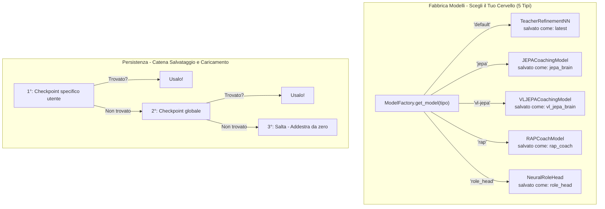

### -Configurazione (`config.py`)

```python
GLOBAL_SEED = 42                    # Riproducibilità globale (AR-6, P1-02)
INPUT_DIM = METADATA_DIM = 25      # Vettore canonico a 25 dimensioni (era 19, era legacy 12)
OUTPUT_DIM = METADATA_DIM = 25     # P1-08: Allineato con METADATA_DIM (era 4, conflitto corretto)
HIDDEN_DIM = 128                   # Dimensione nascosta per AdvancedCoachNN / TeacherRefinementNN
BATCH_SIZE = 32
LEARNING_RATE = 0.001
EPOCHS = 50
RAP_POSITION_SCALE = 500.0         # P9-01: Fattore di scala per delta posizione ([-1,1] → unità mondo)
```

> **Nota:** `INPUT_DIM` è importato da `feature_engineering/__init__.py` dove `METADATA_DIM = 25`. `OUTPUT_DIM` è ora allineato a `METADATA_DIM = 25` (correzione P1-08 — precedentemente era 4, creando un conflitto con il modello). `RAP_POSITION_SCALE = 500.0` è il fattore canonico per convertire gli output normalizzati del modello RAP in spostamenti nelle unità mondo CS2.

> **Analogia:** Questa è la **pagina delle impostazioni** per il cervello dell'IA. Proprio come un videogioco ha impostazioni per volume, luminosità e difficoltà, la rete neurale ha impostazioni per quante feature leggere (25), quanti punteggi produrre (25 per il modello base — uno per ogni feature — e 10 per RAP), quanti esempi studiare contemporaneamente (32 — la dimensione del batch), quanto velocemente apprende (0.001 — la velocità di apprendimento, come il selettore di velocità su un tapis roulant) e quante volte rivedere tutti i dati (50 epoche). Il `GLOBAL_SEED = 42` garantisce che ogni esecuzione di addestramento sia riproducibile — stesso seme, stessi risultati — tramite `set_global_seed()` che imposta random, numpy, torch e CUDA. Queste impostazioni sono scelte con cura: un apprendimento troppo rapido fa sì che il modello "vada oltre" e non si stabilizzi mai; troppo lento, ci vuole un'eternità.

**Gestione dispositivi:** `get_device()` implementa una **selezione GPU intelligente a 3 livelli**:

1. **Override utente:** Se configurato `CUDA_DEVICE` (es. "cuda:0" o "cpu"), usa quello
2. **GPU discreta automatica:** `_select_best_cuda_device()` enumera tutti i dispositivi CUDA e seleziona quello con più VRAM, **penalizzando le GPU integrate** (Intel UHD, Iris) tramite keyword matching. Su sistemi multi-GPU (es. Intel UHD + NVIDIA GTX 1650), la GPU discreta vince sempre
3. **Fallback CPU:** Se nessuna GPU CUDA è disponibile

Dimensionamento batch basato sull'intensità ML: `Alto=128`, `Medio=32`, `Basso=8`. Il ritardo di throttling tra batch si adatta: `Alto=0.0s`, `Medio=0.05s`, `Basso=0.2s`.

> **Analogia:** Il gestore dispositivi verifica: "Ho un motore turbo (GPU/CUDA) disponibile o devo usare il motore standard (CPU)?". La nuova logica di selezione è come un **concierge di noleggio auto** che, quando ci sono più auto disponibili (multiple GPU), sceglie automaticamente quella più potente e ignora le utilitarie. Se hai una GTX 1650 e una Intel UHD integrata, il sistema sa che la GTX è la "sportiva" e la sceglie. In caso contrario, passa alla CPU, che è più lenta ma comunque funzionante.

### -NeuralRoleHead (MLP per la classificazione dei ruoli)

Definito in `role_head.py` (~309 righe). Un MLP leggero che prevede le probabilità di ruolo dei giocatori in base a 5 parametri di stile di gioco, operando come **opinione secondaria** insieme all'euristica `RoleClassifier`. La logica di consenso in `role_classifier.py` unisce entrambe le opinioni per produrre la classificazione finale.

> **Analogia:** NeuralRoleHead è come un **quiz a sorpresa**: pone solo 5 domande su come giochi ("Quanto spesso sopravvivi ai round?", "Quanto spesso ottieni la prima uccisione?", "Quanto spesso le tue morti vengono scambiate?", "Quanto sei influente?", "Quanto sei aggressivo?") e indovina istantaneamente il tuo ruolo in meno di un millisecondo. Funziona insieme al normale classificatore di ruoli (che utilizza regole di soglia), come due insegnanti che valutano lo stesso studente in modo indipendente, per poi confrontare le loro valutazioni. Se entrambi sono d'accordo, la fiducia aumenta. In caso di disaccordo, l'opinione neurale vince se è chiaramente più sicura.

**Architettura:**

```
Input (5 caratteristiche) → Linear(5, 32) → LayerNorm(32) → ReLU
→ Linear(32, 16) → ReLU
→ Linear(16, 5) → Softmax → 5 probabilità di ruolo
```

~750 parametri apprendibili. Costo di calcolo minimo, adatto per l'inferenza per partita.

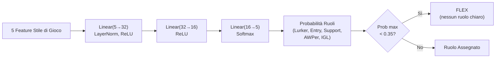

**Caratteristiche di input (5 dimensioni):**

| \# | Caratteristica   | Sorgente                            | Intervallo | Significato                                                       |
| -- | ---------------- | ----------------------------------- | ---------- | ----------------------------------------------------------------- |
| 0  | TAPD             | `rounds_survived / rounds_played` | [0, 1]     | Tasso di sopravvivenza — più alto = più passivo/di supporto    |
| 1  | OAP              | `entry_frags / rounds_played`     | [0, 1]     | Aggressività iniziale — più alta = fragger in entrata          |
| 2  | PODT             | `was_traded_ratio`                | [0, 1]     | Percentuale di morti scambiate — più alta = scambiate/innescate |
| 3  | rating_impact    | `impact_rating` o HLTV 2.0        | float      | Impatto complessivo sui round                                     |
| 4  | aggression_score | `positional_aggression_score`     | float      | Tendenza alla posizione avanzata                                  |

**Ruoli di output (softmax a 5 dimensioni):**

| Indice | Ruolo         | Descrizione                                          |
| ------ | ------------- | ---------------------------------------------------- |
| 0      | LURKER        | Si nasconde dietro le linee nemiche                  |
| 1      | ENTRY_FRAGGER | Primo ad entrare, affronta i duelli iniziali         |
| 2      | SUPPORT       | Ancoraggio del sito, utilizzo delle utilità, scambi |
| 3      | AWPER         | Specialista cecchino                                 |
| 4      | IGL           | Leader in gioco, responsabile tattico                |

**Soglia FLEX:** Se `max(probabilità) < 0,35`, il giocatore è classificato come **FLEX** (versatile, nessun ruolo dominante). Questo impedisce al modello di forzare un ruolo quando il giocatore è davvero un generalista.

**Dettagli addestramento:**

| Aspetto                               | Valore                                                                                                  |
| ------------------------------------- | ------------------------------------------------------------------------------------------------------- |
| **Sconfitta**                   | `KLDivLoss(reduction="batchmean")` sulle previsioni log-softmax rispetto ai target soft label         |
| **Smussamento delle etichette** | ε = 0,02 (impedisce log(0), aggiunge la regolarizzazione)                                              |
| **Ottimizzatore**               | AdamW (lr=1e-3, weight_decay=1e-4)                                                                      |
| **Arresto anticipato**          | Pazienza = 15 epoche sulla perdita di convalida                                                         |
| **Epoche massime**              | 200                                                                                                     |
| **Suddivisione Train/Val**      | 80/20 casuale (dati trasversali, non sequenziali)                                                       |
| **Campioni minimi**             | 20 (dalla tabella `Ext_PlayerPlaystyle`)                                                              |
| **Fonte dati**                  | `cs2_playstyle_roles_2024.csv` → Tabella DB `Ext_PlayerPlaystyle`                                  |
| **Normalizzazione**             | Media/std per funzionalità calcolata al momento dell'addestramento, salvata in `role_head_norm.json` |

**Consenso con classificatore euristico** (`role_classifier.py`):

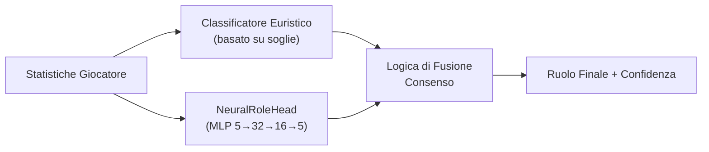

- **Entrambi d'accordo** → fiducia aumentata di +0,10
- **In disaccordo, margine neurale > 0,1** → vince l'opinione neurale
- **In disaccordo, margine neurale ≤ 0,1** → vince l'opinione euristica
- **Neural non disponibile** (nessun checkpoint o norm_stats) → solo euristica
- **Protezione cold-start** → restituisce FLEX con 0% di confidenza se le soglie non sono state apprese

### -Coach Introspection Observatory

**File:** `training_callbacks.py`, `tensorboard_callback.py`, `maturity_observatory.py`, `embedding_projector.py`

L'Osservatorio è un'**architettura di plugin a 4 livelli** che strumenta il ciclo di addestramento senza modificare il codice di addestramento principale. Monitora i segnali neurali dell'allenatore durante l'allenamento e li traduce in stati di maturità interpretabili dall'uomo, consentendo a sviluppatori e operatori di capire se il modello è confuso, in fase di apprendimento o pronto per la produzione.

> **Analogia:** L'Osservatorio è come un **sistema di pagelle per il cervello dell'allenatore**. Mentre l'allenatore studia (allenamento), l'Osservatorio verifica costantemente: "Questo cervello è confuso (DUBBIO)? Ha semplicemente dimenticato tutto ciò che ha imparato (CRISI)? Sta diventando più intelligente (APPRENDIMENTO)? Sta prendendo decisioni giuste con sicurezza (CONVINZIONE)? È completamente maturo (MATURO)?" È come avere un consulente scolastico che controlla i voti, la coerenza nei compiti, i punteggi dei test e il comportamento dello studente, e scrive un rapporto di sintesi dopo ogni lezione. Se la penna del consulente si rompe (errore di callback), questi si limita a scrollare le spalle e ad andare avanti: lo studente continua a studiare senza interruzioni.

**Architettura a 4 livelli:**

| Livello                  | File                        | Scopo                                  | Output chiave                                                                         |
| ------------------------ | --------------------------- | -------------------------------------- | ------------------------------------------------------------------------------------- |
| 1.**Callback ABC** | `training_callbacks.py`   | Interfaccia plugin + registro dispatch | `TrainingCallback` ABC, `CallbackRegistry.fire()`                                 |
| 2.**TensorBoard**  | `tensorboard_callback.py` | Registrazione scalare + istogramma     | Oltre 9 segnali scalari, istogrammi parametri/grad, istogrammi gate/credenza/concetto |
| 3.**Maturità**    | `maturity_observatory.py` | Macchina a stati di convinzione        | 5 segnali →`conviction_index` → 5 stati di maturità                              |
| 4.**Embedding**    | `embedding_projector.py`  | Proiezione credenza/concetto UMAP      | Figure UMAP 2D interattive (degrado graduale se umap-learn non è installato)         |

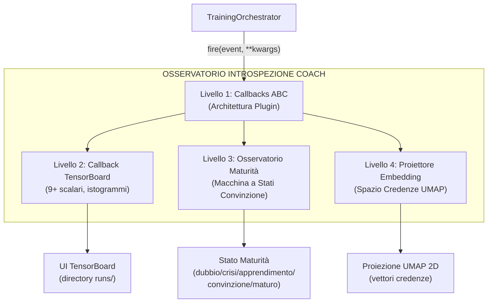

**Maturity State Machine:**

Il `MaturityObservatory` calcola un **indice di convinzione** composito da 5 segnali neurali, lo livella con EMA (α=0,3) e classifica il modello in uno dei 5 stati di maturità:

```mermaid
stateDiagram-v2
    [*] --> DUBBIO
    DUBBIO --> APPRENDIMENTO : convinzione > 0.3 & in aumento
    DUBBIO --> CRISI : era sicuro, caduta > 20%
    APPRENDIMENTO --> CONVINZIONE : convinzione > 0.6, std < 0.05 per 10 epoche
    APPRENDIMENTO --> DUBBIO : convinzione scende sotto 0.3
    APPRENDIMENTO --> CRISI : caduta 20% dal max mobile
    CONVINZIONE --> MATURO : convinzione > 0.75, stabile 20+ epoche,\nvalue_accuracy > 0.7, gate_spec > 0.5
    CONVINZIONE --> CRISI : caduta 20% dal max mobile
    MATURO --> CRISI : caduta 20% dal max mobile
    CRISI --> APPRENDIMENTO : convinzione recupera > 0.3
    CRISI --> DUBBIO : convinzione rimane < 0.3
```

**5 Segnali di Maturità:**

| Segnale                 | Peso | Intervallo | Cosa Misura                                                                     | Fonte                                        |
| ----------------------- | ---- | ---------- | ------------------------------------------------------------------------------- | -------------------------------------------- |
| `belief_entropy`      | 0,25 | [0, 1]     | Entropia di Shannon del vettore di credenza a 64 dim (più basso = più sicuro) | `model._last_belief_batch`                 |
| `gate_specialization` | 0,25 | [0, 1]     | `1 - mean_gate_activation` (più alto = esperti più specializzati)           | `SuperpositionLayer.get_gate_statistics()` |
| `concept_focus`       | 0,20 | [0, 1]     | `1 - entropy(concept_embedding_norms)` (entropia più bassa = focalizzato)    | `model.concept_embeddings`                 |
| `value_accuracy`      | 0,20 | [0, 1]     | `1 - (val_loss / initial_val_loss)` (più alto = migliore calibrazione)       | Ciclo di convalida                           |
| `role_stability`      | 0,10 | [0, 1]     | Coerenza della convinzione nelle epoche recenti (`1 - std*5`)                 | Cronologia autoreferenziale                  |

**Formula di convinzione:**

```
indice_convinzione = 0,25 × (1 - entropia_credenza)
+ 0,25 × specializzazione_gate
+ 0,20 × focus_concetto
+ 0,20 × accuratezza_valore
+ 0,10 × stabilità_ruolo

punteggio_maturità = EMA(indice_convinzione, α=0,3)
```

**Soglie di stato:**

| Stato                   | Condizione                                                                                                  |
| ----------------------- | ----------------------------------------------------------------------------------------------------------- |
| **DUBBIO**        | `conviction < 0,3`                                                                                        |
| **CRISI**         | `conviction` scende > 20% dal massimo mobile entro 5 epoche                                               |
| **APPRENDIMENTO** | `conviction ∈ [0,3, 0,6]` e in aumento                                                                   |
| **CONVICTION**    | `conviction > 0,6`, stabile (`std < 0,05` su 10 epoche)                                                 |
| **MATURE**        | `conviction > 0,75`, stabile per oltre 20 epoche, `value_accuracy > 0,7`, `gate_specialization > 0,5` |

**`MaturitySnapshot` dataclass:** Ogni epoca, l'Osservatorio produce un'istantanea immutabile:

| Campo | Tipo | Descrizione |
|---|---|---|
| `epoch` | int | Numero dell'epoca |
| `timestamp` | datetime | Momento della registrazione |
| `belief_entropy` | float | Entropia di Shannon del vettore credenze |
| `gate_specialization` | float | Specializzazione degli esperti |
| `concept_focus` | float | Focalizzazione sui concetti di coaching |
| `value_accuracy` | float | Accuratezza delle predizioni di valore |
| `role_stability` | float | Stabilità della classificazione dei ruoli |
| `conviction_index` | float | Indice composito pesato |
| `maturity_score` | float | Punteggio EMA livellato (α=0.3) |
| `state` | str | Stato corrente (DUBBIO/CRISI/APPRENDIMENTO/CONVINZIONE/MATURO) |

**Estrazione dei 5 segnali neurali — come vengono calcolati:**

| Segnale | Metodo | Fonte dati | Calcolo |
|---|---|---|---|
| `belief_entropy` | `_compute_belief_entropy()` | `model._last_belief_batch` | softmax(belief) → Shannon entropy / log(dim) → 1 - normalizzata |
| `gate_specialization` | `_compute_gate_specialization()` | `strategy.superposition.get_gate_statistics()` | `1 - mean_activation` (più alto = esperti più specializzati) |
| `concept_focus` | `_compute_concept_focus()` | `model.concept_embeddings.weight` | norme L2 → softmax → `1 - entropy` (più basso = più focalizzato) |
| `value_accuracy` | `_compute_value_accuracy()` | Ciclo di validazione | `1 - (val_loss / initial_val_loss)`, clamped [0, 1] |
| `role_stability` | `_compute_role_stability()` | Cronologia recente | `1 - std(ultimi 10 conviction_index) × 5`, clamped [0, 1] |

**API pubblica:** `current_state` (proprietà → stringa stato), `current_conviction` (proprietà → float), `get_timeline()` (→ lista di `MaturitySnapshot` per esportazione/grafici).

**Integrazione TensorBoard:** Ogni `on_epoch_end()` registra **7 scalari** su TensorBoard:

```
maturity/belief_entropy, maturity/gate_specialization, maturity/concept_focus,
maturity/value_accuracy, maturity/role_stability,
maturity/conviction_index, maturity/maturity_score
```

Più un log testuale dello stato corrente via logger strutturato.

> **Analogia estesa:** Ogni segnale misura un aspetto diverso della "salute mentale" del modello. L'`entropia delle credenze` è come chiedere "Il tuo cervello è sicuro o confuso?". La `specializzazione del gate` è "I tuoi esperti hanno ruoli chiari o fanno tutti la stessa cosa?". Il `focus sui concetti` è "Stai usando i 16 vocaboli di coaching in modo distinto o li confondi?". L'`accuratezza del valore` è "Le tue stime di vantaggio corrispondono alla realtà?". La `stabilità dei ruoli` è "Cambi continuamente idea o sei coerente?". L'indice di convinzione combina tutto questo in un unico "voto di salute" e l'EMA lo livella per evitare oscillazioni — come un medico che non si allarma per un singolo battito anomalo ma guarda la tendenza.

**Garanzie di progettazione:**

- **Impatto zero se disabilitato:** Quando non vengono registrate callback, tutte le chiamate `CallbackRegistry.fire()` sono no-op. Nessuna allocazione di memoria, nessun overhead di calcolo.
- **Isolamento degli errori:** Ogni callback è sottoposto individualmente a try/except-wrapping. Un errore di scrittura di TensorBoard o di calcolo UMAP non causa mai l'arresto anomalo del ciclo di training: l'errore viene registrato e il training continua.
- **Componibile:** È possibile aggiungere nuove callback sottoclassando `TrainingCallback` e registrandosi con `CallbackRegistry.add()`. Non è necessario modificare il codice di training.

**Integrazione CLI:** Avviato tramite `run_full_training_cycle.py` con i flag:

- `--no-tensorboard` — disabilita il callback di TensorBoard
- `--tb-logdir <percorso>` — imposta la directory di log di TensorBoard (predefinito: `runs/`)
- `--umap-interval <N>` — proiezione UMAP ogni N epoche (predefinito: 10)

---

## Riepilogo della Parte 1A — Il Cervello

La Parte 1A ha documentato il **nucleo cognitivo** del sistema di coaching — l'intero sottosistema di reti neurali che costituisce il "cervello" del coach:

| Componente | Ruolo | Dettagli Chiave |
|---|---|---|
| **AdvancedCoachNN** | Coaching supervisionato base | LSTM a 2 livelli + 3 esperti MoE, input/output 25-dim |
| **JEPA** | Pre-addestramento auto-supervisionato | Encoder online/target (EMA τ=0.996), InfoNCE contrastivo |
| **VL-JEPA** | Allineamento visione-linguaggio | 16 concetti di coaching in 5 dimensioni tattiche |
| **SuperpositionLayer** | Gating contestuale | Modulazione dipendente dal contesto 25-dim con osservabilità integrata |
| **CoachTrainingManager** | Orchestrazione addestramento | 3 livelli di maturità (CALIBRAZIONE→APPRENDIMENTO→MATURO) |
| **TrainingOrchestrator** | Ciclo di epoche unificato | Early stopping, checkpoint, integrazione callback |
| **ModelFactory** | Istanziazione modelli | 5 tipi di modello con persistenza e fallback |
| **NeuralRoleHead** | Classificazione ruoli | MLP 5→32→16→5, consenso con euristica |
| **MaturityObservatory** | Introspezione addestramento | 5 segnali → indice di convinzione → 5 stati di maturità |

> **Analogia:** Se il sistema di coaching fosse un **essere umano**, la Parte 1A ha descritto il suo cervello — le reti neurali che imparano, il sistema di valutazione della maturità che decide quando il cervello è pronto a dare consigli, e la fabbrica che costruisce e salva ogni tipo di cervello. Ma un cervello da solo non basta: ha bisogno di **occhi e orecchie** per percepire il mondo e di uno **specialista medico** per diagnosi approfondite. La **Parte 1B** documenta proprio questo.

```mermaid
flowchart LR
    subgraph PARTE1A["PARTE 1A — Il Cervello (questo documento)"]
        NN["Core NN<br/>(JEPA, VL-JEPA,<br/>AdvancedCoachNN)"]
        OBS["Osservatorio<br/>(TensorBoard + Maturità<br/>+ Embedding)"]
        FACTORY["ModelFactory +<br/>Persistenza"]
    end
    subgraph PARTE1B["PARTE 1B — I Sensi e lo Specialista"]
        RAP["RAP Coach<br/>(7 componenti +<br/>ChronovisorScanner +<br/>GhostEngine)"]
        DS["Sorgenti Dati<br/>(Demo, HLTV, Steam,<br/>FACEIT, TensorFactory,<br/>FrameBuffer, FAISS)"]
    end
    subgraph PARTE2["PARTE 2 — Servizi e Infrastruttura"]
        SVC["Servizi di Coaching<br/>(fallback 4 livelli)"]
        ANL["Motori di Analisi<br/>(10 specialisti)"]
        KB["Conoscenza<br/>(RAG + COPER)"]
        DB["Database<br/>(Tri-Tier SQLite)"]
    end

    DS --> NN
    DS --> RAP
    NN --> SVC
    RAP --> SVC
    OBS --> NN
    FACTORY --> NN
    ANL --> SVC
    KB --> SVC
    SVC --> DB

    style PARTE1A fill:#e8f4f8
    style PARTE1B fill:#fff3e0
    style PARTE2 fill:#f0f8e8
```

> **Continua nella Parte 1B** — *I Sensi e lo Specialista: RAP Coach Model, ChronovisorScanner, GhostEngine, Sorgenti Dati (Demo Parser, HLTV, Steam, FACEIT, TensorFactory, FrameBuffer, FAISS, Round Context)*
