## 9. Schema del database e ciclo di vita dei dati

Il progetto utilizza **SQLModel** (Pydantic + SQLAlchemy) con SQLite (modalità WAL) e un'**architettura dual-database** specializzata. 19 tabelle SQLModel principali distribuite su 2 database:

1. **`database.db`** — Database monolite principale dell'applicazione (16 tabelle). Contiene tutte le tabelle core: statistiche giocatori, stato del coach, task di ingestione, insight di coaching, profili utente, notifiche di sistema, base RAG (`TacticalKnowledge`), banca esperienze COPER (`CoachingExperience`), risultati partite, calibrazioni e soglie di ruolo.
2. **`hltv_metadata.db`** — Database dei metadati professionali (3 tabelle). Contiene i profili dei giocatori pro (`ProPlayer`, `ProTeam`) e le schede statistiche (`ProPlayerStatCard`). Separato dal monolite perché viene scritto da un processo separato (HLTV sync service) per eliminare la contesa WAL con i daemon del session engine.

Questa separazione garantisce che le operazioni di scrittura intensive del session engine (ingestione demo, addestramento ML → `database.db`) non contendano lock WAL con lo scraping HLTV in processo separato (`hltv_metadata.db`).

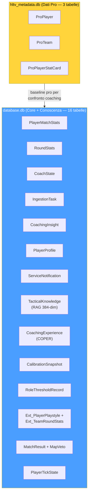

> **Analogia:** Il database è l'**archivio** del sistema: ogni informazione ha un cassetto e una cartella specifici. L'architettura dual-database è come avere **due archivi specializzati**: l'archivio principale (dati del gioco, conoscenze tattiche, esperienze di coaching — tutto in un unico grande schedario WAL) e lo schedario dei professionisti (dati HLTV, aggiornato da un processo separato per evitare contesa). Separandoli, il processo principale può scrivere e leggere dall'archivio generale mentre il servizio HLTV aggiorna lo schedario dei pro senza bloccarsi a vicenda. SQLite in modalità WAL consente a più programmi di leggere ciascun archivio contemporaneamente. SQLModel combina Pydantic (per la convalida dei dati: "assicurati che il campo età sia effettivamente un numero") con SQLAlchemy (per le operazioni sul database: "salva questo nella tabella giusta"). Le 19 tabelle sono organizzate come l'archivio scolastico: profili degli studenti, punteggi dei test, appunti di classe, valutazioni degli insegnanti e libri della biblioteca.

```mermaid
erDiagram
    PlayerMatchStats ||--o{ RoundStats : "demo_name"
    PlayerMatchStats ||--o{ PlayerTickState : "demo_name, player_name"
    PlayerMatchStats ||--o{ CoachingInsight : "player_name, demo_name"
    PlayerMatchStats }o--o| ProPlayer : "pro_player_id → hltv_id"
    ProPlayer }o--|| ProTeam : "team_id → hltv_id"
    ProPlayer ||--o{ ProPlayerStatCard : "player_id → hltv_id"
    MatchResult ||--o{ MapVeto : "match_id"
    MatchResult ||--o{ PlayerTickState : "match_id"
    CoachingExperience }o--o| MatchResult : "pro_match_id → match_id"

    PlayerMatchStats {
        int id PK
        string player_name "indexed"
        string demo_name "unique per player"
        float rating "0.0 - 5.0"
        string dataset_split "train/val/test"
        int pro_player_id FK
        bool is_pro
    }
    RoundStats {
        int id PK
        string demo_name "indexed"
        int round_number "indexed"
        string player_name "indexed"
        int kills
        float round_rating
    }
    PlayerTickState {
        int id PK
        int match_id FK
        int tick "128 Hz"
        string demo_name "indexed"
        string player_name "indexed"
        float pos_x
        float pos_y
    }
    CoachingInsight {
        int id PK
        string player_name "indexed"
        string demo_name "indexed"
        string title
        string severity
        string focus_area
    }
    CoachingExperience {
        int id PK
        string context_hash "indexed"
        string map_name "indexed"
        string action_taken
        string outcome "indexed"
        string embedding "384-dim JSON"
        int pro_match_id FK
    }
    TacticalKnowledge {
        int id PK
        string title "indexed"
        string category "indexed"
        string embedding "384-dim JSON"
        int usage_count
    }
    ProPlayer {
        int id PK
        int hltv_id "unique indexed"
        string nickname "indexed"
        int team_id FK
    }
    ProTeam {
        int id PK
        int hltv_id "unique indexed"
        string name "indexed"
        int world_rank
    }
    ProPlayerStatCard {
        int id PK
        int player_id FK
        float rating_2_0
        float adr
        string time_span
    }
    MatchResult {
        int match_id PK
        string event_name "indexed"
        int team_a_id
        int winner_id
    }
    MapVeto {
        int id PK
        int match_id FK
        string map_name
        string action
    }
    PlayerProfile {
        int id PK
        string player_name "unique indexed"
        string role
        string bio
    }
    CoachState {
        int id PK
        string status "Paused/Training/Idle/Error"
        float belief_confidence
        string detail
    }
    ServiceNotification {
        int id PK
        string daemon "indexed"
        string severity
        string message
    }
    IngestionTask {
        int id PK
        string demo_path "unique indexed"
        string status "queued/processing/completed/failed"
        int retry_count
    }
    Ext_PlayerPlaystyle {
        int id PK
        string player_name "indexed"
        string assigned_role
        float rating_impact
    }
    Ext_TeamRoundStats {
        int id PK
        int match_id "indexed"
        string team_name "indexed"
        string map_name
    }
    CalibrationSnapshot {
        int id PK
        string calibration_type "indexed"
        string parameters_json
        int sample_count
    }
    RoleThresholdRecord {
        int id PK
        string stat_name "unique indexed"
        float value
        int sample_count
    }
```

> **Spiegazione del diagramma ER:** Ogni riquadro rappresenta un **tipo di record** nel database. `PlayerMatchStats` è come una **pagella** per ogni giocatore in ogni partita (quante uccisioni, morti, la loro valutazione, ecc.). `PlayerTickState` è come un **diario fotogramma per fotogramma**: 128 voci al secondo che registrano esattamente dove si trovava il giocatore, quanto era in salute, in che direzione stava guardando. `RoundStats` è la **scomposizione per domanda**: valutazioni individuali per ogni round (uccisioni, morti, danni, uccisioni noscope, assist flash, valutazione del round), consentendo analisi dettagliate. `CoachingExperience` è il **diario** dell'allenatore: ogni momento di allenamento, se i consigli hanno funzionato e quanto sono stati efficaci. `CoachingInsight` è il **consiglio effettivo** fornito al giocatore. `TacticalKnowledge` è il **libro di testo**: suggerimenti e strategie che l'allenatore può consultare. `RoleThresholdRecord` è la **rubrica di valutazione**, ovvero le soglie apprese per classificare i ruoli dei giocatori. `CalibrationSnapshot` è il **registro di controllo dello strumento**, che registra quando il modello di credenza è stato ricalibrato e con quanti campioni. `Ext_PlayerPlaystyle` è il **report di scouting esterno**, ovvero le metriche dello stile di gioco ricavate dai dati CSV utilizzati per addestrare NeuralRoleHead. `ServiceNotification` è il **sistema di interfono**, ovvero i messaggi di errore ed evento provenienti dai daemon in background mostrati nell'interfaccia utente. Le linee tra le tabelle mostrano le relazioni: ogni record di partita è collegato al profilo di un giocatore, le esperienze di allenamento sono collegate a partite specifiche e RoundStats è collegato a PlayerMatchStats tramite demo_name.

**Ciclo di vita dei dati:**

| Fase                                | Tabelle scritte                                                                   | Volume                                 |
| ----------------------------------- | --------------------------------------------------------------------------------- | -------------------------------------- |
| Inserimento demo                    | `PlayerMatchStats`, `PlayerTickState`, `MatchMetadata`                      | ~100.000 tick/partita                  |
| Arricchimento round                 | `RoundStats` (isolamento per round, per giocatore)                              | ~30 righe/partita (round × giocatori) |
| Scansione HLTV                      | `ProPlayer`, `ProTeam`, `ProPlayerStatCard`                                 | ~500 giocatori                         |
| Importazione CSV                    | Tabelle esterne tramite `csv_migrator.py`                                       | ~10.000 righe                          |
| Dati sullo stile di gioco           | `Ext_PlayerPlaystyle` (da CSV per NeuralRoleHead)                               | ~300+ giocatori                        |
| Progettazione delle feature         | `PlayerMatchStats.dataset_split` aggiornato                                     | Sul posto                              |
| Popolazione RAG                     | `TacticalKnowledge`                                                             | ~200 articoli                          |
| Estrazione dell'esperienza          | `CoachingExperience`                                                            | ~1.000 per partita                     |
| Output di coaching                  | `CoachingInsight`                                                               | ~5-20 per partita                      |
| Apprendimento delle soglie di ruolo | `RoleThresholdRecord`                                                           | 9 soglie                               |
| Calibrazione delle convinzioni      | `CalibrationSnapshot` (dopo il riaddestramento)                                 | 1 per ogni calibrazione eseguita       |
| Telemetria di sistema               | `CoachState`, `ServiceNotification`, `IngestionTask`                        | Continuo                               |
| Backup                              | Automatizzato tramite `BackupManager` (7 rotazioni giornaliere + 4 settimanali) | Copia completa del database            |

**Indici e ottimizzazione query:**

Le tabelle più interrogate hanno indici strategici per garantire query veloci:

| Tabella | Indice | Colonne | Tipo di query ottimizzata |
| ------- | ------ | ------- | ------------------------- |
| `PlayerMatchStats` | `idx_pms_player` | `player_name` | Ricerca per giocatore |
| `PlayerMatchStats` | `idx_pms_demo` | `demo_name` | Ricerca per partita |
| `PlayerMatchStats` | `idx_pms_processed` | `processed_at` | Ordinamento cronologico |
| `RoundStats` | `idx_rs_demo_round` | `demo_name, round_number` | Ricerca per round specifico |
| `IngestionTask` | `idx_it_status` | `status` | Coda di lavoro (status=queued) |
| `CoachingInsight` | `idx_ci_player` | `player_name` | Insight per giocatore |
| `TacticalKnowledge` | `idx_tk_category` | `category` | Ricerca RAG per categoria |
| `ProPlayer` | `idx_pp_name` | `nickname` | Ricerca pro per nome |

**Vincoli di integrità:**

| Vincolo | Tabelle | Enforcement |
| ------- | ------- | ----------- |
| `player_name` NOT NULL | PlayerMatchStats, RoundStats | A livello di schema |
| `demo_name` UNIQUE per player | PlayerMatchStats | Previene duplicati |
| `status` CHECK IN ('queued', 'processing', 'completed', 'failed') | IngestionTask | Enum enforcement |
| `dataset_split` CHECK IN ('train', 'val', 'test') | PlayerMatchStats | Split validity |
| Foreign key demo_name | RoundStats → PlayerMatchStats | Relazione round-partita |

**Dettaglio tabelle chiave:**

**`PlayerMatchStats`** (32 campi) — la tabella più interrogata del sistema:

La tabella PlayerMatchStats contiene tutte le statistiche aggregate per giocatore per partita. È la "pagella" di ogni partita analizzata:

| Campo | Tipo | Descrizione |
| ----- | ---- | ----------- |
| `id` | Integer PK | Identificatore univoco |
| `player_name` | String | Nome del giocatore (indexed) |
| `demo_name` | String | Nome del file demo (unique per player) |
| `kills`, `deaths`, `assists` | Integer | KDA base |
| `adr` | Float | Average Damage per Round |
| `kast` | Float | Kill/Assist/Survive/Trade % |
| `headshot_percentage` | Float | HS% |
| `hltv_rating` | Float | Rating HLTV 2.0 calcolato |
| `dataset_split` | String | "train" / "val" / "test" |
| `is_pro` | Boolean | Flag giocatore professionista |
| `processed_at` | DateTime | Timestamp di elaborazione |
| `map_name` | String | Mappa giocata |
| ... | ... | 20+ campi aggiuntivi per feature avanzate |

**`TacticalKnowledge`** — la base RAG:

| Campo | Tipo | Descrizione |
| ----- | ---- | ----------- |
| `id` | Integer PK | Identificatore |
| `title` | String | Titolo del documento (indexed) |
| `description` | String | Descrizione del contenuto tattico |
| `category` | String | "positioning" / "economy" / "utility" / "aim" (indexed) |
| `map_name` | String | Mappa specifica (indexed, opzionale) |
| `situation` | String | Contesto situazionale: "T-side pistol round", "CT retake A site" |
| `pro_example` | String | Riferimento a demo pro (opzionale) |
| `embedding` | String | Vettore 384-dim JSON (sentence-transformers) |
| `created_at` | DateTime | Timestamp di creazione |
| `usage_count` | Integer | Contatore utilizzo |

La ricerca semantica RAG funziona calcolando la **cosine similarity** tra l'embedding della query utente e gli embedding precomputati di ogni documento. I top-3 risultati con similarity > 0.5 vengono usati per arricchire il contesto di coaching. Il campo `situation` consente il filtraggio contestuale (es. "T-side pistol round") prima della ricerca semantica.

**`CoachingExperience`** — la banca COPER (22+ campi):

| Campo | Tipo | Descrizione |
| ----- | ---- | ----------- |
| `id` | Integer PK | Identificatore |
| `context_hash` | String | Hash dello stato di gioco per lookup rapido (indexed) |
| `map_name` | String | Mappa (indexed) |
| `round_phase` | String | "pistol" / "eco" / "full_buy" / "force" |
| `side` | String | "T" / "CT" |
| `position_area` | String | "A-site" / "Mid" / etc. (indexed, opzionale) |
| `game_state_json` | String | Snapshot completo del tick (max 16KB, validato con `field_validator`) |
| `action_taken` | String | "pushed" / "held_angle" / "rotated" / "used_utility" / etc. |
| `outcome` | String | "kill" / "death" / "trade" / "objective" / "survived" (indexed) |
| `delta_win_prob` | Float | Variazione della probabilità di vittoria da questa azione |
| `confidence` | Float | Affidabilità/generalizzabilità 0.0-1.0 |
| `usage_count` | Integer | Quante volte recuperata per coaching |
| `pro_match_id` | Integer FK | Riferimento a MatchResult (ON DELETE SET NULL) |
| `pro_player_name` | String | Nome giocatore pro di riferimento (indexed, opzionale) |
| `embedding` | String | Vettore 384-dim JSON per ricerca semantica (opzionale) |
| `source_demo` | String | Demo di origine (opzionale) |
| `created_at` | DateTime | Timestamp di creazione |
| `outcome_validated` | Boolean | Se l'esito è stato validato |
| `effectiveness_score` | Float | Score -1.0 a 1.0 |
| `follow_up_match_id` | Integer | Partita di follow-up per tracking |
| `times_advice_given` | Integer | Quante volte il consiglio è stato dato |
| `times_advice_followed` | Integer | Quante volte il consiglio è stato seguito |
| `last_feedback_at` | DateTime | Ultimo feedback ricevuto |

Il sistema COPER utilizza queste esperienze per **imparare dai propri consigli**: il campo `context_hash` consente il lookup rapido di situazioni simili, `outcome` e `delta_win_prob` misurano l'efficacia dell'azione, e il ciclo di feedback (`outcome_validated`, `times_advice_given/followed`, `effectiveness_score`) consente al sistema di prioritizzare consigli che hanno storicamente prodotto risultati positivi. Il campo `game_state_json` è limitato a 16KB per prevenire crescita incontrollata del database.

> **Analogia:** Il ciclo di vita dei dati mostra **come le informazioni fluiscono attraverso il sistema nel tempo**, come il tracciamento di un pacco dalla fabbrica alla consegna. Prima arrivano le registrazioni delle partite (100.000 punti dati per partita!). Poi le statistiche dei giocatori professionisti vengono estratte da HLTV (come scaricare un almanacco sportivo). Vengono importati file CSV esterni (come ottenere dati storici). L'IA elabora tutto, genera consigli per gli allenatori, apprende le soglie di ruolo e registra costantemente lo stato di salute del sistema. I backup vengono eseguiti automaticamente: 7 copie giornaliere e 4 copie settimanali, come se salvassi i tuoi compiti sia sul computer che su un'unità USB, per ogni evenienza.

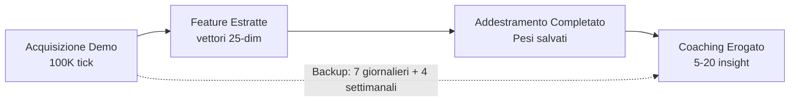

## 10. Regime di formazione e limiti di maturità

> **Analogia:** Il regime di formazione è il **curriculum scolastico completo**, dalla scuola materna al diploma. Uno studente (il modello di intelligenza artificiale) inizia con zero conoscenze e apprende gradualmente attraverso 4 fasi, sbloccando corsi più avanzati man mano che si dimostra all'altezza. I limiti di maturità sono come i **requisiti di valutazione**: non puoi sostenere l'esame di Fisica AP (Ottimizzazione RAP) finché non hai superato Matematica di base (Pre-Formazione JEPA), Algebra (Baseline Pro) e Pre-Calcolo (Fine-Tuning Utente). Ogni limite verifica: "Hai studiato abbastanza demo per essere pronto per il livello successivo?"

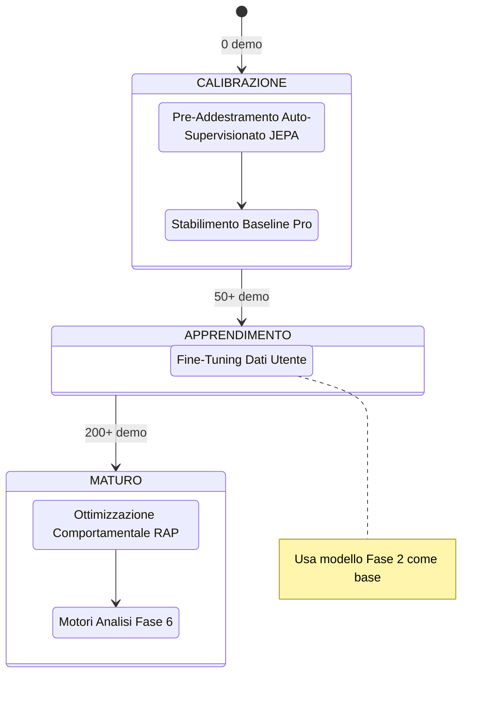

**Requisiti dati per fase:**

| Fase                       | Dati minimi               | Tipo di addestramento          | Perdita primaria                           |
| -------------------------- | ------------------------- | ------------------------------ | ------------------------------------------ |
| 1\. Pre-addestramento JEPA | 10 demo pro               | Auto-supervisionato (InfoNCE)  | Contrastivo con negativi in batch          |
| 2\. Baseline pro           | 50 corrispondenze pro     | Supervisionato                 | MSE(pred, pro_stats)                       |
| 3\. Ottimizzazione utente  | 50 corrispondenze utente  | Supervisionato (trasferimento) | MSE(pred, user_stats)                      |
| 4\. Ottimizzazione RAP     | 200 corrispondenze totali | Multi-task                     | Strategia + Valore + Sparsità + Posizione |

> **Analogia:** La fase 1 è come **guardare programmi di cucina**: il modello apprende i pattern semplicemente osservando (auto-supervisionato, senza bisogno di etichette). La fase 2 è come **una scuola di cucina con un libro di testo**: "Ecco come fa un professionista la pasta" (supervisionata con dati professionali). La fase 3 è come **cucinare per la tua famiglia**: "La tua famiglia preferisce il piccante, quindi adattiamo la ricetta" (affinando i dati degli utenti). La fase 4 è un **addestramento da chef provetto**: imparare a bilanciare contemporaneamente sapore, presentazione, tempi e nutrizione (multi-task: strategia + valore + parsimonia + posizione). Hai bisogno di almeno 10 programmi di cucina per iniziare, 50 ricette da imparare e 200 piatti in totale preparati prima di diplomarti.

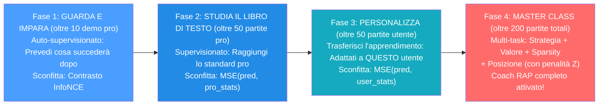

**Protocollo VL-JEPA Two-Stage (Allineamento Concetti):**

Quando il VL-JEPA è attivo, le Fasi 1-2 vengono estese con un **protocollo two-stage** che allinea le rappresentazioni latenti ai 16 coaching concepts:

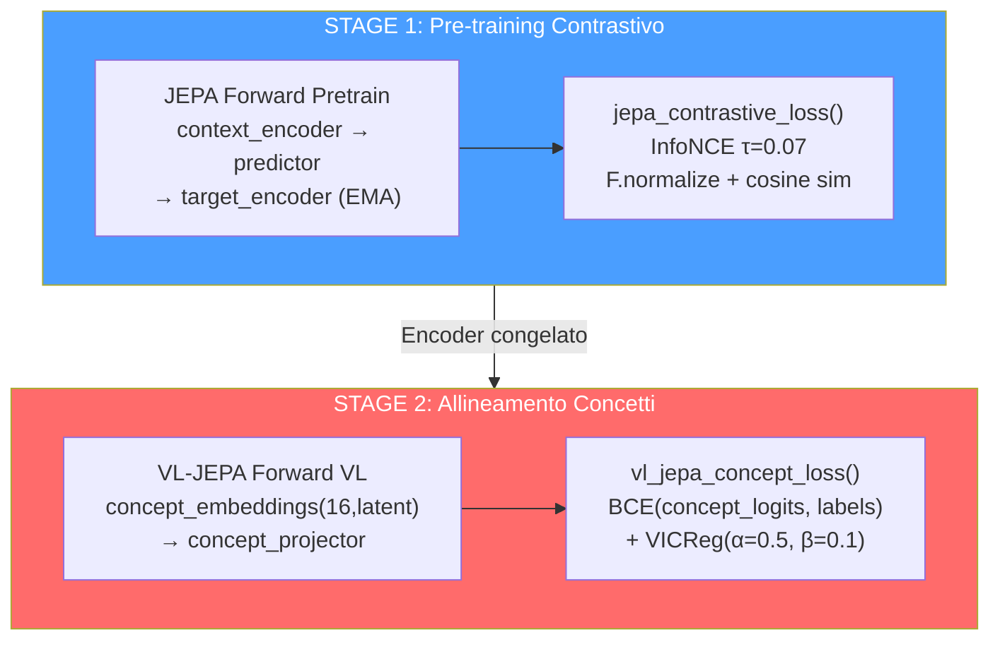

| Stage | Cosa si addestra | Cosa è congelato | Loss | Scopo |
| ----- | --------------- | ---------------- | ---- | ----- |
| 1 | Context encoder, predictor | Target encoder (EMA) | InfoNCE (τ=0.07) | Rappresentazioni latenti generali |
| 2 | Concept embeddings, concept projector, concept temperature | Encoder (opzionale fine-tuning) | BCE + VICReg diversity | Allineamento ai 16 coaching concepts |

**I 16 Coaching Concepts (tassonomia):**

| Indice | Concetto | Categoria | Descrizione |
| ------ | -------- | --------- | ----------- |
| 0 | Positioning Quality | Posizionamento | Qualità della posizione rispetto al contesto |
| 1 | Trade Readiness | Posizionamento | Prontezza al trade kill |
| 2 | Rotation Speed | Posizionamento | Velocità di rotazione tra siti |
| 3 | Utility Usage | Utility | Frequenza e qualità dell'uso granate |
| 4 | Utility Effectiveness | Utility | Efficacia delle utility usate |
| 5 | Decision Quality | Decisione | Qualità delle decisioni in-game |
| 6 | Risk Assessment | Decisione | Valutazione del rischio pre-azione |
| 7 | Engagement Timing | Ingaggio | Timing degli ingaggi |
| 8 | Engagement Distance | Ingaggio | Distanza ottimale di ingaggio |
| 9 | Crosshair Placement | Ingaggio | Posizionamento mirino pre-peek |
| 10 | Recoil Control | Ingaggio | Controllo del rinculo |
| 11 | Economy Management | Decisione | Gestione dell'economia di squadra |
| 12 | Information Gathering | Decisione | Raccolta informazioni (peek, utility info) |
| 13 | Composure Under Pressure | Psicologia | Compostezza sotto pressione |
| 14 | Aggression Control | Psicologia | Controllo dell'aggressività |
| 15 | Adaptation Speed | Psicologia | Velocità di adattamento al meta avversario |

> **Analogia dei 16 Concetti:** I 16 coaching concepts sono come le **16 materie di un curriculum scolastico completo**. Tre materie riguardano la **geografia** (posizionamento — dove ti trovi). Due riguardano la **chimica** (utility — come usi i tuoi strumenti). Cinque riguardano la **strategia** (decisione e economia — le scelte che fai). Quattro riguardano la **ginnastica** (ingaggio — le abilità fisiche: mira, rinculo, timing). Tre riguardano la **psicologia** (compostezza, aggressività, adattamento). Lo Stage 2 del VL-JEPA insegna al modello a "capire" queste 16 materie e a dare un voto a ciascuna per ogni azione del giocatore.

**AdamW + CosineAnnealing (JEPA Trainer):**

| Iperparametro | Valore | Scopo |
| ------------- | ------ | ----- |
| Optimizer | AdamW | Weight decay separato dai gradienti |
| Learning rate | 1e-4 (default) | Tasso di apprendimento iniziale |
| Weight decay | 0.01 | Regolarizzazione L2 |
| Scheduler | CosineAnnealingLR | Decadimento coseno del LR fino a 0 |
| EMA decay | 0.996 | Target encoder momentum update |
| Gradient clip | 1.0 | Prevenzione gradient explosion |

**DriftMonitor (z_threshold=2.5):**

Il `DriftMonitor` integrato nel JEPA Trainer monitora il **drift delle feature** durante il training. Se lo Z-score di una feature supera 2.5, emette un warning che indica possibile distribuzione shifting:

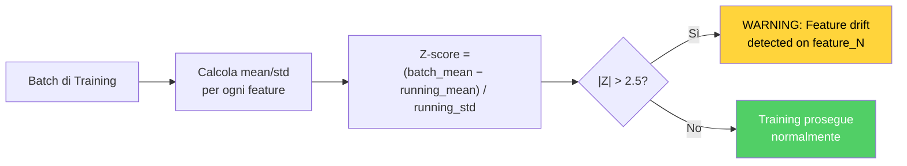

**Trigger di riaddestramento:** Il demone Teacher monitora la crescita del numero di demo professionali; attiva il riaddestramento quando `count ≥ last_count × 1,10`.

> **Analogia:** Il trigger di riaddestramento è come una **scuola che aggiorna il suo curriculum quando arrivano abbastanza nuovi libri di testo**. Il demone Teacher (un processo in background) controlla costantemente: "Quante demo professionali abbiamo ora?". Quando il numero cresce del 10% o più dall'ultimo addestramento, dice: "Abbiamo abbastanza nuovo materiale: è ora di riqualificare il modello in modo che rimanga al passo con l'evoluzione del meta professionale."

**JEPAPretrainDataset** (`jepa_train.py`):

Il dataset di pre-training JEPA utilizza **finestre temporali** per creare coppie contesto-target:

| Parametro | Valore | Scopo |
| --------- | ------ | ----- |
| `context_len` | 10 tick | Lunghezza finestra di contesto (input) |
| `target_len` | 10 tick | Lunghezza finestra target (da predire) |
| Gap | 0-5 tick (random) | Distanza variabile tra contesto e target |
| Batch size | 32 | Numero di coppie per batch |

> **Analogia del Dataset:** Il dataset di pre-training è come un **esercizio di lettura veloce**. Al modello viene mostrata una pagina del libro (10 tick di contesto) e poi gli si chiede: "Cosa c'è scritto nella pagina successiva?" (10 tick target). Il gap variabile rende l'esercizio più difficile — a volte la pagina successiva è subito dopo, a volte sono separate da qualche pagina vuota. Questo forza il modello a imparare pattern generali, non sequenze specifiche.

---

## 11. Catalogo delle funzioni di perdita

> **Analogia:** Le funzioni di perdita sono i **punteggi dei test** che l'IA cerca di minimizzare. Ogni modello ha il suo tipo di test. Un punteggio più basso significa una prestazione migliore, l'opposto dei voti scolastici! Pensa a ogni funzione di perdita come a una domanda specifica del test: "Quanto era vicina la tua previsione alla risposta corretta?" (MSE), "Hai scelto la risposta corretta tra più opzioni?" (InfoNCE/BCE), "Hai utilizzato troppe risorse?" (Scarsità). La tabella seguente è simile al **calendario completo dell'esame**: ogni test, per ogni modello, con la formula di valutazione esatta.

| Modello                   | Nome della perdita        | Formula                                                                                                                         | Scopo                                                                  |
| ------------------------- | ------------------------- | ------------------------------------------------------------------------------------------------------------------------------- | ---------------------------------------------------------------------- |
| **JEPA**            | InfoNCE Contrastive       | `−log(exp(sim(pred, target)/τ) / Σ exp(sim(pred, neg_i)/τ))`, τ=0.07, `F.normalize` prima della similarità del coseno | Allineamento delle previsioni di contesto con gli embedding del target |
| **JEPA**            | Ottimizzazione            | `MSE(coaching_head(Z_ctx), y_true)`                                                                                           | Punteggio di coaching supervisionato                                   |
| **AdvancedCoachNN** | Supervisionato            | `MSELoss(MoE_output, y_true)`                                                                                                 | Allenamento a livello di partita                                       |
| **RAP**             | Strategia                 | `MSELoss(advice_probs, target_strat)`                                                                                         | Raccomandazione tattica corretta                                       |
| **RAP**             | Valore                    | `0,5 × MSE(V(s), true_advantage)`                                                                                            | Stima accurata del vantaggio                                           |
| **RAP**             | Sparsità                 | `L1(gate_weights)`                                                                                                            | Specializzazione esperta                                               |
| **RAP**             | Posizione                 | `MSE(xy) + 2× MSE(z)`                                                                                                        | Posizionamento ottimale con penalità sull'asse Z                      |
| **WinProb**         | Previsione                | `BCEWithLogitsLoss(pred, risultato)`                                                                                          | Previsione dell'esito del round                                        |
| **NeuralRoleHead**  | KL-Divergence             | `KLDivLoss(log_softmax(pred), target)` con smoothing delle etichette ε=0,02                                                  | Corrispondenza della distribuzione di probabilità del ruolo           |
| **VL-JEPA**         | Allineamento dei concetti | `BCE(concept_logits, concept_labels)` + `VICReg(concept_diversity)`                                                         | Fondamenti del concetto di linguaggio visivo                           |

> **Analogia per le funzioni di perdita delle chiavi:** **InfoNCE** è come un test a risposta multipla: "Ecco 32 possibili risposte: qual è quella corretta?" Il modello ottiene un punteggio più alto per aver scelto quello giusto E per esserne sicuro. L'**MSE** (Errore Quadratico Medio) è come misurare la distanza della tua freccetta dal centro del bersaglio: più vicino = minore perdita. L'**BCE** (Entropia Incrociata Binaria) è come un quiz vero/falso: "La tua squadra ha vinto? Sì o no?". La **Perdita di Sparsità** è come un insegnante che dice "Usa meno parole nel tuo tema": incoraggia il modello ad attivare meno esperti, rendendolo più efficiente e interpretabile. La **Perdita di Posizione con penalità Z 2x** è come dire "mancare a sinistra o a destra è grave, ma cadere da un dirupo (dal piano sbagliato) è due volte peggio". La **KL-Divergence** è come confrontare due classifiche: "La tua classifica dei ruoli corrisponde a quella reale?" — misura quanto la distribuzione predetta si discosta da quella target.

**Dettaglio: InfoNCE Contrastive Loss (JEPA)**

L'InfoNCE è la loss principale del pre-training JEPA. Il suo scopo è allineare le predizioni del contesto con gli embedding del target, respingendo contemporaneamente i negativi (altri campioni nel batch):

```
L_InfoNCE = -log( exp(sim(pred, target⁺) / τ) / Σᵢ exp(sim(pred, targetᵢ) / τ) )
```

| Componente | Valore | Ruolo |
| ---------- | ------ | ----- |
| `sim()` | Cosine similarity dopo `F.normalize` | Misura di similarità [-1, +1] |
| `τ` (temperature) | 0.07 | Sharpness della distribuzione — valori bassi = più selettivi |
| `target⁺` | L'embedding target corretto per questo contesto | Il "positivo" — la risposta corretta |
| `targetᵢ` | Tutti gli embedding nel batch | Negativi in-batch — le risposte sbagliate |
| Batch size | 32 | Numero di negativi = batch_size - 1 = 31 |

> **Analogia InfoNCE:** Immagina di essere in una stanza con 32 persone. Ti viene mostrata una foto (contesto) e devi trovare la persona giusta (target positivo) tra le 32. La temperatura τ=0.07 è come la **nitidezza degli occhiali**: valori bassi significano occhiali molto precisi — devi essere molto sicuro della tua scelta per ottenere un buon punteggio. Valori alti significano occhiali sfocati — anche una scelta approssimativa va bene. Il τ basso del JEPA forza il modello a imparare rappresentazioni molto precise.

**Dettaglio: VL-JEPA Concept Loss (VICReg Components)**

La loss di allineamento concetti del VL-JEPA combina due componenti:

```
L_concept = BCE(concept_logits, concept_labels) + α·VICReg_diversity
```

Dove `VICReg_diversity` è composta da:

| Termine VICReg | Formula | Peso | Scopo |
| -------------- | ------- | ---- | ----- |
| **Variance** | `max(0, γ - std(z))` per ogni dimensione | α=0.5 | Previene il collasso delle rappresentazioni — ogni dimensione deve variare |
| **Covariance** | `Σᵢ≠ⱼ cov(zᵢ, zⱼ)²` | β=0.1 | Decorrelazione — ogni dimensione deve catturare informazioni diverse |

> **Analogia VICReg:** La **Variance** è come un insegnante che dice "Ognuno di voi deve avere un'opinione diversa — non copiate tutti la stessa risposta!" (previene il collasso dove tutti i concept embedding diventano identici). La **Covariance** è come dire "Ogni studente deve specializzarsi in una materia diversa — non servono 16 esperti di storia e zero di matematica!" (forza diversità tra le dimensioni). Insieme, garantiscono che i 16 concept embedding siano sia **diversi tra loro** che **significativi individualmente**.

**Dettaglio: RAP Multi-Task Loss**

Il RAP Coach combina 4 loss in una loss totale pesata:

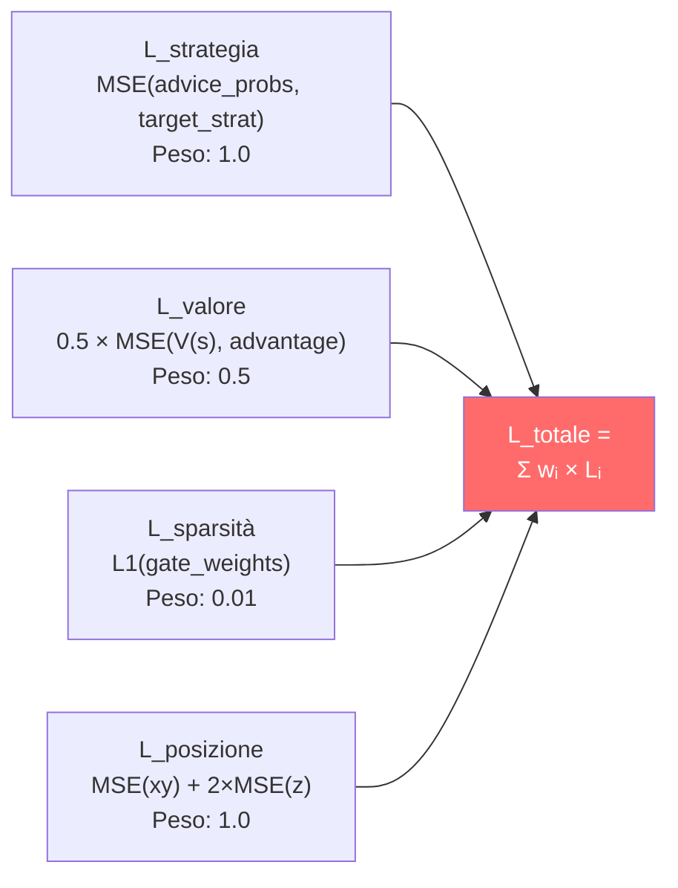

La penalità Z 2× nella loss di posizione riflette il fatto che in CS2 sbagliare il **piano** (sopra vs sotto in Nuke/Vertigo) è molto più grave che sbagliare la posizione orizzontale. Un errore di 100 unità sull'asse Z (piano sbagliato) è strategicamente catastrofico, mentre lo stesso errore su X/Y potrebbe essere irrilevante.

---

## 12. Logica Completa del Programma — Dal Lancio al Consiglio

Questo capitolo documenta la **logica completa** di Macena CS2 Analyzer, dal momento in cui l'utente lancia l'applicazione fino a quando riceve i consigli di coaching. A differenza dei capitoli precedenti che si concentrano sui sottosistemi AI, qui viene spiegato come **ogni componente del programma** lavora insieme: l'interfaccia desktop, l'architettura quad-daemon, la pipeline di ingestione, il sistema di storage, il playback tattico, l'osservabilità e il ciclo di vita dell'applicazione.

> **Analogia:** Se i capitoli 1-11 descrivono i **singoli organi** di un corpo umano (cervello, cuore, polmoni, fegato), questo capitolo descrive il **corpo intero in azione**: come si sveglia al mattino, come respira, cammina, mangia, pensa e parla. Capire gli organi è essenziale, ma capire come lavorano insieme è ciò che dà vita al sistema. Immaginate Macena CS2 Analyzer come una **piccola città**: ha un municipio (il processo principale Kivy), una centrale operativa sotterranea (il Session Engine con i suoi 4 daemon), un archivio comunale (il database SQLite), un ufficio postale (la pipeline di ingestione), una scuola (il sistema di addestramento ML), una biblioteca (il sistema di conoscenza RAG/COPER), un ospedale (il servizio di coaching) e un sistema di monitoraggio della salute pubblica (l'osservabilità). Questo capitolo vi guida attraverso ogni edificio e mostra come i cittadini (i dati) si muovono da un luogo all'altro.

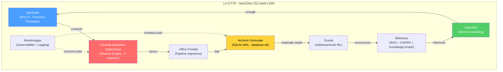

---

### 12.1 Punto di Ingresso e Sequenza di Avvio (`main.py`)

**File:** `Programma_CS2_RENAN/main.py`

Quando l'utente lancia l'applicazione, `main.py` orchestra una **sequenza di avvio a 9 fasi** rigorosamente ordinata. Ogni fase deve completarsi con successo prima che la successiva possa iniziare. Se una fase critica fallisce, l'applicazione termina con un messaggio esplicito — mai silenziosamente.

> **Analogia:** L'avvio del programma è come la **checklist di pre-volo di un aereo**. Prima che l'aereo possa decollare, il pilota (main.py) deve completare una serie di controlli in ordine: verificare l'integrità della fusoliera (audit RASP), impostare gli strumenti (configurazione percorsi), controllare il carburante (migrazione database), accendere i motori (inizializzazione Kivy), caricare i passeggeri (registrazione schermate), attivare il pilota automatico (lancio daemon) e infine decollare (mostrare l'interfaccia). Se un controllo fallisce — ad esempio il carburante è insufficiente (database corrotto) — il volo viene cancellato, non si prova a decollare sperando che vada bene.

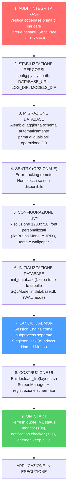

**Dettagli delle fasi critiche:**

| Fase | Componente | Cosa fa | Conseguenza del fallimento |
| ---- | ---------- | ------- | -------------------------- |
| 1 | `integrity.py` (RASP) | Verifica hash dei file sorgente contro il manifesto | Terminazione immediata — possibile manomissione |
| 2 | `config.py` | Stabilizza `sys.path`, definisce tutte le costanti di percorso | Errori di importazione in cascata |
| 3 | `db_migrate.py` | Esegue migrazioni Alembic pendenti | Schema incompatibile — crash su operazioni DB |
| 5 | Kivy `Config` | Imposta `KIVY_NO_CONSOLELOG`, registra font, carica `.kv` | UI non renderizzabile |
| 6 | `database.py` | `create_all()` su engine SQLite con `check_same_thread=False` | Nessuna persistenza possibile |
| 7 | `lifecycle.py` | Lancia subprocess con PYTHONPATH corretto, verifica mutex | Nessuna automazione in background |

> **Analogia:** Le conseguenze del fallimento sono disposte come **tessere del domino**: se la fase 2 (percorsi) fallisce, le fasi 3-9 cadranno tutte perché nessuna sa dove trovare il database, i modelli o i log. Se la fase 6 (database) fallisce, le fasi 7-9 funzioneranno apparentemente ma non potranno salvare né recuperare nulla — come un ristorante che ha aperto i battenti ma si è dimenticato di accendere i fornelli.

---

### 12.2 Gestione del Ciclo di Vita (`lifecycle.py`)

**File:** `Programma_CS2_RENAN/core/lifecycle.py`

L'`AppLifecycleManager` è un **Singleton** che gestisce il ciclo di vita dell'intera applicazione: dalla garanzia che esista una sola istanza attiva, al lancio del subprocess daemon, fino allo shutdown coordinato.

> **Analogia:** Il Lifecycle Manager è come il **direttore di un teatro**. Prima dello spettacolo, verifica che non ci siano altri spettacoli in corso nella stessa sala (Single Instance Lock). Poi assume il regista (Session Engine daemon) che lavorerà dietro le quinte. Durante lo spettacolo, il direttore è sempre presente in caso di emergenza. Alla fine, il direttore si assicura che tutti lascino il teatro in ordine: prima il regista termina il suo lavoro, poi le luci si spengono, poi le porte si chiudono.

**Meccanismi principali:**

| Meccanismo | Implementazione | Scopo |
| ---------- | --------------- | ----- |
| **Single Instance Lock** | Windows Named Mutex / file lock su Linux | Impedisce istanze multiple (corruzione DB) |
| **Lancio Daemon** | `subprocess.Popen(session_engine.py)` con PYTHONPATH | Processo separato per lavoro pesante |
| **Rilevamento Morte Genitore** | Il daemon monitora EOF su `stdin` | Se il processo principale muore, il daemon si arresta |
| **Shutdown Graceful** | Invio "STOP" via stdin → daemon termina entro 5s | Nessuna perdita di dati o task zombie |
| **Status Polling** | UI interroga `CoachState` ogni 10s | Aggiornamento stato daemon senza IPC diretto |
| **Error Recovery** | Se daemon muore, errore registrato + ServiceNotification | Utente informato, nessun crash silenzioso |
| **Keep-Alive** | UI verifica heartbeat ogni 15s | Se heartbeat > 30s stale → warning "Daemon non risponde" |

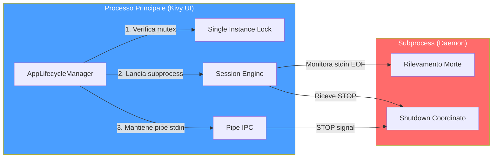

> **Analogia:** La pipe `stdin` è come un **filo telefonico** tra il direttore e il regista. Finché il filo è collegato, il regista sa che il direttore è ancora presente. Se il filo si spezza improvvisamente (EOF — il processo principale crasha), il regista capisce che lo spettacolo è finito e chiude tutto in modo ordinato. Se il direttore vuole terminare normalmente, invia il messaggio "STOP" attraverso il filo e aspetta che il regista confermi di aver terminato.

---

### 12.3 Sistema di Configurazione (`config.py`)

**File:** `Programma_CS2_RENAN/core/config.py`

Il sistema utilizza **tre livelli di configurazione**, ciascuno con un diverso livello di persistenza e sicurezza:

> **Analogia:** I tre livelli di configurazione sono come i **tre strati di un'armatura medievale**. Lo strato interno (hardcoded) è l'armatura di base che non cambia mai — le fondamenta del sistema. Lo strato intermedio (JSON) è la cotta di maglia personalizzabile — l'utente può regolarla come preferisce. Lo strato esterno (Keyring) è il casco con la visiera — protegge i segreti più preziosi (chiavi API) in una cassaforte del sistema operativo, inaccessibile a occhi indiscreti.

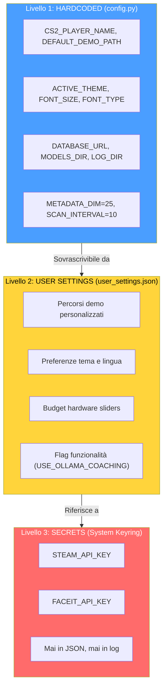

**Costanti critiche del sistema:**

| Costante | Valore | File | Scopo |
| -------- | ------ | ---- | ----- |
| `METADATA_DIM` | 25 | `config.py` | Dimensione del feature vector — contratto unificato |
| `SCAN_INTERVAL` | 10 | `config.py` | Intervallo scansione Hunter (secondi) |
| `MAX_DEMOS_PER_MONTH` | 10 | `config.py` | Quota mensile upload demo |
| `MAX_TOTAL_DEMOS` | 100 | `config.py` | Limite totale demo a vita |
| `MIN_DEMOS_FOR_COACHING` | 10 | `config.py` | Soglia per coaching personalizzato completo |
| `TRADE_WINDOW_TICKS` | 192 | `trade_kill_detector.py` | Finestra temporale trade kill (~3 secondi a 64 tick) |
| `HLTV_BASELINE_KPR` | 0.679 | `demo_parser.py` | Baseline HLTV 2.0 per KPR |
| `HLTV_BASELINE_SURVIVAL` | 0.317 | `demo_parser.py` | Baseline HLTV 2.0 per sopravvivenza |
| `FOV_DEGREES` | 90 | `player_knowledge.py` | Campo visivo simulato del giocatore |
| `MEMORY_DECAY_TAU` | 160 | `player_knowledge.py` | Costante di decadimento memoria tick |
| `CONFIDENCE_ROUNDS_CEILING` | 300 | `correction_engine.py` | Tetto round per confidenza massima |
| `SILENCE_THRESHOLD` | 0.2 | `explainability.py` | Soglia sotto la quale il silenzio è azione valida |
| `MIN_SAMPLES_FOR_VALIDITY` | 10 | `role_thresholds.py` | Campioni minimi per soglia ruolo valida |
| `HALF_LIFE_DAYS` | 90 | `pro_baseline.py` | Decadimento temporale dati pro |
| `Z_LEVEL_THRESHOLD` | 200 | `connect_map_context.py` | Soglia Z per classificazione piano |

> **Analogia delle Costanti:** Le costanti sono come i **parametri vitali di riferimento** in medicina. `METADATA_DIM=25` è come dire "la pressione sistolica normale è 120" — tutti i medici (modelli ML) usano lo stesso riferimento. `TRADE_WINDOW_TICKS=192` è come la "golden hour" in traumatologia: se un compagno viene ucciso e tu uccidi il suo assassino entro 3 secondi, è un trade kill. `SILENCE_THRESHOLD=0.2` è come il "primum non nocere" (prima, non nuocere): se il coach non ha nulla di significativo da dire, è meglio tacere che dare consigli inutili.

**Architettura dei percorsi:**

Il sistema gestisce percorsi con un'attenzione particolare alla **portabilità Windows/Linux**. Il cuore è `BRAIN_DATA_ROOT`: una directory configurabile dall'utente che contiene modelli, log e dati derivati. Se non esiste, il sistema ricade sulla cartella del progetto.

| Percorso | Contenuto | Configurabile |
| -------- | --------- | ------------- |
| `DATABASE_URL` | Database monolite principale (`database.db`) | No — sempre nella cartella del progetto |
| `BRAIN_DATA_ROOT` | Radice per dati derivati (modelli, log) | Sì — via `user_settings.json` |
| `MODELS_DIR` | Checkpoint dei modelli `.pt` | Derivato da `BRAIN_DATA_ROOT` |
| `LOG_DIR` | File di log dell'applicazione | Derivato da `BRAIN_DATA_ROOT` |
| `MATCH_DATA_PATH` | Database per-match (`match_XXXX.db`) | Derivato da `BRAIN_DATA_ROOT` |
| `DEFAULT_DEMO_PATH` | Cartella demo dell'utente | Sì — via UI Settings |
| `PRO_DEMO_PATH` | Cartella demo professionali | Sì — via UI Settings |

> **Analogia:** `BRAIN_DATA_ROOT` è come l'**indirizzo di casa del cervello** dell'allenatore. Puoi spostarlo su un disco più grande (SSD esterno) semplicemente cambiando l'indirizzo, e tutto il resto — modelli, log, dati delle partite — seguirà automaticamente. Il database principale (`database.db`), invece, è come il **registro comunale**: rimane sempre nello stesso posto per ragioni di integrità.

---

### 12.4 Motore di Sessione — Architettura Quad-Daemon (`session_engine.py`)

**File:** `Programma_CS2_RENAN/core/session_engine.py`

Il Session Engine è il **cuore pulsante** dell'automazione del sistema. Vive come subprocess separato e ospita **4 daemon thread** che lavorano in parallelo, ciascuno con una responsabilità ben definita. Questo design separa completamente il lavoro pesante (parsing demo, addestramento ML) dall'interfaccia utente, garantendo che la GUI Kivy rimanga sempre reattiva.

> **Analogia:** Il Session Engine è come una **centrale nucleare sotterranea** che alimenta l'intera città. Ha 4 reattori (daemon), ciascuno che produce un diverso tipo di energia. Il Reattore 1 (Hunter) è lo **scanner radar**: scansiona costantemente l'orizzonte cercando nuove demo da processare. Il Reattore 2 (Digester) è la **raffineria**: prende le demo grezze e le trasforma in dati strutturati. Il Reattore 3 (Teacher) è il **laboratorio di ricerca**: usa i dati raffinati per addestrare il cervello dell'allenatore. Il Reattore 4 (Pulse) è il **sistema di monitoraggio cardiaco**: emette un battito ogni 5 secondi per confermare che la centrale è viva. Se la città in superficie (GUI Kivy) viene distrutta da un terremoto (crash), la centrale rileva la perdita di comunicazione e si spegne in modo sicuro.

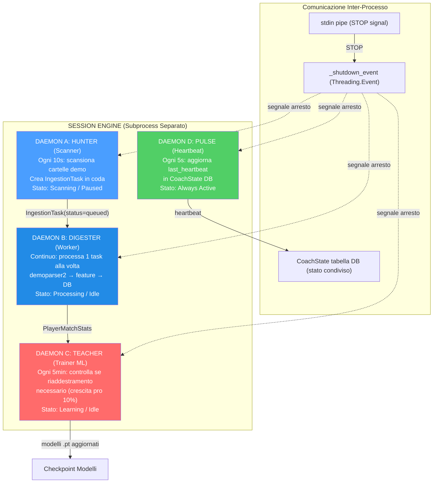

**Ciclo di vita di ogni daemon:**

| Daemon | Intervallo | Lavoro per ciclo | Trigger |
| ------ | ---------- | ---------------- | ------- |
| **Hunter** | 10 secondi | Scansiona cartelle pro e utente, crea `IngestionTask` per nuovi `.dem` | Sempre attivo (se stato = Scanning) |
| **Digester** | Continuo | Preleva 1 task dalla coda, esegue parsing completo | `_work_available_event` (segnalato da Hunter) |
| **Teacher** | 300 secondi (5 min) | Controlla crescita sample pro; se ≥10% → `run_full_cycle()` | `pro_count >= last_count × 1.10` |
| **Pulse** | 5 secondi | Aggiorna `CoachState.last_heartbeat` nel database | Sempre attivo |

> **Analogia del Digester:** Il Digester è come un **lavapiatti instancabile**: prende un piatto sporco (demo grezza) dalla pila, lo lava accuratamente (parsing con demoparser2, estrazione feature, calcolo rating HLTV 2.0, arricchimento RoundStats), lo asciuga (normalizzazione), lo ripone nello scaffale giusto (salva in database) e poi prende il piatto successivo. Non prende mai 2 piatti alla volta — uno alla volta, per evitare errori. Se la pila è vuota, aspetta pazientemente (sleep 2s + `_work_available_event`) finché qualcuno non porta nuovi piatti sporchi.

> **Analogia del Teacher:** Il Teacher è come un **professore universitario che aggiorna i suoi corsi**. Ogni 5 minuti controlla: "Sono arrivati abbastanza nuovi articoli scientifici (demo pro)?" Se il numero è cresciuto del 10% dall'ultimo aggiornamento, dice: "È ora di riscrivere le dispense!" e lancia un ciclo completo di addestramento. Dopo l'addestramento, esegue anche un controllo meta-shift: "La media dei professionisti è cambiata? Il meta del gioco si è spostato?" — garantendo che il coaching rimanga sempre attuale.

**Sequenza di shutdown:**

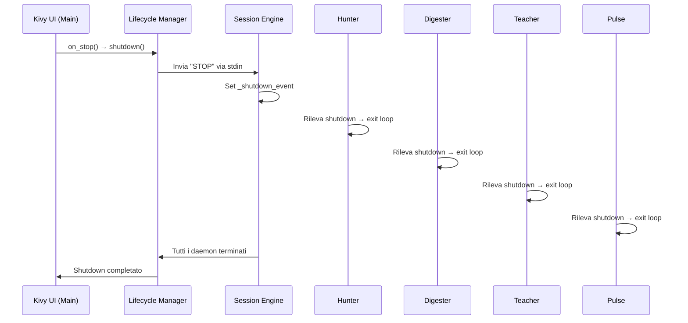

**Dettagli implementativi dei daemon:**

| Daemon | Metodo Principale | Loop Interno | Condizione di Uscita |
| ------ | ----------------- | ------------ | -------------------- |
| **Hunter** | `_hunter_loop()` | `while not _shutdown_event.is_set()` → `scan_all_paths()` → `sleep(10)` | `_shutdown_event` set |
| **Digester** | `_digester_loop()` | `while not _shutdown_event.is_set()` → `_work_available_event.wait(2)` → `process_next_task()` | `_shutdown_event` set |
| **Teacher** | `_teacher_loop()` | `while not _shutdown_event.is_set()` → `_check_retrain_needed()` → `sleep(300)` | `_shutdown_event` set |
| **Pulse** | `_pulse_loop()` | `while not _shutdown_event.is_set()` → `state_mgr.heartbeat()` → `sleep(5)` | `_shutdown_event` set |

**Gestione errori nei daemon:**

Ogni daemon è protetto da un `try/except` globale. Se un daemon crasha:
1. L'errore viene loggato con traceback completo
2. Lo `StateManager` registra l'errore (`set_error(daemon, message)`)
3. Una `ServiceNotification` viene creata per l'utente
4. Il daemon **non viene riavviato automaticamente** (per design: crash di un daemon indica un bug, non un errore transitorio)
5. Gli altri daemon continuano a funzionare indipendentemente

> **Analogia:** Ogni daemon è un **lavoratore con il proprio ufficio e la propria porta**. Se un lavoratore ha un malore (crash), chiude la sua porta e mette un avviso "Temporaneamente non disponibile" (ServiceNotification). Gli altri lavoratori negli altri uffici continuano a lavorare normalmente. Il direttore (Session Engine) prende nota dell'incidente ma non cerca di rianimare il lavoratore — preferisce che un tecnico (lo sviluppatore) indaghi la causa prima di farlo tornare al lavoro.

**Zombie Task Cleanup:** All'avvio, il Session Engine cerca task con `status="processing"` rimasti da un crash precedente e li resetta a `status="queued"`, consentendo il ripristino automatico senza perdita di dati.

**Backup Automatico:** All'avvio del Session Engine, `BackupManager.should_run_auto_backup()` verifica se è necessario un backup e, in caso affermativo, crea un checkpoint con etichetta `"startup_auto"`. Il backup segue una rotazione di 7 copie giornaliere + 4 settimanali.

---

### 12.5 Interfaccia Desktop (`apps/desktop_app/`)

**Directory:** `Programma_CS2_RENAN/apps/desktop_app/`
**File chiave:** `layout.kv`, `wizard_screen.py`, `player_sidebar.py`, `tactical_viewer_screen.py`, `tactical_viewmodels.py`, `tactical_map.py`, `timeline.py`, `widgets.py`, `help_screen.py`, `ghost_pixel.py`

L'interfaccia desktop è costruita con **Kivy + KivyMD** e segue il pattern **MVVM** (Model-View-ViewModel). Lo `ScreenManager` gestisce la navigazione tra le schermate con transizioni `FadeTransition`.

> **Analogia:** L'interfaccia desktop è come un **cruscotto di un'auto sportiva**. Il cruscotto (ScreenManager) ha diverse modalità di visualizzazione che puoi selezionare: la vista "Viaggio" (Home — dashboard generale), la vista "Navigazione" (Tactical Viewer — mappa 2D), la vista "Diagnostica" (Coach — analisi dettagliata), la vista "Impostazioni" (Settings — personalizzazione). Ogni vista ha i suoi indicatori specializzati. Il pattern MVVM garantisce che il "motore" (ViewModel) e il "display" (View) siano separati: se cambi il design del cruscotto, il motore continua a funzionare identicamente, e viceversa.

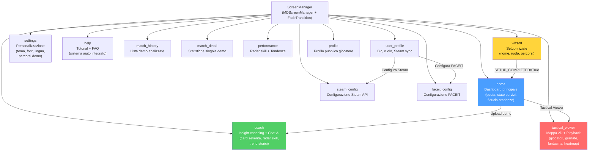

**13 schermate dell'interfaccia:**

| Schermata | Ruolo | Componenti chiave |
| --------- | ----- | ----------------- |
| **Wizard** | Prima configurazione | Nome giocatore, ruolo, percorsi cartelle demo |
| **Home** | Dashboard | Quota mensile (X/10), stato servizi (verde/rosso), fiducia credenze (0-1), task attivi, contatore partite processate |
| **Coach** | Insight coaching | Card colorate per severità, radar skill multi-dimensionale, trend storici, chat AI (Ollama/Claude), task attivi |
| **Tactical Viewer** | Riproduzione tattica | Mappa 2D con giocatori/granate/fantasma, timeline con marcatori eventi, sidebar giocatori CT/T, controlli velocità (0.25x→8x) |
| **Settings** | Personalizzazione | Tema (CS2/CSGO/CS1.6), font, dimensione testo, lingua, percorsi demo, wallpaper |
| **Help** | Supporto utente | Tutorial interattivo, FAQ, troubleshooting |
| **Match History** | Storico partite | Lista demo analizzate con filtri e ordinamento |
| **Match Detail** | Dettaglio partita | Statistiche dettagliate per una singola demo analizzata |
| **Performance** | Progressi | Radar skill a 5 assi, grafici di tendenza, confronti temporali |
| **User Profile** | Profilo utente | Bio, ruolo preferito, sincronizzazione Steam/FACEIT |
| **Profile** | Profilo pubblico | Visualizzazione profilo pubblico del giocatore |
| **Steam Config** | Configurazione Steam | Inserimento e validazione API key Steam |
| **FACEIT Config** | Configurazione FACEIT | Inserimento e validazione API key FACEIT |

> **Analogia della Home Screen:** La Home è come la **plancia di comando di una nave spaziale**. L'indicatore di quota ("5/10 demo questo mese") è il **misuratore di carburante**. Lo stato del servizio (verde/rosso) è il **pannello dei sistemi vitali**: verde = tutti i sistemi operativi, rosso = allarme. La fiducia delle credenze (0.0-1.0) è il **livello di stabilità dell'IA**: 0.0 = l'IA non sa nulla, 1.0 = l'IA è sicura delle sue analisi. Il contatore delle partite processate è l'**odometro**: quanta strada ha percorso il sistema.

**Widget personalizzati:**

| Widget | File | Funzione |
| ------ | ---- | -------- |
| `PlayerSidebar` | `player_sidebar.py` | Lista CT/T con icone ruolo, salute/armatura, arma corrente, denaro, e stato vivo/morto |
| `TacticalMap` | `tactical_map.py` | Canvas Kivy 2D con rendering multilivello: texture mappa → heatmap → giocatori → granate → fantasma |
| `Timeline` | `timeline.py` | Scrubber orizzontale con tick numbers, marcatori eventi colorati, drag-to-seek, double-click jump |
| `GhostPixel` | `ghost_pixel.py` | Rendering del cerchio fantasma semi-trasparente (posizione ottimale predetta da RAP) |

**Temi disponibili:**

L'applicazione supporta **3 temi** selezionabili dalla schermata Settings, ciascuno con una palette colori e wallpaper personalizzati:

| Tema | Palette primaria | Ispirazione |
| ---- | --------------- | ----------- |
| **CS2** (default) | Blu acciaio + arancio | Counter-Strike 2 UI moderna |
| **CSGO** | Verde militare + giallo | Counter-Strike: Global Offensive |
| **CS 1.6** | Marrone scuro + verde lime | Counter-Strike 1.6 classico (nostalgia) |

**Coach Screen — Layout dettagliato:**

La schermata Coach è la più complessa dell'applicazione, con 5 aree funzionali:

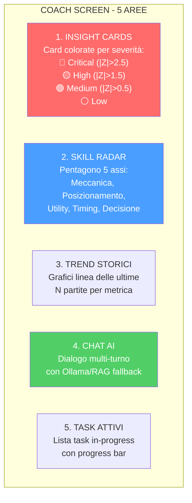

> **Analogia del Coach Screen:** La schermata Coach è come l'**ambulatorio del dottore dopo la visita**. Le **Insight Cards** sono il referto immediato: "Pressione alta!" (rosso), "Colesterolo da monitorare" (giallo), "Buona forma fisica" (verde). Il **Radar** è la visualizzazione delle capacità fisiche. I **Trend** sono il confronto con le visite precedenti. La **Chat AI** è la possibilità di fare domande al dottore. I **Task Attivi** mostrano gli esami ancora in corso.

**Pattern MVVM nel Tactical Viewer:**

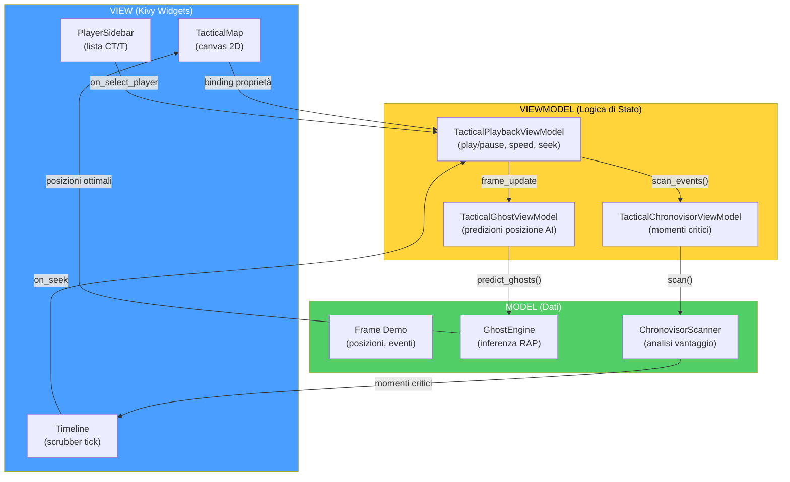

> **Analogia MVVM:** Il pattern MVVM è come un **giornale televisivo**: il **Modello** è il giornalista sul campo che raccoglie i fatti (dati demo, inferenza AI). Il **ViewModel** è il redattore che organizza le notizie e decide cosa è importante (stato di riproduzione, velocità, selezione). La **View** è il presentatore che legge le notizie al pubblico (rendering su schermo Kivy). Il giornalista non sa come viene presentata la notizia. Il presentatore non sa come è stata raccolta. Il redattore è il ponte tra i due. Se cambi il presentatore (nuovo design UI), la notizia rimane la stessa.

---

### 12.6 Pipeline di Ingestione (`ingestion/`)

**Directory:** `Programma_CS2_RENAN/ingestion/`
**File chiave:** `demo_loader.py`, `steam_locator.py`, `integrity.py`, `registry/`, `pipelines/user_ingest.py`, `pipelines/json_tournament_ingestor.py`

La pipeline di ingestione è il **percorso completo** che un file `.dem` compie dal filesystem fino a diventare insight di coaching nel database. È orchestrata dal daemon Hunter (scoperta) e dal daemon Digester (elaborazione).

> **Analogia:** La pipeline di ingestione è come il **percorso di una lettera attraverso l'ufficio postale**. (1) Il postino (Hunter) raccoglie la lettera (file .dem) dalla cassetta postale (cartella demo). (2) L'ufficio smistamento (DemoLoader) apre la busta e ne estrae il contenuto (parsing con demoparser2). (3) L'archivista (FeatureExtractor) misura e cataloga ogni dettaglio (25 feature per tick). (4) Lo storico (RoundStatsBuilder) scrive un riassunto per capitolo (statistiche per round). (5) Il bibliotecario (data_pipeline) classifica e ordina il materiale (normalizzazione, split dataset). (6) Il medico (CoachingService) esamina tutto e scrive una diagnosi (insight di coaching). (7) Infine, tutto viene archiviato (persistenza in database) per consultazione futura.

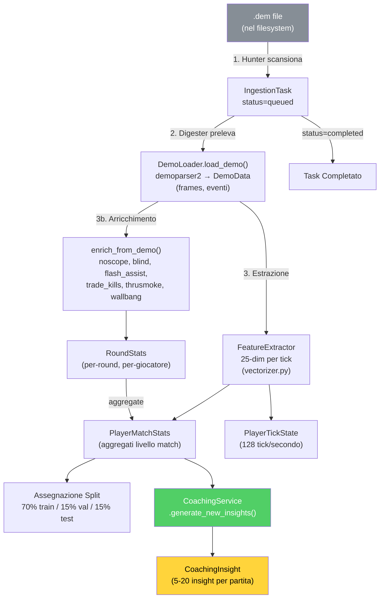

**DemoLoader — Il parser del cuore della pipeline:**

Il `DemoLoader` è il wrapper attorno a **demoparser2** (libreria Rust ad alte prestazioni) che trasforma un file `.dem` binario in strutture dati Python:

| Fase di Parsing | Output | Dimensione tipica |
| --------------- | ------ | ----------------- |
| 1. Header parsing | Metadata (map, server, duration) | ~100 bytes |
| 2. Frame extraction | Lista di frame (posizione, salute, arma per ogni tick) | ~100.000 frame/partita |
| 3. Event extraction | Lista eventi (kill, death, bomb_plant, round_start, etc.) | ~500-2.000 eventi/partita |
| 4. Player summary | Statistiche aggregate per giocatore | ~10 record |

**FeatureExtractor** (`backend/processing/feature_engineering/vectorizer.py`):

Il FeatureExtractor è il componente che trasforma i dati grezzi del demo in **vettori numerici a 25 dimensioni** (`METADATA_DIM=25`) utilizzabili dalle reti neurali. **Importante:** queste sono feature **a livello di tick** (128 Hz), non statistiche aggregate a livello di partita. Ogni singolo frame di gioco produce un vettore 25-dim che cattura lo stato istantaneo del giocatore:

| Dim | Feature | Tipo | Range | Descrizione |
| --- | ------- | ---- | ----- | ----------- |
| 0 | health | Float | [0, 1] | Salute normalizzata |
| 1 | armor | Float | [0, 1] | Armatura normalizzata |
| 2 | has_helmet | Binary | 0/1 | Casco equipaggiato |
| 3 | has_defuser | Binary | 0/1 | Kit defuse equipaggiato |
| 4 | equipment_value | Float | [0, 1] | Valore equipaggiamento normalizzato |
| 5 | is_crouching | Binary | 0/1 | Accucciato |
| 6 | is_scoped | Binary | 0/1 | Mirino attivo (scope) |
| 7 | is_blinded | Binary | 0/1 | Accecato da flash |
| 8 | enemies_visible | Float | [0, 1] | Nemici visibili (normalizzato, clamped) |
| 9 | pos_x | Float | [-1, 1] | Posizione X (normalizzata ±pos_xy_extent) |
| 10 | pos_y | Float | [-1, 1] | Posizione Y (normalizzata ±pos_xy_extent) |
| 11 | pos_z | Float | [0, 1] | Posizione Z (normalizzata, gestisce Nuke/Vertigo) |
| 12 | view_x_sin | Float | [-1, 1] | sin(yaw) — continuità ciclica angolo orizzontale |
| 13 | view_x_cos | Float | [-1, 1] | cos(yaw) — continuità ciclica angolo orizzontale |
| 14 | view_y | Float | [-1, 1] | Pitch normalizzato (angolo verticale) |
| 15 | z_penalty | Float | [0, 1] | Distinzione livello verticale (penalità piano) |
| 16 | kast_estimate | Float | [0, 1] | Stima KAST (rapporto partecipazione) |
| 17 | map_id | Float | [0, 1] | Hash deterministico della mappa |
| 18 | round_phase | Float | {0, 0.33, 0.66, 1} | Fase economica: pistol/eco/force/full_buy |
| 19 | weapon_class | Float | {0–1.0} | Classe arma: 0=coltello, 0.2=pistola, 0.4=SMG, 0.6=fucile, 0.8=sniper, 1.0=pesante |
| 20 | time_in_round | Float | [0, 1] | Secondi nel round / 115 (clamped) |
| 21 | bomb_planted | Binary | 0/1 | Bomba piazzata |
| 22 | teammates_alive | Float | [0, 1] | Compagni vivi (count / 4) |
| 23 | enemies_alive | Float | [0, 1] | Nemici vivi (count / 5) |
| 24 | team_economy | Float | [0, 1] | Media soldi squadra / 16000 (clamped) |

**Normalizzazione e bounds:**

La normalizzazione è integrata direttamente nel FeatureExtractor, con bounds configurabili tramite `HeuristicConfig` (esternalizzata in JSON). La codifica ciclica degli angoli di vista (sin/cos per lo yaw) previene discontinuità ai bordi 0°/360°. Il `z_penalty` distingue automaticamente i piani in mappe multilivello (Nuke, Vertigo). La classe arma utilizza una mappatura categorica ordinale (6 classi) definita nella costante `WEAPON_CLASS_MAP` (include anche granate=0.1 e equipaggiamento speciale=0.05).

**Dataset Split Temporale:**

La suddivisione del dataset segue un rigido **ordinamento cronologico** per prevenire il data leakage temporale:

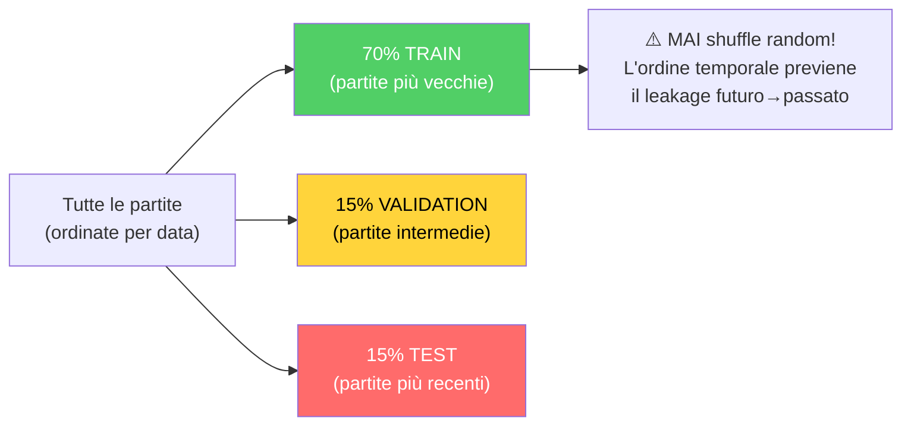

> **Analogia:** La divisione temporale è come preparare un **esame scolastico equo**. Le domande del test (15% test) devono riguardare argomenti insegnati DOPO gli esercizi (70% train) e i compiti a casa (15% val). Se le domande del test riguardassero argomenti studiati prima degli esercizi, lo studente (il modello) sembrerebbe più bravo di quanto sia realmente — un trucco, non vera conoscenza.

> **Analogia del Feature Vector:** Il vettore a 25 dimensioni è come la **lettura istantanea di 25 sensori** attaccati al giocatore in ogni momento: 5 sensori "corporei" (salute, armatura, casco, defuse kit, valore equipaggiamento), 3 sensori "posturali" (accucciato, con mirino, accecato), 1 sensore "visivo" (nemici visibili), 6 sensori "spaziali" (posizione X/Y/Z e angoli di vista sin/cos/pitch), 1 sensore "livello" (penalità Z per Nuke/Vertigo), 1 sensore "tattico" (KAST), 3 sensori "contestuali" (mappa, fase economica, classe arma), e 5 sensori "situazionali" (tempo nel round, bomba piazzata, compagni/nemici vivi, economia di squadra). A differenza delle statistiche aggregate a livello di partita, ogni tick produce un nuovo vettore — 128 letture al secondo.

**Enrich From Demo — Arricchimento post-parsing:**

Dopo il parsing base, `enrich_from_demo()` aggiunge metriche avanzate calcolate dagli eventi:

| Metrica arricchita | Calcolo | Fonte |
| ------------------ | ------- | ----- |
| Trade kills | `TradeKillDetector.detect()` con TRADE_WINDOW_TICKS=192 | Eventi kill/death |
| Flash assists | Conteggio blind entro finestra temporale prima di un kill | Eventi blind + kill |
| Noscope kills | Kill con arma sniper senza scope attivo | Evento kill + weapon state |
| Wallbang kills | Kill attraverso superfici penetrabili | Evento kill con flag penetration |
| Through-smoke kills | Kill con fumo attivo nella linea di tiro | Evento kill + smoke position |
| Blind kills | Kill mentre il giocatore è flashato | Evento kill + flash state |

**Componenti specifici:**

| Componente | File | Ruolo |
| ---------- | ---- | ----- |
| **DemoLoader** | `demo_loader.py` | Wrappa `demoparser2`, estrae frame e eventi dal file `.dem` |
| **SteamLocator** | `steam_locator.py` | Localizza automaticamente la cartella demo di CS2 via registro Steam / libraryfolders.vdf |
| **IntegrityChecker** | `integrity.py` | Verifica che i file demo siano validi, completi e non corrotti prima del parsing |
| **UserIngestPipeline** | `pipelines/user_ingest.py` | Pipeline completa per demo utente: parse → enrich → stats → coaching |
| **JsonTournamentIngestor** | `pipelines/json_tournament_ingestor.py` | Importa dati torneo da file JSON strutturati |
| **Registry** | `registry/registry.py` | Traccia tutte le demo processate, previene duplicati |
| **ResourceManager** | `ingestion/resource_manager.py` | Gestione risorse hardware: CPU/RAM throttling, spazio disco |
| **JsonTournamentIngestor** | `pipelines/json_tournament_ingestor.py` | Importa dati torneo da file JSON strutturati |
| **RegistryLifecycle** | `registry/lifecycle.py` | Gestione ciclo di vita dei record di ingestione |

**SteamLocator** (`ingestion/steam_locator.py`, 135 righe) — localizzazione automatica demo CS2:

Il SteamLocator implementa un algoritmo di **discovery cross-platform** per trovare automaticamente la cartella delle demo di CS2:

| Piattaforma | Strategia | Percorso tipico |
| ----------- | --------- | --------------- |
| **Windows** | Registro di sistema → `libraryfolders.vdf` | `C:\Program Files (x86)\Steam\steamapps\common\Counter-Strike Global Offensive\game\csgo\replays` |
| **Linux** | `~/.steam/steam/` → `libraryfolders.vdf` | `~/.steam/steam/steamapps/common/...` |
| **Fallback** | Chiede all'utente via UI Settings | Percorso personalizzato |

**IntegrityChecker** (`ingestion/integrity.py`, 53 righe):

Verifica preliminare di ogni file demo prima del parsing costoso:
- **Magic bytes**: `PBDEMS2\0` (CS2 Source 2) o `HL2DEMO\0` (legacy Source 1)
- **Size bounds**: minimo 1KB (non vuoto), massimo 5GB (non corrotto/eccessivo)
- **Read test**: tenta di leggere i primi N byte per verificare che il file sia accessibile

> **Analogia dello SteamLocator:** Lo SteamLocator è come un **segugio che fiuta la cartella di CS2** nel tuo computer. Sa che Steam memorizza le sue librerie in posti specifici (registro Windows, `libraryfolders.vdf` su Linux/Mac), e segue le tracce fino alla cartella `csgo/replays` dove vengono salvate le demo. Se non riesce a trovarla automaticamente, chiede all'utente di indicare il percorso manualmente — ma nella maggior parte dei casi, la trova da solo.

---

### 12.7 Console di Controllo Unificata (`backend/control/`)

**File:** `Programma_CS2_RENAN/backend/control/console.py`, `ingest_manager.py`, `db_governor.py`, `ml_controller.py`

La Console è un **Singleton** che funge da punto di coordinamento centrale per tutti i sottosistemi backend. È il "quadro di comando" attraverso cui ogni parte del sistema può essere controllata.

> **Analogia:** La Console è come la **torre di controllo di un aeroporto**. Ha 4 schermi: uno per il radar (ServiceSupervisor — monitora i servizi in esecuzione), uno per le piste (IngestionManager — coordina l'arrivo delle demo), uno per la manutenzione (DatabaseGovernor — verifica l'integrità dello storage) e uno per l'addestramento dei piloti (MLController — gestisce il ciclo di vita dell'apprendimento automatico). Il controllore del traffico aereo (Console Singleton) coordina tutto da un'unica postazione.

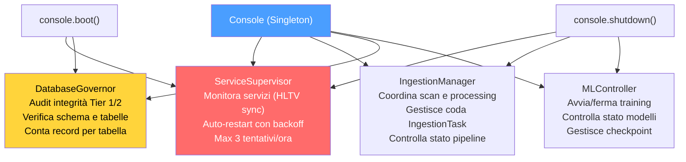

**Sequenza di boot della Console:**

1. `ServiceSupervisor` avvia il servizio "hunter" (HLTV sync) come processo monitorato
2. `DatabaseGovernor` esegue un audit di integrità: verifica tutte le tabelle, conta record, controlla schema
3. `MLController` resta in stato di attesa — il training è gestito dal daemon Teacher
4. `IngestionManager` resta idle — il lavoro attivo è gestito dai daemon Hunter/Digester

**MLControlContext — Controllo Live dell'Addestramento:**

L'`MLController` utilizza un token di controllo chiamato `MLControlContext` (`backend/control/ml_controller.py`) che viene passato ai cicli di addestramento per consentire **intervento in tempo reale** da parte dell'operatore. Questo sostituisce l'approccio precedente basato su `StopIteration` con un sistema thread-safe più robusto.

> **Analogia:** MLControlContext è come il **telecomando di un lettore video**. L'operatore può premere **Pausa** (il training si ferma immediatamente, senza perdita di dati), **Play** (il training riprende dal punto esatto in cui si era fermato), **Stop** (il training termina con un'eccezione controllata `TrainingStopRequested`) o regolare la **velocità** (throttle: 0.0 = massima velocità, 1.0 = massimo ritardo). Il meccanismo usa `threading.Event` per evitare busy-wait durante la pausa — il thread di training semplicemente dorme finché non riceve il segnale di ripresa.

```mermaid
flowchart LR
    OP["Operatore"] -->|"request_pause()"| CTX["MLControlContext"]
    OP -->|"request_resume()"| CTX
    OP -->|"request_stop()"| CTX
    OP -->|"set_throttle(0.5)"| CTX
    CTX -->|"check_state()<br/>in ogni batch"| LOOP["Ciclo Training"]
    LOOP -->|"Pausa: Event.wait()"| PAUSE["Training Sospeso<br/>(nessun busy-wait)"]
    LOOP -->|"Stop: raise<br/>TrainingStopRequested"| STOP["Training Terminato<br/>(checkpoint salvato)"]
    style CTX fill:#4a9eff,color:#fff
    style PAUSE fill:#ffd43b,color:#000
    style STOP fill:#ff6b6b,color:#fff
```

| Comando | Metodo | Effetto |
| ------- | ------ | ------- |
| **Pausa** | `request_pause()` | `_resume_event.clear()` → blocca `check_state()` |
| **Riprendi** | `request_resume()` | `_resume_event.set()` → sblocca il training |
| **Stop** | `request_stop()` | Lancia `TrainingStopRequested` (eccezione custom) |
| **Throttle** | `set_throttle(factor)` | Aggiunge `time.sleep(factor)` dopo ogni batch |

---

### 12.8 Onboarding e Flusso Nuovo Utente

**File:** `Programma_CS2_RENAN/backend/onboarding/new_user_flow.py`

L'`OnboardingManager` guida i nuovi utenti attraverso una **progressione a 3 fasi** che si adatta automaticamente alla quantità di dati disponibili.

> **Analogia:** L'onboarding è come il **tutorial di un videogioco RPG**. Quando inizi una nuova partita (nessuna demo caricata), il gioco ti guida passo passo: "Benvenuto, avventuriero! Carica la tua prima demo per iniziare." Dopo 1-2 demo, il sistema dice: "Buon inizio! Caricane altre N per sbloccare l'analisi stabile." Dopo 3+ demo, il sistema annuncia: "Il tuo coach è pronto! Le analisi personalizzate sono ora attive." Ogni fase sblocca gradualmente le funzionalità del programma, impedendo al sistema di mostrare risultati inaffidabili quando non ha abbastanza dati.

```mermaid
stateDiagram-v2
    [*] --> AWAITING: 0 demo caricate
    AWAITING --> BUILDING: 1-2 demo caricate
    BUILDING --> READY: 3+ demo caricate

    state AWAITING {
        AW: Messaggio: Benvenuto! Carica la tua prima demo.
        note right of AW: Nessuna analisi disponibile
    }
    state BUILDING {
        BU: Messaggio: Carica N demo in più per baseline stabile.
        note right of BU: Analisi parziale disponibile
    }
    state READY {
        RE: Messaggio: Coach pronto! Analisi personalizzata attiva.
        note right of RE: Tutte le funzionalità sbloccate
    }
```

**Wizard Screen (Prima Configurazione):**

Alla prima esecuzione (`SETUP_COMPLETED = False`), l'utente viene guidato attraverso il Wizard:

1. **Nome giocatore** — Il nome che apparirà nelle analisi
2. **Ruolo preferito** — Entry Fragger, AWPer, Lurker, Support o IGL
3. **Percorsi cartelle demo** — Dove il sistema cerca automaticamente le demo
4. Al completamento: `SETUP_COMPLETED = True`, redirect alla Home

**Cache delle quote (Task 2.16.1):** Il conteggio demo è cachato per 60 secondi per evitare query DB ripetute. `invalidate_cache()` viene chiamato dopo ogni nuovo upload, garantendo che la UI mostri sempre il conteggio corretto senza sovraccaricare il database.

**Help System** (`backend/knowledge/help_system.py`):

Il sistema di aiuto integrato fornisce supporto contestuale all'utente:

| Funzionalità | Implementazione |
| ------------ | --------------- |
| **Tutorial interattivo** | Guide step-by-step per le funzionalità principali |
| **FAQ contestuali** | Domande frequenti filtrate per schermata corrente |
| **Troubleshooting** | Albero decisionale per problemi comuni (Steam path non trovato, demo non parsata, coaching vuoto) |
| **Tooltips** | Spiegazioni inline per metriche complesse (KAST, HLTV 2.0 Rating, ADR) |

> **Analogia:** Il Help System è come avere un **assistente bibliotecario** sempre disponibile. Se sei nella sezione "Narrativa" (Tactical Viewer), ti aiuta con le domande relative alla lettura delle mappe. Se sei in "Scienze" (Coach), ti spiega cosa significano le metriche. Se qualcosa non funziona, ti guida passo passo nella risoluzione del problema — come un flow chart "Se il rubinetto non dà acqua → controlla la valvola → controlla il tubo → chiama l'idraulico."

---

### 12.9 Architettura di Storage (`backend/storage/`)

**Directory:** `Programma_CS2_RENAN/backend/storage/`
**File chiave:** `database.py`, `db_models.py`, `match_data_manager.py`, `storage_manager.py`, `maintenance.py`, `state_manager.py`, `stat_aggregator.py`, `backup.py`

Il sistema di storage utilizza un'architettura **dual-database** basata su SQLite in modalità WAL (Write-Ahead Logging), che consente letture e scritture concorrenti senza blocchi.

> **Analogia:** L'architettura di storage è come un **sistema bibliotecario a 2 piani**. Il **piano terra** (`database.db`, 16 tabelle) contiene il catalogo generale, le schede di tutti i lettori (giocatori), la base di conoscenza tattica (RAG), la banca esperienze COPER, le recensioni dei critici (insight di coaching) e il registro dei prestiti (task di ingestione) — tutto in un unico grande schedario sempre disponibile. Lo **schedario separato** (`hltv_metadata.db`, 3 tabelle) contiene i profili dei giocatori professionisti e le loro statistiche — separato perché viene aggiornato da un processo diverso (HLTV sync) per evitare contesa di lock. Oltre a questi, i **database per-match** (`match_XXXX.db`) contengono i manoscritti originali completi (dati tick-per-tick delle partite) — ciascuno in una scatola separata per evitare che lo schedario principale diventi troppo pesante. La modalità WAL è come avere una **porta girevole**: molte persone possono entrare a leggere contemporaneamente, e qualcuno può scrivere senza bloccare l'ingresso.

```mermaid
flowchart TB
    subgraph T12["database.db (Monolite SQLite WAL — 16 tabelle)"]
        PMS["PlayerMatchStats<br/>(32 campi per giocatore/partita)"]
        CS["CoachState<br/>(stato globale del sistema)"]
        IT["IngestionTask<br/>(coda di lavoro)"]
        CI["CoachingInsight<br/>(consigli generati)"]
        PP["PlayerProfile<br/>(profilo utente)"]
        TK["TacticalKnowledge<br/>(base RAG 384-dim)"]
        CE["CoachingExperience<br/>(banca esperienza COPER)"]
        RS["RoundStats<br/>(statistiche per-round)"]
        SN["ServiceNotification<br/>(alert di sistema)"]
        EXT["Ext_PlayerPlaystyle +<br/>Ext_TeamRoundStats"]
        CALIB_ST["CalibrationSnapshot +<br/>RoleThresholdRecord"]
        MATCH_ST["MatchResult + MapVeto"]
    end
    subgraph T_HLTV["hltv_metadata.db (Dati Pro — 3 tabelle)"]
        PRO["ProPlayer + ProTeam +<br/>ProPlayerStatCard"]
    end
    subgraph T3["match_XXXX.db (Per-Match SQLite)"]
        PTS["PlayerTickState<br/>(~100.000 righe per partita)<br/>Posizione, salute, arma<br/>ogni 1/128 di secondo"]
    end
    T12 -->|"Riferimento"| T3
    T_HLTV -->|"Baseline pro per<br/>confronto coaching"| T12

    style T12 fill:#4a9eff,color:#fff
    style T_HLTV fill:#ffd43b,color:#000
    style T3 fill:#868e96,color:#fff
```

**Le 19 tabelle SQLModel:**

| # | Tabella | Database | Categoria | Descrizione |
| - | ------- | -------- | --------- | ----------- |
| 1 | `PlayerMatchStats` | database.db | Core | Statistiche aggregate per giocatore/partita (32 campi) |
| 2 | `PlayerTickState` | database.db | Core | Stato per-tick (128 Hz), anche archiviato in DB per-match separati |
| 3 | `PlayerProfile` | database.db | Utente | Profilo utente (nome, ruolo, Steam ID, quota mensile) |
| 4 | `RoundStats` | database.db | Core | Statistiche isolate per round (uccisioni, valutazione, arricchimento) |
| 5 | `CoachingInsight` | database.db | Coaching | Consigli generati dal servizio di coaching |
| 6 | `CoachingExperience` | database.db | Coaching | Banca esperienze COPER (contesto, esito, efficacia) |
| 7 | `IngestionTask` | database.db | Sistema | Coda di lavoro per il daemon Digester |
| 8 | `CoachState` | database.db | Sistema | Stato globale (training metrics, heartbeat, status) |
| 9 | `ServiceNotification` | database.db | Sistema | Messaggi di errore/evento dei daemon → UI |
| 10 | `TacticalKnowledge` | database.db | Conoscenza | Base RAG (embedding 384-dim in JSON) |
| 11 | `ProPlayer` | hltv_metadata.db | Pro | Profili giocatori professionisti |
| 12 | `ProTeam` | hltv_metadata.db | Pro | Metadata squadre professionali |
| 13 | `ProPlayerStatCard` | hltv_metadata.db | Pro | Statistiche stagionali per giocatore pro |
| 14 | `Ext_PlayerPlaystyle` | database.db | Esterno | Dati stile di gioco da CSV (per NeuralRoleHead) |
| 15 | `Ext_TeamRoundStats` | database.db | Esterno | Statistiche torneo esterne |
| 16 | `MatchResult` | database.db | Partite | Esiti delle partite |
| 17 | `MapVeto` | database.db | Partite | Storico selezione mappe |
| 18 | `CalibrationSnapshot` | database.db | Sistema | Registro di calibrazione del modello di credenza (timestamp, campioni, risultato) |
| 19 | `RoleThresholdRecord` | database.db | Sistema | Soglie apprese per la classificazione dei ruoli (persistite tra i riavvii) |

**Enum di supporto (non tabelle):**

| Enum | Tipo | Descrizione |
| ---- | ---- | ----------- |
| `DatasetSplit` | `str, Enum` | Categorie split (train/val/test/unassigned) — usato come constraint su `PlayerMatchStats.dataset_split` |
| `CoachStatus` | `str, Enum` | Stati del coach (Paused/Training/Idle/Error) — usato come constraint su `CoachState.status` |

**Componenti di Storage dettagliati:**

**MatchDataManager** (`backend/storage/match_data_manager.py`, 719 righe) — il componente più grande dello storage layer:

Il MatchDataManager è responsabile della gestione dei dati per-partita ad alta densità (PlayerTickState con ~100.000 righe per partita). Per evitare che il database principale cresca in modo incontrollato, ogni partita ha il proprio database SQLite separato (`match_XXXX.db`).

| Metodo | Descrizione |
| ------ | ----------- |
| `create_match_db(demo_name)` | Crea un nuovo database per-match con schema `PlayerTickState` |
| `store_tick_data(demo_name, ticks)` | Bulk insert di tick data nel DB dedicato |
| `load_match_frames(demo_name)` | Carica tutti i frame per il Tactical Viewer |
| `get_match_db_path(demo_name)` | Risolve il percorso del DB per-match |
| `list_available_matches()` | Elenca tutti i match con DB disponibili |
| `delete_match_data(demo_name)` | Rimuove il DB per-match e aggiorna il registro |
| `get_match_statistics(demo_name)` | Calcola statistiche aggregate dal tick data |

> **Analogia:** Il MatchDataManager è come un **archivista che gestisce le scatole dei manoscritti originali**. Ogni partita è un manoscritto troppo voluminoso per stare nello schedario generale (database.db), quindi viene conservato in una scatola separata con un'etichetta (match_XXXX.db). L'archivista sa esattamente dove si trova ogni scatola, può aprirla su richiesta e, quando la scatola diventa troppo vecchia, può spostarla nell'archivio freddo.

**StorageManager** (`backend/storage/storage_manager.py`, 249 righe):

Il StorageManager è il **coordinatore di alto livello** dello storage che gestisce quote, upload e ciclo di vita dei dati:

| Responsabilità | Implementazione |
| -------------- | --------------- |
| **Quota mensile** | `can_user_upload()` → verifica `MAX_DEMOS_PER_MONTH=10` e `MAX_TOTAL_DEMOS=100` |
| **Upload flow** | `handle_demo_upload(path)` → validazione → copia in working dir → crea IngestionTask |
| **Pulizia** | `cleanup_old_data(days)` → rimuove match DB e task vecchi |
| **Spazio disco** | `get_storage_usage()` → report dimensioni per ogni database e directory |

**StateManager** (`backend/storage/state_manager.py`, 165 righe):

Il StateManager è un **Singleton** che mantiene lo stato runtime del sistema e lo persiste nel database tramite la tabella `CoachState`:

| Metodo | Scopo |
| ------ | ----- |
| `update_status(daemon, text)` | Aggiorna lo stato di un daemon specifico |
| `heartbeat()` | Aggiorna il timestamp `last_heartbeat` |
| `get_state()` | Restituisce lo stato corrente come oggetto `CoachState` |
| `set_error(daemon, message)` | Registra un errore per un daemon con timestamp |
| `update_training_metrics(epoch, loss, val_loss, eta)` | Aggiorna le metriche di training in tempo reale |
| `get_belief_confidence()` | Restituisce il livello di fiducia del modello di credenza (0.0-1.0) |

**StatAggregator** (`backend/storage/stat_aggregator.py`, 99 righe):

Calcola statistiche aggregate a partire dai dati grezzi per-round:

| Aggregazione | Formula | Uso |
| ------------ | ------- | --- |
| `avg_kills` | `mean(RoundStats.kills)` | Dashboard, radar chart |
| `avg_adr` | `mean(RoundStats.damage_dealt / rounds)` | Confronto pro |
| `avg_kast` | `mean(rounds_with_kast / total_rounds)` | Metrica HLTV |
| `accuracy` | `sum(hits) / sum(shots_fired)` | Performance meccanica |
| `trade_kill_rate` | `trade_kills / team_deaths` | Lavoro di squadra |

**BackupManager** (`backend/storage/backup.py`, 203 righe):

| Caratteristica | Dettaglio |
| -------------- | --------- |
| **Rotazione giornaliera** | 7 copie — la più vecchia viene sovrascritta |
| **Rotazione settimanale** | 4 copie — backup settimanale aggiuntivo |
| **Trigger automatico** | All'avvio del Session Engine via `should_run_auto_backup()` |
| **Trigger manuale** | Via Console o UI Settings |
| **Formato** | Copia completa del file `.db` (non dump SQL) |
| **Etichettatura** | `startup_auto`, `manual`, `pre_migration` |

**Maintenance** (`backend/storage/maintenance.py`, 53 righe):

| Operazione | Frequenza | Scopo |
| ---------- | --------- | ----- |
| `vacuum()` | Mensile | Compatta il database, recupera spazio da record eliminati |
| `analyze()` | Dopo ogni bulk insert | Aggiorna le statistiche dell'ottimizzatore query SQLite |
| `wal_checkpoint()` | All'avvio | Forza il merge del WAL nel database principale |
| `integrity_check()` | All'avvio | `PRAGMA integrity_check` — verifica coerenza strutturale |

**DbMigrate** (`backend/storage/db_migrate.py`, 112 righe):

Wrapper attorno ad Alembic che automatizza l'esecuzione delle migrazioni:

```mermaid
flowchart LR
    BOOT["main.py (Fase 3)"]
    BOOT --> CHECK["db_migrate.check_pending()"]
    CHECK -->|"Migrazioni pendenti"| APPLY["alembic.upgrade('head')"]
    CHECK -->|"Schema aggiornato"| SKIP["Nessuna azione"]
    APPLY --> VERIFY["Verifica schema post-migrazione"]
    VERIFY -->|"OK"| CONTINUE["Continua avvio"]
    VERIFY -->|"Errore"| ABORT["TERMINAZIONE<br/>Schema incompatibile"]
    style CONTINUE fill:#51cf66,color:#fff
    style ABORT fill:#ff6b6b,color:#fff
```

**Connection Pooling e Concorrenza:**

| Parametro | Valore | Scopo |
| --------- | ------ | ----- |
| `check_same_thread` | `False` | Consente accesso multi-thread |
| `timeout` | 30 secondi | Busy timeout per contesa WAL |
| `pool_size` | 1 | Singolo scrittore SQLite (sicurezza single-writer) |
| `max_overflow` | 4 | Connessioni overflow per picchi di carico |
| WAL mode | Abilitato | Letture concorrenti illimitate |

---

### 12.10 Motore di Playback e Viewer Tattico

**File:** `Programma_CS2_RENAN/core/playback.py`, `playback_engine.py`, `apps/desktop_app/tactical_viewer_screen.py`, `tactical_map.py`, `timeline.py`, `player_sidebar.py`

Il sistema di playback tattico consente all'utente di **rivivere le proprie partite** su una mappa 2D interattiva, con overlay AI (posizione fantasma ottimale), marcatori eventi (uccisioni, piazzamenti bomba) e controlli di riproduzione completi.

> **Analogia:** Il Tactical Viewer è come un **sistema di replay sportivo di livello professionistico**. Immagina di poter guardare le tue partite di calcio dalla prospettiva di un drone aereo, con la possibilità di rallentare, accelerare, mettere in pausa, e con un assistente AI che ti mostra "dove avresti dovuto trovarti" come un'ombra trasparente sul campo. Inoltre, una timeline intelligente evidenzia automaticamente i momenti chiave: "Minuto 23:15 — hai perso il vantaggio qui" (marcatore rosso) o "Minuto 34:02 — giocata eccellente!" (marcatore verde). Puoi cliccare su qualsiasi marcatore e il replay salta direttamente a quel momento.

```mermaid
flowchart TB
    subgraph VIEWER["TACTICAL VIEWER - COMPONENTI"]
        MAP["TacticalMap (Canvas Kivy)<br/>Rendering 2D: giocatori (cerchi colorati),<br/>granate (overlay HE/molotov/fumo/flash),<br/>heatmap (sfondo calore gaussiano),<br/>fantasma AI (cerchio trasparente posizione ottimale)"]
        TIMELINE["Timeline (Scrubber)<br/>Barra di scorrimento con tick numbers,<br/>marcatori eventi (uccisioni, piazzamenti),<br/>drag per cercare, double-click per saltare"]
        SIDEBAR["PlayerSidebar (CT + T)<br/>Lista giocatori per squadra,<br/>salute, armatura, arma, denaro,<br/>giocatore selezionato evidenziato"]
        CONTROLS["Controlli Playback<br/>Play/Pause, velocità (0.25x → 8x),<br/>selettore round/segmento,<br/>toggle fantasma on/off"]
    end
    subgraph ENGINE["MOTORI"]
        PBE["PlaybackEngine<br/>Frame rate 60 FPS,<br/>interpolazione tra frame 64-tick,<br/>gestione velocità variabile"]
        GE["GhostEngine<br/>Inferenza RAP in tempo reale,<br/>optimal_pos delta × 500.0,<br/>fallback (0.0, 0.0) se errore"]
        CS["ChronovisorScanner<br/>Analisi vantaggio temporale,<br/>rilevamento momenti critici,<br/>classificazione giocata/errore"]
    end
    MAP --> PBE
    TIMELINE --> PBE
    SIDEBAR --> PBE
    CONTROLS --> PBE
    PBE --> GE
    PBE --> CS
    GE -->|"posizioni fantasma"| MAP
    CS -->|"marcatori eventi"| TIMELINE

    style MAP fill:#4a9eff,color:#fff
    style GE fill:#ff6b6b,color:#fff
    style CS fill:#51cf66,color:#fff
```

**PlaybackEngine — Architettura interna:**

Il PlaybackEngine gestisce la riproduzione frame-by-frame con interpolazione temporale:

| Caratteristica | Dettaglio |
| -------------- | --------- |
| **Frame rate** | 60 FPS (interpolazione da 64-tick nativo del demo) |
| **Velocità variabile** | 0.25x (slow-mo), 0.5x, 1x (normale), 2x, 4x, 8x (fast-forward) |
| **Interpolazione** | Lineare tra frame adiacenti per movimenti fluidi |
| **Buffering** | Pre-carica 120 frame in anticipo per evitare lag |
| **Seek** | Accesso diretto a qualsiasi tick via indice |
| **Round selection** | Salta direttamente all'inizio di un round specifico |

**GhostEngine — Inferenza in tempo reale:**

Il GhostEngine è il componente che trasforma le predizioni del RAP Coach in **posizioni fantasma visibili sulla mappa**:

```mermaid
flowchart LR
    FRAME["Frame corrente<br/>(posizioni giocatori)"]
    FRAME --> EXTRACT["Estrai feature vector<br/>(vectorizer.py, 25-dim)"]
    EXTRACT --> RAP["RAP Coach forward()<br/>→ optimal_position_delta"]
    RAP --> SCALE["Scala delta × 500.0<br/>(unità mondo CS2)"]
    SCALE --> POS["Posizione fantasma =<br/>posizione_corrente + delta_scalato"]
    POS --> RENDER["Rendering cerchio<br/>semi-trasparente su mappa"]
    RAP -->|"Errore/Modello assente"| FALLBACK["Fallback: (0.0, 0.0)<br/>Nessun fantasma mostrato"]
    style RAP fill:#ff6b6b,color:#fff
    style RENDER fill:#51cf66,color:#fff
    style FALLBACK fill:#868e96,color:#fff
```

> **Analogia del GhostEngine:** Il fantasma è come un **allenatore invisibile** che corre sul campo accanto a te. Guarda la stessa partita che guardi tu, ma conosce la posizione ottimale dove dovresti trovarti. La sua ombra semi-trasparente sulla mappa dice: "Saresti stato più al sicuro e più efficace qui." Il fattore ×500.0 converte i piccoli delta del modello (numeri tra -1 e +1) in distanze reali sulla mappa (centinaia di unità mondo). Se il modello non è caricato, il fantasma semplicemente scompare — non mostra posizioni sbagliate.

**ChronovisorScanner — Rilevamento momenti critici:**

Il ChronovisorScanner analizza l'intera partita e identifica i **momenti decisivi** basandosi sul cambio di vantaggio:

| Tipo momento | Condizione | Colore marcatore |
| ------------ | ---------- | --------------- |
| **Errore critico** | Morte in vantaggio numerico (es. 4v3 → 3v3) | 🔴 Rosso |
| **Giocata eccellente** | Uccisione in svantaggio numerico (es. 2v3 → 2v2) | 🟢 Verde |
| **Piazzamento bomba** | Evento bomb_planted con timer | 🟡 Giallo |
| **Clutch** | Vittoria 1vN (N ≥ 2) | ⭐ Oro |
| **Eco round win** | Vittoria con equipaggiamento < $2.000 | 🔵 Blu |

Ogni momento viene posizionato sulla Timeline come un marcatore cliccabile. Il click salta il playback direttamente a quel tick.

**Flusso di caricamento del viewer (One-Click):**

1. L'utente clicca "Tactical Viewer" dalla Home
2. Se nessuna demo è caricata → `trigger_viewer_picker()` apre il file picker automaticamente
3. L'utente seleziona un file `.dem`
4. Appare un dialogo "Ricostruzione Dinamica 2D in Corso..."
5. Un thread in background esegue `_execute_viewer_parse(path)` → `DemoLoader.load_demo()`
6. Al completamento: dismissione dialogo, caricamento frame in PlaybackEngine
7. La mappa viene renderizzata con i giocatori al frame 0

---

### 12.11 Dati Spaziali e Gestione Mappe

**File:** `Programma_CS2_RENAN/core/spatial_data.py`, `spatial_engine.py`, `data/map_config.json`

Il sistema di gestione mappe traduce le **coordinate mondo di CS2** (valori tipici: -2000 a +2000 su X/Y) in **coordinate pixel** sulla texture della mappa (0.0 a 1.0 normalizzato), e viceversa.

> **Analogia:** La gestione mappe è come un **sistema GPS per il mondo di CS2**. Ogni mappa ha la sua "proiezione cartografica": un punto di origine (angolo in alto a sinistra), una scala (quante unità di gioco per pixel) e, per mappe multilivello come Nuke, un **separatore di piani** (z_cutoff = -495 per Nuke). Il GPS sa che se la tua coordinata Z è sopra -495, sei al piano superiore, altrimenti al piano inferiore. Questa informazione è cruciale per il GhostEngine e per il rendering corretto sulla mappa tattica.

```mermaid
flowchart LR
    WORLD["Coordinate Mondo CS2<br/>(pos_x=-1200, pos_y=800, pos_z=100)"]
    WORLD -->|"MapMetadata.world_to_radar()"| NORM["Coordinate Normalizzate<br/>(0.35, 0.62)"]
    NORM -->|"× dimensione texture"| PIXEL["Coordinate Pixel<br/>(224px, 397px)"]
    PIXEL -->|"rendering su canvas"| MAP["Punto sulla Mappa 2D"]

    MAP -->|"click utente"| PIXEL2["Pixel Cliccato"]
    PIXEL2 -->|"MapMetadata.radar_to_world()"| WORLD2["Coordinate Mondo<br/>(per query AI)"]

    style WORLD fill:#ff6b6b,color:#fff
    style NORM fill:#ffd43b,color:#000
    style MAP fill:#51cf66,color:#fff
```

**MapMetadata** (dataclass immutabile per ogni mappa):

| Campo | Esempio (Dust2) | Scopo |
| ----- | ---------------- | ----- |
| `pos_x` | -2476 | X dell'angolo in alto a sinistra in unità mondo |
| `pos_y` | 3239 | Y dell'angolo in alto a sinistra in unità mondo |
| `scale` | 4.4 | Unità di gioco per pixel della texture |
| `z_cutoff` | `None` | Separatore di livello (solo mappe multilivello) |
| `level` | `"single"` | Tipo: "single", "upper", "lower" |
| `texture_width` | 1024 | Larghezza texture radar in pixel |
| `texture_height` | 1024 | Altezza texture radar in pixel |

**MapManager** (`core/map_manager.py`):

Il MapManager è il componente di alto livello che coordina il caricamento delle mappe per l'interfaccia:

| Metodo | Scopo |
| ------ | ----- |
| `get_map_metadata(map_name)` | Restituisce MapMetadata per la mappa richiesta |
| `load_radar_texture(map_name)` | Carica texture PNG della mappa radar da cache o disco |
| `get_available_maps()` | Lista delle mappe supportate con metadata |
| `world_to_pixel(pos, map_name)` | Shortcut per conversione coordinate mondo → pixel |

**Mappe multilivello supportate:**

| Mappa | z_cutoff | Livelli | Note |
| ----- | -------- | ------- | ---- |
| **Nuke** | -495 | upper / lower | Due plant site su piani diversi |
| **Vertigo** | 11700 | upper / lower | Grattacielo con due aree giocabili |
| Tutte le altre | `None` | single | Mappe a livello singolo |

**SpatialEngine** (`core/spatial_engine.py`):

Il SpatialEngine aggiunge capacità di **ragionamento spaziale** al sistema di coordinate base:

| Metodo | Input | Output | Uso |
| ------ | ----- | ------ | --- |
| `distance_2d(pos_a, pos_b)` | Due coordinate mondo | Float (unità mondo) | Calcolo distanza di ingaggio |
| `is_visible(pos_a, pos_b, obstacles)` | Due pos + ostacoli | Bool | Linea di vista (semplificata) |
| `get_zone(pos, map_name)` | Coordinata + mappa | Stringa (es. "A_site") | Classificazione zona tattica |
| `nearest_cover(pos, map_name)` | Coordinata + mappa | Coordinata copertura | Suggerimento posizionale |

**AssetManager** (`core/asset_manager.py`):

Gestisce il caricamento delle texture delle mappe e degli asset UI:

| Asset | Formato | Dimensione tipica | Cache |
| ----- | ------- | ----------------- | ----- |
| Texture mappa (radar) | PNG 1024×1024 | ~500KB | Sì (in-memory) |
| Icone giocatore | PNG 32×32 | ~2KB | Sì |
| Font (JetBrains Mono, YUPIX) | TTF | ~200KB | Sì (registrate in Kivy) |
| Wallpaper temi | PNG 1920×1080 | ~2MB | Lazy load |

> **Analogia dell'AssetManager:** L'AssetManager è come il **magazziniere del teatro**. Sa esattamente dove sono conservati tutti gli oggetti di scena (texture, font, icone), li carica su richiesta, e tiene i più usati nella **tasca** (cache) per non dover tornare in magazzino ogni volta. Se un oggetto non esiste, restituisce un placeholder generico — lo spettacolo deve andare avanti.

---

### 12.12 Osservabilità e Logging

**File:** `Programma_CS2_RENAN/observability/logger_setup.py`
**File correlati:** `backend/storage/state_manager.py`, `backend/services/telemetry_client.py`

Il sistema di osservabilità garantisce che ogni evento significativo sia **tracciabile, strutturato e persistente**. Il client di telemetria (`telemetry_client.py`) utilizza **`httpx`** (HTTP asincrono) per l'invio non bloccante di metriche e eventi, evitando che latenze di rete influiscano sulle prestazioni dell'applicazione.

> **Analogia:** L'osservabilità è come il **sistema di telecamere di sicurezza e registri di un edificio**. Il logging strutturato (`get_logger()`) è la telecamera che registra tutto con timestamp e etichette ("chi ha fatto cosa, dove e quando"). Lo StateManager è la **lavagna nella hall** che mostra lo stato attuale di ogni piano (daemon): "Piano 1 (Hunter): Scanning. Piano 2 (Digester): Idle. Piano 3 (Teacher): Learning." Le ServiceNotification sono gli **annunci interfono** che informano i residenti (l'utente) di eventi importanti o errori.

```mermaid
flowchart TB
    subgraph LOG["LOGGING STRUTTURATO"]
        GL["get_logger(name)<br/>→ logging.Logger"]
        GL --> FILE["FileHandler<br/>logs/cs2_analyzer.log<br/>(append mode)"]
        GL --> CON["ConsoleHandler<br/>(solo WARNING+)"]
        FILE --> FMT["Formato: TIMESTAMP | LEVEL | NAME | MESSAGE"]
    end
    subgraph STATE["STATE MANAGER"]
        SM["StateManager (Singleton)"]
        SM --> US["update_status(daemon, text)"]
        SM --> HB["heartbeat()"]
        SM --> GS["get_state() → CoachState"]
        SM --> SE["set_error(daemon, message)"]
    end
    subgraph NOTIFY["NOTIFICHE"]
        SN["ServiceNotification"]
        SN --> UI["Mostrate nell'UI<br/>(badge, toast)"]
    end
    LOG --> STATE
    STATE --> NOTIFY

    style LOG fill:#4a9eff,color:#fff
    style STATE fill:#ffd43b,color:#000
    style NOTIFY fill:#ff6b6b,color:#fff
```

**Daemon monitorati dallo StateManager:**

| Daemon | Campo in CoachState | Valori tipici |
| ------ | ------------------- | ------------- |
| Hunter (scanner) | `hltv_status` | "Scanning", "Paused", "Error" |
| Digester (worker) | `ingest_status` | "Processing", "Idle", "Error" |
| Teacher (trainer) | `ml_status` | "Learning", "Idle", "Error" |
| Globale | `status` | "Paused", "Training", "Idle", "Error" |

**Sentry Integration** (`observability/sentry_setup.py`):

Il sistema include integrazione opzionale con **Sentry** per error tracking remoto, con un approccio **double opt-in** per la privacy:

| Caratteristica | Implementazione |
| -------------- | --------------- |
| **Double opt-in** | L'utente deve (1) impostare `SENTRY_DSN` come variabile d'ambiente E (2) attivare il flag nelle impostazioni |
| **PII Scrubbing** | Tutti i dati personali (nomi giocatori, Steam ID, percorsi) vengono rimossi prima dell'invio |
| **Breadcrumb sanitization** | I breadcrumb di navigazione vengono puliti da informazioni sensibili |
| **Non bloccante** | Se Sentry non è configurato, il sistema prosegue normalmente (Fase 4 dell'avvio) |
| **Contesto arricchito** | Ogni errore include: versione app, stato daemon, conteggio demo, sistema operativo |

> **Analogia:** Sentry è come un **servizio di telemedicina opzionale**. Se lo attivi (double opt-in), quando il tuo corpo (l'applicazione) ha un malfunzionamento grave, invia automaticamente un referto anonimizzato al dottore remoto (server Sentry). Il referto non contiene il tuo nome né il tuo indirizzo (PII scrubbing) — solo i sintomi e le circostanze dell'incidente. Se preferisci la privacy totale, non attivi il servizio e tutto resta locale.

**Logger Setup** (`observability/logger_setup.py`, 76 righe):

Il sistema di logging centralizzato fornisce log strutturati con:

| Caratteristica | Dettaglio |
| -------------- | --------- |
| **Formato** | `TIMESTAMP | LEVEL | LOGGER_NAME | MESSAGE` |
| **File handler** | `logs/cs2_analyzer.log` (append mode, rotazione automatica) |
| **Console handler** | Solo `WARNING+` per non inquinare l'output |
| **Naming convention** | `get_logger("cs2analyzer.<module>")` — namespace gerarchico |
| **Livelli usati** | `DEBUG` (sviluppo), `INFO` (operazioni normali), `WARNING` (anomalie non critiche), `ERROR` (fallimenti), `CRITICAL` (terminazione) |

**Metriche di training esposte in CoachState:** `current_epoch`, `total_epochs`, `train_loss`, `val_loss`, `eta_seconds`, `belief_confidence`, `system_load_cpu`, `system_load_mem`.

> **Analogia:** Le metriche di training sono come il **pannello strumenti di un'auto durante una corsa**: l'epoca corrente è il **contachilometri** (a che punto sei), la train_loss è il **consumo di carburante** (più basso = più efficiente), la val_loss è il **cronometro del giro** (il tuo tempo sulla pista di test), e l'ETA è il **GPS** che stima quanto manca alla destinazione. L'utente può vedere tutto questo in tempo reale sulla Home screen, aggiornato ogni 10 secondi.

---

### 12.13 Reporting e Visualizzazione

**File:** `Programma_CS2_RENAN/reporting/visualizer.py`, `report_generator.py`
**File correlati:** `backend/processing/heatmap_engine.py`

Il sistema di reporting trasforma i dati grezzi in **visualizzazioni comprensibili** per l'utente.

> **Analogia:** Il sistema di reporting è come un **grafico designer** che prende numeri aridi e li trasforma in poster colorati e infografiche. Il **Visualizer** crea grafici radar (pentagoni che mostrano le tue 5 abilità rispetto ai pro), grafici di tendenza (come stai migliorando nel tempo) e tabelle di confronto. L'**HeatmapEngine** crea mappe di calore (dove stai troppo vs. dove dovresti stare). Il **ReportGenerator** assembla tutto in un documento PDF completo, come un referto medico che il "paziente" (giocatore) può studiare con calma.

```mermaid
flowchart TB
    DATA["Dati da Database<br/>(PlayerMatchStats,<br/>RoundStats, CoachingInsight)"]
    DATA --> VIS["Visualizer<br/>Radar skill (5 assi),<br/>trend storici (grafici linea),<br/>confronti pro (tabelle)"]
    DATA --> HM["HeatmapEngine<br/>Mappe di calore gaussiane,<br/>heatmap differenziali (tu vs pro),<br/>rilevamento hotspot"]
    DATA --> RG["ReportGenerator<br/>Assemblaggio PDF completo,<br/>formattazione professionale,<br/>esportazione su disco"]
    VIS --> UI["Mostrati nell'UI<br/>(coach screen, performance)"]
    HM --> TV["Overlay su TacticalMap<br/>(viewer tattico)"]
    RG --> PDF["File PDF<br/>(esportabile)"]

    style VIS fill:#4a9eff,color:#fff
    style HM fill:#ff6b6b,color:#fff
    style RG fill:#51cf66,color:#fff
```

**HeatmapEngine — Dettagli tecnici:**

| Caratteristica | Dettaglio |
| -------------- | --------- |
| **Thread-safety** | `generate_heatmap_data()` gira in thread separato (non blocca UI) |
| **Texture creation** | Solo nel thread principale (requisito OpenGL Kivy) |
| **Tipo** | Occupazione gaussiana 2D (blur kernel parametrico) |
| **Differenziale** | Sottrae heatmap pro da heatmap utente → rosso (troppo tempo), blu (troppo poco) |
| **Hotspot** | Identifica cluster di posizione per training posizionale |

**MatchVisualizer** (`reporting/visualizer.py`, 402 righe) — metodi di rendering specializzati:

Il MatchVisualizer estende la capacità di reporting con 6 metodi di rendering ad alta qualità (cfr. sezione 12.26 per i dettagli algoritmici):

| Metodo | Input | Output | Descrizione |
| ------ | ----- | ------ | ----------- |
| `render_skill_radar(user, pro)` | Dict metriche | PNG radar chart | Pentagono 5 assi con overlay pro baseline |
| `render_trend_chart(history, metric)` | Lista storica | PNG line chart | Andamento temporale con media mobile |
| `render_heatmap(positions, map_name)` | Coordinate tick | PNG heatmap | Gaussiana 2D su texture mappa |
| `render_differential(user_pos, pro_pos)` | Due set posizioni | PNG heatmap diff | Rosso (eccesso) / Blu (deficit) / Verde (allineamento) |
| `render_critical_moments(events)` | Lista eventi round | PNG timeline | Marcatori colorati per kill/death/bomb |
| `render_comparison_table(user, pro)` | Due profili stats | HTML/PNG tabella | Delta percentuale per ogni metrica |

**ReportGenerator** (`reporting/report_generator.py`):

Assembla tutti gli elementi visuali in un **documento PDF completo**:

1. **Header**: Nome giocatore, data, demo analizzata
2. **Executive Summary**: Metriche chiave (KPR, ADR, KAST, Rating)
3. **Radar Chart**: Confronto 5 assi con pro baseline
4. **Trend Charts**: Tendenze delle ultime N partite
5. **Heatmap Differenziale**: Dove posizionarsi meglio
6. **Momenti Critici**: I 5 momenti decisivi della partita
7. **Consigli del Coach**: Top-3 insight prioritizzati
8. **Footer**: Generato da Macena CS2 Analyzer v.X.X

> **Analogia del Report PDF:** Il report è come un **referto medico completo dopo un check-up**. La prima pagina ha il riepilogo ("paziente in buona salute, da migliorare il colesterolo"). Poi vengono i grafici dettagliati (analisi del sangue = radar chart, TAC = heatmap, ECG = trend). Infine le raccomandazioni del dottore (i consigli del coach). Il paziente può studiarlo con calma a casa e portarlo al prossimo appuntamento.

---

### 12.14 Gestione Quote e Limiti

Il sistema implementa un meccanismo di **quota mensile** per prevenire l'abuso delle risorse di elaborazione e garantire una distribuzione equa del carico.

> **Analogia:** Il sistema di quote è come un **abbonamento in palestra con sessioni limitate**. Ogni mese hai 10 sessioni (demo) disponibili. Ogni volta che carichi una demo, il contatore diminuisce. All'inizio del mese successivo, il contatore si resetta. Inoltre, c'è un limite totale a vita di 100 demo: come un diario che ha solo 100 pagine. Queste limitazioni garantiscono che il sistema non venga sovraccaricato da utenti che caricano centinaia di demo alla volta, e che il database non cresca in modo incontrollato.

| Limite | Valore | Enforcement |
| ------ | ------ | ----------- |
| **MAX_DEMOS_PER_MONTH** | 10 | `StorageManager.can_user_upload()` |
| **MAX_TOTAL_DEMOS** | 100 | `StorageManager.can_user_upload()` |
| **MIN_DEMOS_FOR_COACHING** | 10 | Soglia per coaching personalizzato completo |
| **Reset mensile** | Automatico | `PlayerProfile.last_upload_month` vs. mese corrente |

```mermaid
flowchart LR
    UPLOAD["Utente carica demo"]
    UPLOAD --> CHECK{"can_user_upload()?"}
    CHECK -->|"Quota OK"| PROCESS["Crea IngestionTask<br/>monthly_count += 1"]
    CHECK -->|"Quota esaurita"| DENY["Errore: Limite mensile<br/>raggiunto (10/10)"]
    CHECK -->|"Limite totale"| DENY2["Errore: Limite totale<br/>raggiunto (100/100)"]
    style PROCESS fill:#51cf66,color:#fff
    style DENY fill:#ff6b6b,color:#fff
    style DENY2 fill:#ff6b6b,color:#fff
```

---

### 12.15 Tolleranza ai Guasti e Recupero

Il sistema è progettato per **non perdere mai dati** e **riprendersi automaticamente** da quasi tutti i tipi di fallimento.

> **Analogia:** La tolleranza ai guasti è come un **sistema di sicurezza in una centrale nucleare**: ci sono multipli livelli di protezione, ciascuno indipendente dagli altri. Se un livello fallisce, il successivo si attiva. (1) Il **Zombie Task Cleanup** è come il turno di notte che ripulisce gli strumenti dimenticati: se il turno precedente (sessione precedente) ha lasciato task in stato "processing" a causa di un crash, il turno successivo li resetta e li ricomincia. (2) Il **Backup Automatico** è come la cassaforte ignifuga: anche se l'intero edificio brucia, i documenti nella cassaforte sopravvivono. (3) Il **Service Supervisor** è come il guardiano che riavvia i generatori di emergenza se si spengono. (4) Il **Connection Pooling** è come avere riserve di chiavi: se una serratura si blocca, ce ne sono altre 19 disponibili.

```mermaid
flowchart TB
    subgraph RECOVERY["MECCANISMI DI TOLLERANZA AI GUASTI"]
        ZTC["Zombie Task Cleanup<br/>All'avvio: task 'processing'<br/>→ reset a 'queued'<br/>Ripristino automatico senza perdita"]
        BAK["Backup Automatico<br/>All'avvio: checkpoint 'startup_auto'<br/>Rotazione: 7 giornalieri + 4 settimanali<br/>Copia completa database"]
        SUP["Service Supervisor<br/>Monitora servizi esterni<br/>Auto-restart con backoff esponenziale<br/>Max 3 tentativi/ora"]
        CB["Circuit Breaker HLTV<br/>MAX_FAILURES=10, RESET=3600s<br/>Stato: CLOSED→OPEN→HALF_OPEN<br/>Previene cascade failure"]
        POOL["Connection Pooling<br/>20 connessioni persistenti<br/>Timeout 30s per contesa WAL<br/>Health checks automatici"]
        GRACE["Degradazione Graduale<br/>Coaching: 4 livelli fallback<br/>GhostEngine: (0,0) se errore<br/>Ogni servizio ha un piano B"]
    end

    style ZTC fill:#4a9eff,color:#fff
    style BAK fill:#51cf66,color:#fff
    style SUP fill:#ffd43b,color:#000
    style CB fill:#be4bdb,color:#fff
    style GRACE fill:#ff6b6b,color:#fff
```

**Matrice di fallimento e recupero:**

| Scenario di fallimento | Meccanismo di recupero | Perdita di dati |
| ---------------------- | ---------------------- | --------------- |
| Crash dell'applicazione durante parsing | Zombie Task Cleanup al riavvio | Nessuna — task ricominciato |
| Corruzione database | Restore da backup automatico più recente | Massimo 24 ore di dati |
| Servizio HLTV non raggiungibile | Circuit Breaker `_CircuitBreaker` (MAX_FAILURES=10, RESET_WINDOW_S=3600): dopo 10 fallimenti consecutivi il circuito si apre e blocca le richieste per 1 ora, poi passa a HALF_OPEN per un test. Previene cascade failure su API esterne. | Nessuna — dati pro ritardati |
| Modello ML non caricabile | Fallback a pesi casuali (GhostEngine) o coaching base | Nessuna — qualità degradata |
| RAM insufficiente durante training | Early stopping automatico, checkpoint salvato | Nessuna — ultimo checkpoint valido |
| Disco pieno | Database Governor rileva e notifica via ServiceNotification | Prevenzione — nessun dato scritto |
| Demo corrotta/troncata | IntegrityChecker rifiuta prima del parsing | Nessuna — demo ignorata con warning |
| Ollama non disponibile | LLM fallback a RAG puro, poi coaching base | Nessuna — qualità narrativa degradata |
| API Steam/FACEIT timeout | Retry con backoff esponenziale (max 3 tentativi) | Nessuna — profilo non aggiornato |
| Browser Playwright crash | BrowserManager: ricrea istanza, retry operazione | Nessuna — scraping HLTV ritardato |
| Conflitto WAL (lock contention) | Timeout 30s con retry automatico | Nessuna — operazione ritardata |
| Checkpoint ML corrotto | Fallback a checkpoint precedente (versionamento) | Parziale — perde ultimo training |

**Degradazione graduale — La Catena di Fallback:**

```mermaid
flowchart TB
    subgraph COACHING_FALLBACK["COACHING: 4 LIVELLI FALLBACK"]
        C1["Livello 1: COPER<br/>Esperienza + RAG + Pro ref<br/>(migliore qualità)"]
        C2["Livello 2: Ibrido<br/>ML Z-score + RAG<br/>(buona qualità)"]
        C3["Livello 3: RAG Puro<br/>Solo knowledge base<br/>(qualità base)"]
        C4["Livello 4: Template<br/>Consigli generici<br/>(qualità minima)"]
    end
    C1 -->|"COPER non disponibile"| C2
    C2 -->|"ML non addestrato"| C3
    C3 -->|"Knowledge base vuota"| C4
    style C1 fill:#51cf66,color:#fff
    style C2 fill:#4a9eff,color:#fff
    style C3 fill:#ffd43b,color:#000
    style C4 fill:#ff6b6b,color:#fff
```

```mermaid
flowchart TB
    subgraph GHOST_FALLBACK["GHOST ENGINE: 3 LIVELLI FALLBACK"]
        G1["Livello 1: RAP Coach<br/>Predizione posizione ottimale<br/>con delta × 500.0"]
        G2["Livello 2: Baseline Pro<br/>Posizione media dei pro<br/>nella stessa zona"]
        G3["Livello 3: Fallback (0,0)<br/>Nessuna posizione fantasma<br/>(funzionalità disabilitata)"]
    end
    G1 -->|"Modello non caricato"| G2
    G2 -->|"Baseline non disponibile"| G3
    style G1 fill:#51cf66,color:#fff
    style G2 fill:#ffd43b,color:#000
    style G3 fill:#ff6b6b,color:#fff
```

> **Analogia della Degradazione:** La degradazione graduale è come un **sistema di illuminazione a 4 livelli in caso di blackout**. Livello 1: corrente principale (COPER completo — la migliore esperienza). Livello 2: generatore di backup (ML+RAG ibrido — buono ma non perfetto). Livello 3: batterie di emergenza (RAG puro — le luci sono accese ma fioche). Livello 4: torce a mano (template generici — vedi appena, ma non resti al buio). Il sistema **non crasha mai** — degrada sempre in modo controllato e trasparente.

---

### 12.16 Viaggio Completo dell'Utente — 4 Flussi Principali

Questa sezione descrive i **4 flussi principali** che un utente attraversa durante l'uso di Macena CS2 Analyzer.

#### Flusso 1: Upload e Analisi di una Demo

> **Analogia:** Questo flusso è come **portare un campione di sangue in laboratorio**: lo consegni al banco accettazione (upload), il tecnico lo prepara (parsing), il chimico lo analizza (feature extraction), il medico legge i risultati (coaching service) e ti viene consegnato il referto (insight nella UI). Tutto avviene in modo automatico una volta consegnato il campione.

```mermaid
sequenceDiagram
    participant U as Utente
    participant UI as Kivy UI
    participant H as Hunter Daemon
    participant D as Digester Daemon
    participant CS as CoachingService
    participant DB as Database

    U->>UI: Seleziona file .dem
    UI->>DB: Crea IngestionTask(status=queued)
    Note over H: Ciclo scan ogni 10s
    H->>DB: Trova nuovo task
    H->>D: Segnala _work_available
    D->>D: DemoLoader.load_demo()
    D->>D: FeatureExtractor.extract()
    D->>D: enrich_from_demo()
    D->>DB: Salva PlayerMatchStats + RoundStats
    D->>CS: generate_new_insights()
    CS->>CS: COPER → Ibrido → RAG → Base
    CS->>DB: Salva CoachingInsight (5-20)
    D->>DB: status = completed
    Note over UI: Polling ogni 10s
    UI->>DB: Leggi nuovi insight
    UI->>U: Mostra card coaching colorate
```

**Dettaglio: Pipeline CoachingService interna**

Quando `generate_new_insights()` viene invocato, il CoachingService esegue internamente:

```mermaid
flowchart TB
    INPUT["PlayerMatchStats<br/>+ RoundStats enriched"]
    INPUT --> Z_SCORE["1. Calcolo Z-score<br/>per ogni feature vs<br/>baseline pro"]
    Z_SCORE --> CLASSIFY["2. Classificazione severità<br/>|Z|>2.5 → CRITICAL<br/>|Z|>1.5 → HIGH<br/>|Z|>0.5 → MEDIUM"]
    CLASSIFY --> COPER["3. Lookup COPER<br/>Esperienze passate simili<br/>con outcome positivo"]
    COPER --> RAG["4. Ricerca RAG<br/>3 documenti più rilevanti<br/>(similarity 384-dim)"]
    RAG --> HYBRID["5. Fusione HybridEngine<br/>ML insights + RAG context<br/>+ COPER experience"]
    HYBRID --> CORRECT["6. CorrectionEngine<br/>Top-3 correzioni pesate<br/>per importanza"]
    CORRECT --> EXPLAIN["7. ExplainabilityGenerator<br/>Template per SkillAxis<br/>(5 assi coaching)"]
    EXPLAIN --> PERSIST["8. Persistenza<br/>CoachingInsight nel DB<br/>(5-20 per partita)"]
    style INPUT fill:#868e96,color:#fff
    style HYBRID fill:#4a9eff,color:#fff
    style PERSIST fill:#51cf66,color:#fff
```

**LessonGenerator** — generazione lezioni strutturate da demo:

| Parametro | Valore | Significato |
| --------- | ------ | ----------- |
| `ADR_STRONG` | 75 | ADR ≥ 75 → "Buon danno medio" |
| `HS_STRONG` | 0.40 | HS% ≥ 40% → "Buona precisione al testa" |
| `KAST_STRONG` | 0.70 | KAST ≥ 70% → "Buona contribuzione al round" |
| Formato output | Sezione 1 (Overview) + Sezione 2 (Punti di forza) + Sezione 3 (Aree di miglioramento) + Sezione 4 (Pro tip) | Struttura lezione standard |

Il LessonGenerator opera in modalità doppia: se Ollama è disponibile, genera lezioni in linguaggio naturale via `LLMService.generate_lesson()`. Se non è disponibile, usa template strutturati con i dati numerici inseriti in frasi preformate.

#### Flusso 2: Visualizzazione Tattica

> **Analogia:** Questo flusso è come **guardare una partita registrata al moviola** con un commentatore AI. Carichi il video (demo), il sistema lo decodifica, e poi puoi navigare avanti e indietro, rallentare, accelerare, e vedere dove il commentatore pensa che avresti dovuto posizionarti.

```mermaid
sequenceDiagram
    participant U as Utente
    participant TV as TacticalViewerScreen
    participant PBE as PlaybackEngine
    participant GE as GhostEngine
    participant TM as TacticalMap

    U->>TV: Apri Tactical Viewer
    TV->>TV: File picker automatico
    U->>TV: Seleziona .dem
    TV->>TV: Thread: DemoLoader.load_demo()
    Note over TV: Dialog: Ricostruzione 2D...
    TV->>PBE: Carica frame
    TV->>TM: Imposta mappa + texture
    U->>PBE: Play / Seek / Velocità
    loop Ogni frame (60 FPS)
        PBE->>TM: Aggiorna posizioni giocatori
        PBE->>GE: predict_ghosts(frame)
        GE->>TM: Posizioni fantasma ottimali
        TM->>TM: Rendering canvas 2D
    end
```

#### Flusso 3: Riaddestramento ML Automatico

> **Analogia:** Questo flusso è completamente **automatico**, come il pilota automatico di un aereo. L'utente non deve fare nulla: il sistema monitora costantemente la quantità di dati disponibili e, quando ce ne sono abbastanza di nuovi, riaddestra automaticamente il modello per mantenerlo aggiornato con il meta corrente.

```mermaid
sequenceDiagram
    participant T as Teacher Daemon
    participant DB as Database
    participant CM as CoachTrainingManager
    participant FS as Filesystem

    loop Ogni 5 minuti
        T->>DB: pro_count = COUNT(is_pro=True)
        T->>DB: last_count = CoachState.last_trained_sample_count
        alt pro_count >= last_count × 1.10
            T->>CM: run_full_cycle()
            CM->>CM: Fase 1: JEPA Pre-Training
            CM->>CM: Fase 2: Pro Baseline
            CM->>CM: Fase 3: User Fine-Tuning
            CM->>CM: Fase 4: RAP Optimization
            CM->>FS: Salva checkpoint .pt
            CM->>DB: Aggiorna CoachState
            T->>T: _check_meta_shift()
        else Non abbastanza dati nuovi
            T->>T: Sleep 5 minuti
        end
    end
```

#### Flusso 4: Chat AI con il Coach

> **Analogia:** La chat è come avere un **colloquio privato con il tuo allenatore**. Puoi fargli domande specifiche ("Cosa dovrei migliorare su Dust2?"), e lui consulta la sua base di conoscenza, le tue statistiche e i riferimenti pro per darti una risposta personalizzata. Se Ollama è installato localmente, la risposta suona naturale e motivante. Se non è disponibile, il sistema usa comunque la base di conoscenza RAG per fornire risposte utili.

**CoachingDialogueEngine — Pipeline Multi-Turno:**

Il dialogo AI segue una pipeline a 5 fasi per ogni messaggio dell'utente:

| Fase | Componente | Descrizione |
| ---- | ---------- | ----------- |
| 1 | **Intent Classification** | Classifica la domanda: coaching, stats query, comparison, general |
| 2 | **Context Retrieval** | Recupera le ultime N partite, insight recenti, profilo giocatore |
| 3 | **RAG Augmentation** | Cerca nella knowledge base i 3 documenti più rilevanti (similarity search 384-dim) |
| 4 | **COPER Augmentation** | Se disponibile, aggiunge esperienze di coaching passate con outcome positivo |
| 5 | **Response Generation** | Genera risposta via Ollama (se disponibile) o template RAG strutturato |

| Parametro | Valore | Scopo |
| --------- | ------ | ----- |
| `MAX_CONTEXT_TURNS` | 6 | Numero massimo di turni mantenuti nel contesto |
| `MAX_RESPONSE_WORDS` | 100 | Limite parole per risposta LLM |
| `SIMILARITY_THRESHOLD` | 0.5 | Soglia minima per risultati RAG |
| Tone | "coaching, encouraging" | Prompt system per tono positivo |

```mermaid
flowchart TB
    USER["Utente scrive domanda<br/>nella chat panel"]
    USER --> CVM["CoachingChatViewModel<br/>(lazy-loaded al primo toggle)"]
    CVM --> CHECK{"Ollama<br/>disponibile?"}
    CHECK -->|"Sì"| OLLAMA["OllamaCoachWriter<br/>LLM locale, <100 parole<br/>tono coaching, incoraggiante"]
    CHECK -->|"No"| RAG["Risposta RAG<br/>Ricerca semantica<br/>nella base conoscenza"]
    OLLAMA --> STREAM["Risposta streaming<br/>nella chat bubble"]
    RAG --> STATIC["Risposta strutturata<br/>con riferimenti"]
    STREAM --> UI["Mostrata nell'UI<br/>(bolle chat utente vs AI)"]
    STATIC --> UI

    style OLLAMA fill:#51cf66,color:#fff
    style RAG fill:#ffd43b,color:#000
```

#### Flusso 5: Diagnostica e Manutenzione

> **Analogia:** Questo flusso è il **tagliando periodico dell'auto**. L'operatore (sviluppatore o utente esperto) porta il sistema in officina (console o tools) e fa eseguire una serie di controlli. Non è necessario farlo ogni giorno, ma è consigliato dopo aggiornamenti, dopo periodi di inattività, o quando qualcosa sembra andare storto.

```mermaid
sequenceDiagram
    participant OP as Operatore
    participant TOOL as Tool Suite
    participant DB as Database
    participant FS as Filesystem

    OP->>TOOL: python tools/headless_validator.py
    TOOL->>TOOL: 7 fasi (ambiente, import, schema, config, ML, observ.)
    alt Tutte le fasi PASS
        TOOL->>OP: Exit code 0 — Sistema sano ✓
    else Almeno una fase FAIL
        TOOL->>OP: Exit code 1 — Dettaglio errore
        OP->>TOOL: python tools/db_inspector.py
        TOOL->>DB: Ispezione 3 database
        TOOL->>OP: Report tabelle, record, integrità
        OP->>TOOL: python goliath.py
        TOOL->>TOOL: 10 reparti diagnostici
        TOOL->>OP: Report completo con raccomandazioni
    end
```

**Matrice strumenti per scenario:**

| Scenario | Strumento consigliato | Tempo |
| -------- | -------------------- | ----- |
| Quick check post-deploy | `headless_validator.py` | ~10s |
| Database sospetto | `db_inspector.py` | ~30s |
| Demo non parsata | `demo_inspector.py` | ~5s |
| Training diverge | `Ultimate_ML_Coach_Debugger.py` | ~2min |
| Check-up completo | `Goliath_Hospital.py` | ~3min |
| Audit ML profondo | `brain_verify.py` | ~5min |

---

### 12.17 Suite di Strumenti — Validazione e Diagnostica (`tools/`)

**Directory:** `Programma_CS2_RENAN/tools/`
**File principali:** `headless_validator.py`, `db_inspector.py`, `demo_inspector.py`, `brain_verify.py`, `Goliath_Hospital.py`, `Ultimate_ML_Coach_Debugger.py`, `_infra.py`

La suite di strumenti è una **raccolta di 35 script** che formano una piramide di validazione multi-livello. Ogni strumento ha uno scopo preciso e può essere eseguito indipendentemente, ma insieme formano un sistema di garanzia della qualità che copre ogni aspetto del progetto.

> **Analogia:** La suite di strumenti è come il **reparto di controllo qualità di una fabbrica automobilistica**. Ogni veicolo (build del progetto) attraversa una serie di stazioni di ispezione, ciascuna specializzata in un aspetto: il **Headless Validator** è la stazione di collaudo rapido che verifica che il motore si accenda e le ruote girino (regression gate in 7 fasi). Il **DB Inspector** è il meccanico che smonta e controlla il motore pezzo per pezzo (ispezione database). Il **Demo Inspector** è il tecnico che verifica la carrozzeria (integrità file demo). Il **Brain Verify** è il neurologo che testa ogni funzione cognitiva (118 regole di qualità dell'intelligenza). Il **Goliath Hospital** è l'ospedale completo con 10 reparti specializzati. Nessun veicolo esce dalla fabbrica senza aver superato tutti i controlli.

```mermaid
flowchart TB
    subgraph PYRAMID["PIRAMIDE DI VALIDAZIONE (dal più veloce al più profondo)"]
        L1["LIVELLO 1: Headless Validator<br/>7 fasi, ~10 secondi<br/>Gate di regressione obbligatorio<br/>Exit code 0 = PASS"]
        L2["LIVELLO 2: pytest Suite<br/>73 file di test<br/>Unit + Integration + E2E<br/>~2-5 minuti"]
        L3["LIVELLO 3: Backend Validator<br/>Verifica import, schema,<br/>coerenza interfacce<br/>~30 secondi"]
        L4["LIVELLO 4: Goliath Hospital<br/>10 reparti diagnostici<br/>Audit profondo multisistema<br/>~1-3 minuti"]
        L5["LIVELLO 5: Brain Verify<br/>118 regole qualità intelligence<br/>16 sezioni di verifica<br/>~2-5 minuti"]
    end
    L1 --> L2 --> L3 --> L4 --> L5
    style L1 fill:#51cf66,color:#fff
    style L2 fill:#4a9eff,color:#fff
    style L3 fill:#228be6,color:#fff
    style L4 fill:#ffd43b,color:#000
    style L5 fill:#ff6b6b,color:#fff
```

**Headless Validator** (`tools/headless_validator.py`, 320 righe) — il gate di regressione obbligatorio (Dev Rule 9). Eseguito dopo **ogni** task di sviluppo:

| Fase | Verifica | Dettaglio |
| ---- | -------- | --------- |
| 1 | **Ambiente** | Python ≥ 3.10, dipendenze critiche presenti (torch, kivy, sqlmodel, demoparser2) |
| 2 | **Import Core** | `config.py`, `spatial_data.py`, `lifecycle.py` — i moduli fondamentali si caricano senza errori |
| 3 | **Import Backend** | `nn/`, `processing/`, `storage/`, `services/`, `coaching/` — tutti i sottosistemi backend importabili |
| 4 | **Schema DB** | Le 19 tabelle SQLModel si creano correttamente, le relazioni sono valide |
| 5 | **Configurazione** | `METADATA_DIM`, percorsi, costanti — valori coerenti e raggiungibili |
| 6 | **ML Smoke** | Istanziazione modelli (JEPA, RAP, MoE) con pesi casuali — verificano dimensioni e forward pass |
| 7 | **Osservabilità** | `get_logger()` funzionante, `StateManager` inizializzabile, log path scrivibile |

> **Analogia:** Il Headless Validator è il **termometro** del progetto. Non fa una diagnosi approfondita, ma se la temperatura è alta (exit code ≠ 0), sai subito che qualcosa non va. È il primo controllo da fare, veloce e non invasivo. Se passa, puoi procedere con fiducia. Se fallisce, fermati e investiga prima di andare avanti.

**Infrastruttura Condivisa** (`tools/_infra.py`):

| Componente | Ruolo |
| ---------- | ----- |
| `BaseValidator` | Classe base per tutti i validatori — output console unificato, conteggio pass/fail/warning |
| `path_stabilize()` | Normalizzazione `sys.path` per evitare import relativi inconsistenti |
| `Console` (Rich) | Output colorato con tabelle, progress bar, emoji di stato |
| `Severity` enum | 4 livelli: `INFO`, `WARNING`, `ERROR`, `CRITICAL` |

**DB Inspector** (`tools/db_inspector.py`, 515 righe) — ispezione profonda del database:

- Apre `database.db` e `hltv_metadata.db` separatamente
- Per ogni tabella: conta record, verifica schema, controlla integrità indici
- Mostra metriche di spazio (dimensione file, pagine WAL, frammentazione)
- Rileva anomalie: tabelle vuote inattese, record orfani, timestamp fuori range
- Output: tabella Rich colorata con stato per ogni tabella

**Demo Inspector** (`tools/demo_inspector.py`, 328 righe) — ispezione file demo:

- Verifica magic bytes (`PBDEMS2\0` per CS2, `HL2DEMO\0` per legacy)
- Controlla dimensione file (1KB min, 5GB max)
- Estrae metadata header senza parsing completo
- Rileva corruzione parziale (troncamento, header danneggiato)
- Output: report sulla validità della demo con dettagli errore se invalida

**Brain Verify** (`tools/brain_verify.py` + `brain_verification/`, 16 sezioni):

Il sistema di verifica dell'intelligenza è organizzato in **16 sezioni tematiche** che coprono **118 regole** di qualità:

```mermaid
flowchart TB
    subgraph BRAIN["BRAIN VERIFY — 16 SEZIONI (118 REGOLE)"]
        S1["§1 Dimensional Contracts<br/>METADATA_DIM, latent_dim,<br/>input shapes"]
        S2["§2 Forward Pass<br/>Smoke test tutti i modelli<br/>con input sintetico"]
        S3["§3 Loss Functions<br/>Gradient flow, NaN check,<br/>loss monotonicity"]
        S4["§4 Training Pipeline<br/>DataLoader, optimizer,<br/>scheduler config"]
        S5["§5 Feature Engineering<br/>Vectorizer alignment,<br/>normalization bounds"]
        S6["§6 Coaching Pipeline<br/>COPER → Hybrid → RAG<br/>fallback chain"]
        S7["§7 Data Integrity<br/>DB schema, FK constraints,<br/>orphan detection"]
        S8["§8 Concept Alignment<br/>16 coaching concepts,<br/>label correctness"]
        S9["..."]
        S16["§16 Integration<br/>End-to-end path<br/>demo → insight"]
    end
    style S1 fill:#4a9eff,color:#fff
    style S6 fill:#51cf66,color:#fff
    style S8 fill:#ffd43b,color:#000
```

**Goliath Hospital** (`tools/Goliath_Hospital.py`) — diagnostica multi-dipartimento:

Il "Goliath Hospital" è il **sistema di diagnostica più completo** del progetto, organizzato come un ospedale con 10 reparti specializzati:

| Reparto | Nome | Controlli |
| ------- | ---- | --------- |
| 1 | **Pronto Soccorso (ER)** | Import critici, crash immediati, path resolution |
| 2 | **Radiologia** | Struttura file/directory, file mancanti, permission |
| 3 | **Patologia** | Schema DB, integrità dati, record anomali |
| 4 | **Cardiologia** | Session Engine, daemon heartbeat, IPC |
| 5 | **Neurologia** | ML models, forward pass, gradient flow |
| 6 | **Oncologia** | Dead code, import inutilizzati, dipendenze circolari |
| 7 | **Pediatria** | Onboarding, flussi primo utente, wizard |
| 8 | **Terapia Intensiva (ICU)** | Concorrenza, race condition, WAL contention |
| 9 | **Farmacia** | Dipendenze, versioni, compatibilità |
| 10 | **Clinica degli Strumenti** | Validazione degli altri strumenti (meta-test) |

> **Analogia:** Goliath Hospital è come un **check-up medico completo**. Non ti fa solo il termometro (Headless Validator) — ti fa radiografie, analisi del sangue, elettrocardiogramma, risonanza magnetica, e chiama 10 specialisti diversi per esaminare ogni aspetto della tua salute. Se un reparto trova un problema, lo segnala con la severità appropriata. Il risultato finale è un **referto completo** con raccomandazioni prioritizzate.

**Ultimate ML Coach Debugger** (`tools/Ultimate_ML_Coach_Debugger.py`) — falsificazione delle credenze neurali:

Questo strumento esegue un audit a **3 fasi** sulla pipeline ML:

1. **Verifica Strutturale** — Dimensioni tensor, architettura modelli, parametri learnable
2. **Verifica Comportamentale** — Forward pass con dati reali, gradient flow, loss convergence
3. **Falsificazione Credenze** — Testa se il modello "crede" cose sbagliate: predizioni overconfident, bias sistematici, pattern degeneri

**Altri strumenti:**

| Strumento | File | Scopo |
| --------- | ---- | ----- |
| `backend_validator.py` | `tools/` | Verifica coerenza import e interfacce backend |
| `build_tools.py` | `tools/` | Automazione build PyInstaller |
| `user_tools.py` | `tools/` | Utilità per l'utente finale (reset, export) |
| `dev_health.py` | `tools/` | Quick check salute sviluppo |
| `context_gatherer.py` | `tools/` | Raccoglie contesto per debug report |
| `dead_code_detector.py` | `tools/` | Identifica codice morto non referenziato |
| `sync_integrity_manifest.py` | `tools/` | Aggiorna `integrity_manifest.json` con hash SHA-256 |
| `project_snapshot.py` | `tools/` | Snapshot completo dello stato del progetto |
| `ui_diagnostic.py` | `tools/` | Diagnostica specifica Kivy/KivyMD |
| `build_pipeline.py` | Root `tools/` | Pipeline di build completa |
| `Feature_Audit.py` | Root | Audit del feature vector 25-dim |
| `Sanitize_Project.py` | Root | Pulizia file temporanei, cache, artifacts |
| `audit_binaries.py` | Root | Verifica integrità eseguibili e .pt |

---

### 12.18 Architettura della Test Suite (`tests/`)

**Directory:** `Programma_CS2_RENAN/tests/`
**File totali:** 73 file di test + `conftest.py` + 10 script forensics + 15 script di verifica

La test suite è organizzata secondo il **principio della piramide dei test**: molti unit test (veloci, isolati), meno integration test (più lenti, con dipendenze reali), e pochi end-to-end test (completi ma costosi).

> **Analogia:** La test suite è come il **sistema di esami di una scuola**. Gli **unit test** sono i quiz giornalieri: rapidi, focalizzati su un singolo argomento, facili da correggere. Gli **integration test** sono gli esami di metà trimestre: verificano che più argomenti funzionino insieme. Gli **e2e test** sono gli esami finali: simulano l'intera esperienza dello studente dall'iscrizione al diploma. I **forensics** sono le indagini speciali: quando qualcosa va storto, scavano a fondo per trovare la causa radice.

```mermaid
flowchart TB
    subgraph PYRAMID["PIRAMIDE DEI TEST (73 FILE)"]
        UNIT["UNIT TEST (~40 file)<br/>Testano singole funzioni/classi<br/>Mock per I/O esterno<br/>Velocità: <1s per test"]
        INTEG["INTEGRATION TEST (~20 file)<br/>Testano pipeline complete<br/>DB SQLite reale (in-memory o temp)<br/>Velocità: 1-10s per test"]
        E2E["E2E / SMOKE TEST (~13 file)<br/>Testano flussi utente completi<br/>Tutte le dipendenze reali<br/>Velocità: 10-60s per test"]
    end
    E2E --> INTEG --> UNIT
    style UNIT fill:#51cf66,color:#fff
    style INTEG fill:#ffd43b,color:#000
    style E2E fill:#ff6b6b,color:#fff
```

**Conftest** (`tests/conftest.py`, 128 righe) — fixture condivise:

| Fixture | Scope | Descrizione |
| ------- | ----- | ----------- |
| `test_db` | `function` | Database SQLite in-memory con tutte le tabelle create, auto-cleanup |
| `sample_match_stats` | `function` | `PlayerMatchStats` con dati realistici derivati da partite reali |
| `mock_demo_data` | `function` | `DemoData` mock con frame e eventi per test di parsing |
| `tmp_models_dir` | `function` | Directory temporanea per checkpoint `.pt` |
| `coaching_service` | `function` | `CoachingService` configurato con DB di test |

**Automated Suite** (`tests/automated_suite/`):

| Categoria | File | Copertura |
| --------- | ---- | --------- |
| **Smoke** | `test_smoke_*.py` | Import critici, istanziazione modelli, DB connection |
| **Unit** | `test_unit_*.py` | Funzioni pure, calcoli, trasformazioni |
| **Functional** | `test_functional_*.py` | Pipeline complete, flussi di lavoro |
| **E2E** | `test_e2e_*.py` | Demo upload → parsing → coaching → insight |
| **Regression** | `test_regression_*.py` | Bug fix specifici (G-01 label leakage, G-07 Bayesian, etc.) |

**Test per sottosistema:**

| Sottosistema | File di test | Cosa testano |
| ------------ | ------------ | ------------ |
| NN Core | `test_jepa_model.py`, `test_rap_model.py`, `test_advanced_nn.py` | Forward pass, dimensioni tensor, gradient flow |
| Coaching | `test_coaching_service.py`, `test_hybrid_engine.py`, `test_correction_engine.py` | Pipeline coaching, prioritizzazione insight, fallback chain |
| Processing | `test_vectorizer.py`, `test_heatmap.py`, `test_feature_eng.py` | Feature extraction, normalizzazione, METADATA_DIM=25 |
| Storage | `test_database.py`, `test_models.py`, `test_backup.py` | CRUD, schema, backup/restore, WAL mode |
| Data Sources | `test_demo_parser.py`, `test_hltv_scraper.py`, `test_steam_api.py` | Parsing, scraping, API timeout/retry |
| Analysis | `test_game_theory.py`, `test_belief.py`, `test_role_engine.py` | Motori analisi, calibrazione, euristica |
| Knowledge | `test_rag.py`, `test_experience_bank.py`, `test_knowledge_graph.py` | Retrieval, COPER efficacia, KG query |
| Ingestion | `test_ingest_pipeline.py`, `test_registry.py` | Pipeline completa, deduplicazione |

**Forensics** (`tests/forensics/`, 10 script):

Gli script forensics sono strumenti diagnostici per indagini post-mortem:

| Script | Scopo |
| ------ | ----- |
| `diagnose_training_failure.py` | Analizza log di training per identificare divergenza, NaN, gradient explosion |
| `inspect_model_weights.py` | Distribuzione pesi, layer statistics, dead neurons |
| `replay_ingestion.py` | Ri-esegue ingestion di una demo specifica con logging verboso |
| `trace_coaching_path.py` | Traccia il percorso di un insight dalla demo all'UI |
| `db_consistency_check.py` | Verifica coerenza tra le 3 database |

> **Analogia Forensics:** Gli script forensics sono come la **scatola nera di un aereo**. Dopo un incidente (bug, crash, risultato inatteso), li usi per ricostruire esattamente cosa è successo, passo dopo passo. Non vengono eseguiti di routine — solo quando serve indagare un problema specifico.

**Verification Scripts** (15 file nella root `tests/`):

Script di verifica one-shot per validare specifici aspetti del sistema:

| Script | Verifica |
| ------ | -------- |
| `verify_feature_pipeline.py` | METADATA_DIM=25 rispettato in tutti i percorsi |
| `verify_training_cycle.py` | 4 fasi training completano senza errore |
| `verify_db_schema.py` | 19 tabelle presenti con schema corretto |
| `verify_coaching_pipeline.py` | Demo → insight path end-to-end |
| `verify_imports.py` | Tutti i moduli importabili senza errori circolari |
| `verify_rag_index.py` | Knowledge base indexata con dimensioni corrette (384-dim) |
| `verify_pro_baseline.py` | Baseline pro caricate e valide |
| `verify_hltv_sync.py` | HLTV sync service configurato correttamente |

**Strategia di test per criticità:**

```mermaid
flowchart TB
    subgraph STRATEGY["STRATEGIA DI TEST PER CRITICITÀ"]
        CRITICAL["🔴 CRITICI (test obbligatori)<br/>Forward pass modelli, Schema DB,<br/>Feature pipeline 25-dim,<br/>Coaching fallback chain"]
        HIGH["🟡 ALTI (test consigliati)<br/>Training convergenza, COPER decay,<br/>HLTV circuit breaker,<br/>Resource throttling"]
        MEDIUM["🟢 MEDI (test utili)<br/>UI rendering, Report generation,<br/>Help system, Theme switching"]
        LOW["⚪ BASSI (test di completezza)<br/>Edge case rari, Platform-specific,<br/>Legacy compatibility"]
    end
    CRITICAL --> HIGH --> MEDIUM --> LOW
    style CRITICAL fill:#ff6b6b,color:#fff
    style HIGH fill:#ffd43b,color:#000
    style MEDIUM fill:#51cf66,color:#fff
    style LOW fill:#868e96,color:#fff
```

**Gap di copertura identificati:**

I seguenti moduli hanno alta complessità (>500 LOC) ma copertura test limitata:

| Modulo | LOC | Copertura test | Rischio |
| ------ | --- | -------------- | ------- |
| `training_orchestrator.py` | 733 | Bassa | ALTO — orchestrazione multi-fase |
| `session_engine.py` | 538 | Media | MEDIO — testabile solo con subprocess |
| `coaching_service.py` | 585 | Media | MEDIO — 4 livelli fallback |
| `experience_bank.py` | 751 | Bassa | ALTO — logica COPER complessa |
| `tensor_factory.py` | 686 | Bassa | ALTO — DataLoader/Dataset |
| `coach_manager.py` | 878 | Bassa | ALTO — stato globale training |

---

### 12.19 Le 12 Fasi di Rimediazione Sistematica

Il progetto ha attraversato un processo di **rimediazione in 12 fasi** che ha risolto complessivamente **370+ problemi** identificati durante audit di qualità progressivi. Ogni fase si è concentrata su una categoria specifica di problemi, dalla correzione di bug critici alla ristrutturazione architetturale.

> **Analogia:** Le 12 fasi di rimediazione sono come la **ristrutturazione progressiva di un edificio storico**. La Fase 1 ha riparato le **fondamenta** (bug critici che impedivano il funzionamento). Le fasi intermedie hanno rinforzato i **muri portanti** (architettura, sicurezza, dati). Le fasi finali hanno completato le **finiture** (logging, edge case, documentazione). Ogni fase ha prodotto un report dettagliato nella directory `reports/`.

```mermaid
flowchart TB
    subgraph PHASES["12 FASI DI RIMEDIAZIONE (370+ PROBLEMI)"]
        P1["Fase 1-3<br/>Bug Critici + Sicurezza<br/>~80 fix"]
        P2["Fase 4-6<br/>Architettura + Dati + ML<br/>~100 fix"]
        P3["Fase 7-9<br/>Resilienza + UI + Testing<br/>~90 fix"]
        P4["Fase 10-12<br/>Osservabilità + Edge Cases<br/>~100 fix"]
    end
    P1 --> P2 --> P3 --> P4
    style P1 fill:#ff6b6b,color:#fff
    style P2 fill:#ffd43b,color:#000
    style P3 fill:#4a9eff,color:#fff
    style P4 fill:#51cf66,color:#fff
```

**Dettaglio per fase:**

| Fase | Focus | Problemi risolti | Esempio chiave |
| ---- | ----- | --------------- | -------------- |
| **1** | Import e struttura base | ~20 | Circular imports, path resolution, missing `__init__.py` |
| **2** | Sicurezza e secrets | ~25 | API keys hard-coded → env vars/keyring, input validation |
| **3** | Data pipeline e feature | ~30 | G-01 label leakage, G-02 normalizzazione bounds, feature alignment |
| **4** | Database e schema | ~30 | WAL mode enforcement, missing indici, schema migration safety |
| **5** | Dead code e cleanup | ~25 | G-06 eliminazione `nn/advanced/`, import inutilizzati, file duplicati |
| **6** | Analysis engines | ~30 | Graceful degradation per tutti i 10 motori, edge case handling |
| **7** | ML pipeline | ~35 | G-07 Bayesian calibration, gradient clipping, checkpoint versioning |
| **8** | Coaching e COPER | ~30 | G-08 experience decay, RAG index validation, fallback chain |
| **9** | UI e UX | ~25 | F8-XX feedback visivo, state consistency, error prevention |
| **10** | Resilienza e concorrenza | ~40 | F5-35 threading.Event, timeout enforcement, circuit breaker |
| **11** | Osservabilità e logging | ~35 | F5-33 structured logging, correlation IDs, Sentry integration |
| **12** | Deep debug e wiring | ~45 | 18 issues: wiring verification, integration testing, edge case audit |

```mermaid
flowchart LR
    subgraph TIMELINE["TIMELINE RIMEDIAZIONE"]
        F1["Fasi 1-3<br/>FONDAMENTA<br/>Import, Security,<br/>Data Pipeline"]
        F2["Fasi 4-6<br/>STRUTTURA<br/>Database, Cleanup,<br/>Analysis Engines"]
        F3["Fasi 7-9<br/>INTELLIGENCE<br/>ML Pipeline,<br/>Coaching, UI"]
        F4["Fasi 10-12<br/>RESILIENZA<br/>Concurrency, Logging,<br/>Deep Wiring"]
    end
    F1 -->|"~75 fix"| F2
    F2 -->|"~85 fix"| F3
    F3 -->|"~90 fix"| F4
    F4 -->|"~120 fix"| DONE["370+ TOTALI"]
    style F1 fill:#ff6b6b,color:#fff
    style F2 fill:#ffd43b,color:#000
    style F3 fill:#4a9eff,color:#fff
    style F4 fill:#51cf66,color:#fff
    style DONE fill:#be4bdb,color:#fff
```

**Directory `reports/`:**

Ogni fase di rimediazione ha prodotto un report dettagliato salvato nella directory `reports/`. Ogni report include:
- Lista numerata dei problemi trovati con codice (G-XX o F-XX)
- Descrizione del problema con file e righe interessate
- Soluzione implementata con diff concettuale
- Verifica: conferma che il fix non ha introdotto regressioni

**Correzioni chiave per codice (G-XX):**

| Codice | Fase | Descrizione | Impatto |
| ------ | ---- | ----------- | ------- |
| **G-01** | 3 | Label leakage in `ConceptLabeler.label_tick()` — feature future leaked nei label di training | CRITICO — invalidava l'addestramento VL-JEPA |
| **G-02** | 4 | Danger zone in `vectorizer.py` — normalizzazione senza bounds check | ALTO — NaN propagation in training |
| **G-06** | 5 | Dead code in `backend/nn/advanced/` — 3 file non referenziati | MEDIO — confusione e import accidentali |
| **G-07** | 7 | Bayesian death estimator non calibrato — modello statico senza auto-calibration | ALTO — predizioni inaccurate |
| **G-08** | 8 | COPER experience bank senza decay — esperienze obsolete mai rimosse | MEDIO — coaching basato su dati stantii |

**Correzioni per feature (F-XX):**

| Codice | Area | Descrizione |
| ------ | ---- | ----------- |
| F3-29 | Processing | ResNet resize inconsistente — dimensioni immagine non normalizzate |
| F5-19 | Services | Matplotlib rendering senza error handling — crash su stats vuote |
| F5-21 | Storage | `session.commit()` esplicito dentro context manager — doppio commit |
| F5-22 | Security | API keys hard-coded in source — migrate a env vars + keyring |
| F5-33 | Observability | `print()` debugging — migrato a structured logging |
| F5-35 | Control | `time.sleep()` loop per stop — migrato a `threading.Event` |
| F6-XX | Analysis | Motori analisi senza graceful degradation — crash su input incompleti |
| F7-XX | Knowledge | RAG senza index validation — embedding dimensioni incoerenti |
| F8-XX | UI | Widget Kivy senza feedback visivo — azioni silenti confondono l'utente |

---

### 12.20 Pre-commit Hooks e Quality Gates

**File:** `.pre-commit-config.yaml` (97 righe)

Il progetto utilizza un sistema di **pre-commit hooks** che si attivano automaticamente prima di ogni commit, impedendo che codice non conforme raggiunga il repository.

> **Analogia:** I pre-commit hooks sono come i **metal detector all'ingresso di un aeroporto**. Prima che qualsiasi bagaglio (codice) salga sull'aereo (repository), deve passare attraverso una serie di controlli automatici. Se un controllo fallisce, il bagaglio viene rifiutato e il passeggero (sviluppatore) deve risolvere il problema prima di riprovare.

**4 Hook Locali (custom del progetto):**

| Hook | Script | Timeout | Descrizione |
| ---- | ------ | ------- | ----------- |
| `headless-validator` | `tools/headless_validator.py` | 20s | 7 fasi regression gate — il più importante |
| `dead-code-detector` | `tools/dead_code_detector.py` | 15s | Identifica import e funzioni non referenziati |
| `integrity-manifest-check` | `tools/sync_integrity_manifest.py` | 10s | Verifica coerenza hash SHA-256 del manifesto |
| `dev-health-quick` | `tools/dev_health.py` | 10s | Quick check salute progetto |

**Hook Standard (da repository esterni):**

| Hook | Sorgente | Descrizione |
| ---- | -------- | ----------- |
| `black` | `psf/black-pre-commit-mirror` | Formattazione automatica Python (line length 100) |
| `isort` | `pycqa/isort` | Ordinamento automatico import (profilo black) |
| `check-yaml` | `pre-commit/pre-commit-hooks` | Validazione sintassi YAML |
| `end-of-file-fixer` | `pre-commit/pre-commit-hooks` | Newline finale obbligatorio |
| `trailing-whitespace` | `pre-commit/pre-commit-hooks` | Rimozione spazi bianchi finali |
| `check-added-large-files` | `pre-commit/pre-commit-hooks` | Blocca file >500KB (previene `.pt` accidentali) |

```mermaid
flowchart LR
    DEV["Developer: git commit"]
    DEV --> HOOKS["Pre-Commit Hooks<br/>(automatici)"]
    HOOKS --> BF["black + isort<br/>(formattazione)"]
    HOOKS --> VALID["headless-validator<br/>(7 fasi)"]
    HOOKS --> DEAD["dead-code-detector<br/>(pulizia)"]
    HOOKS --> INTEG["integrity-manifest<br/>(hash SHA-256)"]
    HOOKS --> HEALTH["dev-health-quick<br/>(salute)"]
    BF -->|"PASS"| OK{"Tutti OK?"}
    VALID -->|"PASS"| OK
    DEAD -->|"PASS"| OK
    INTEG -->|"PASS"| OK
    HEALTH -->|"PASS"| OK
    OK -->|"Sì"| COMMIT["Commit Accettato ✓"]
    OK -->|"No"| REJECT["Commit Rifiutato ✗<br/>Fix necessario"]
    style COMMIT fill:#51cf66,color:#fff
    style REJECT fill:#ff6b6b,color:#fff
```

---

### 12.21 Build, Packaging e Deployment

**File chiave:** `packaging/windows_installer.iss`, `run_build.py`, `setup_new_pc.bat`, `export_env.bat`

Il progetto include un sistema di build e packaging per la distribuzione dell'applicazione desktop su Windows.

> **Analogia:** Il sistema di build è come una **catena di montaggio automobilistica**. `run_build.py` è il **capolinea di assemblaggio**: prende tutti i componenti (sorgenti Python, modelli ML, asset UI) e li assembla in un unico pacchetto eseguibile. `windows_installer.iss` (Inno Setup) è la **carrozzeria**: avvolge il pacchetto in un installer professionale con wizard di installazione, icone e collegamento desktop. I 3 file requirements sono le **distinte dei materiali**: specificano esattamente quali pezzi servono per ogni tipo di assemblaggio.

**3 File Requirements:**

| File | Scopo | Dipendenze |
| ---- | ----- | ---------- |
| `requirements.txt` | **Base** — dipendenze principali per l'esecuzione | 28 pacchetti (torch, kivy, sqlmodel, demoparser2, playwright, httpx, etc.) |
| `requirements-ci.txt` | **CI/CD** — aggiunge strumenti di test e analisi | pytest, coverage, mypy, black, isort, pre-commit |
| `requirements-lock.txt` | **Lock** — versioni esatte per build riproducibili | Pin esatto di ogni dipendenza e sotto-dipendenza |

**Packaging Windows (`packaging/windows_installer.iss`):**

- Installer Inno Setup con wizard grafico
- Icona personalizzata CS2 Analyzer
- Collegamento sul desktop e nel menu Start
- Dimensione stimata: ~500MB (include PyTorch e modelli)
- Target: Windows 10/11 64-bit

**Script di Setup:**

| Script | Scopo |
| ------ | ----- |
| `setup_new_pc.bat` | Configurazione ambiente da zero: Python, pip, venv, dipendenze |
| `export_env.bat` | Esportazione variabili d'ambiente necessarie |
| `run_build.py` | Automazione completa: lint → test → PyInstaller → Inno Setup |

---

### 12.22 Sistema Migrazioni Alembic

**Directory:** `alembic/` (root) + `Programma_CS2_RENAN/backend/storage/migrations/`

Il progetto utilizza **due setup Alembic separati** per gestire le migrazioni dello schema del database in modo organizzato.

> **Analogia:** I due setup Alembic sono come due **quaderni di lavoro** per un architetto. Il quaderno principale (`alembic/` root) contiene il **piano di costruzione completo**: 13 revisioni che documentano ogni modifica strutturale dall'inizio del progetto. Il quaderno secondario (`backend/storage/migrations/`) contiene le **note di cantiere**: 2 revisioni più specifiche per modifiche allo storage layer. Ogni revisione è numerata, datata e reversibile — come le versioni di un documento legale.

**Alembic Root (`alembic/`, 13 versioni):**

Contiene le migrazioni principali dello schema, dalla creazione iniziale delle tabelle alle modifiche più recenti. Ogni migrazione:
- Ha un hash univoco come identificatore
- Contiene `upgrade()` (applica modifica) e `downgrade()` (annulla modifica)
- È idempotente — può essere ri-applicata senza errori
- È testata su schema production-like prima del deploy

**Backend Migrations (`backend/storage/migrations/`, 2 versioni):**

Migrazioni specifiche per lo storage layer, separate per modularità. Gestiscono modifiche a tabelle che sono responsabilità esclusiva del modulo `backend/storage/`.

**Esecuzione automatica:** Le migrazioni vengono eseguite automaticamente durante la fase 3 della sequenza di avvio (`main.py`), garantendo che lo schema sia sempre aggiornato prima di qualsiasi operazione DB.

---

### 12.23 Orchestratore Ingestione Principale (`run_ingestion.py`)

**File:** `Programma_CS2_RENAN/run_ingestion.py` (~1.210 righe)

L'`run_ingestion.py` è il **cuore orchestratore** dell'intera pipeline di ingestione. È il file più grande dedicato all'ingestione e coordina tutte le fasi dal discovery delle demo alla persistenza dei risultati nel database.

> **Analogia:** Se la pipeline di ingestione (sezione 12.6) è il percorso di una lettera attraverso l'ufficio postale, `run_ingestion.py` è il **direttore dell'ufficio postale** in persona. Non smista le lettere lui stesso — delega ai postini (DemoLoader), agli archivisti (FeatureExtractor) e ai medici (CoachingService) — ma coordina il flusso complessivo, decide le priorità, gestisce gli errori e tiene il registro di tutto.

**12+ funzioni principali:**

| Funzione | Ruolo |
| -------- | ----- |
| `discover_demos()` | Scansiona directory configurate, filtra file `.dem` validi |
| `validate_demo_file()` | Controlla magic bytes, dimensione, integrità pre-parsing |
| `process_single_demo()` | Pipeline completa per una demo: parse → extract → enrich → persist |
| `batch_process()` | Processa più demo in sequenza con progress tracking |
| `enrich_round_stats()` | Post-processing: calcola trade kills, blind kills, flash assists |
| `compute_hltv_rating()` | Calcola HLTV 2.0 rating per ogni giocatore |
| `assign_dataset_split()` | Assegna 70% train / 15% val / 15% test con split temporale |
| `generate_coaching_insights()` | Invoca CoachingService per generare 5-20 insight |
| `update_ingestion_task()` | Aggiorna stato task nel DB (queued → processing → completed/failed) |
| `cleanup_failed_tasks()` | Ripulisce task falliti, resetta a queued se recuperabile |
| `report_progress()` | Logging strutturato del progresso complessivo |
| `handle_duplicate_detection()` | Verifica tramite Registry se la demo è già stata processata |

**ResourceManager** (`ingestion/resource_manager.py`, 201 righe):

Il ResourceManager gestisce le **risorse hardware** durante l'ingestione per evitare il sovraccarico del sistema:

| Parametro | Valore Default | Scopo |
| --------- | -------------- | ----- |
| CPU threshold | 80% | Pausa ingestione se CPU supera questa soglia |
| RAM threshold | 85% | Pausa ingestione se RAM supera questa soglia |
| Disk check | Sì | Verifica spazio disco sufficiente prima del processing |
| Throttle delay | 2s | Delay tra task consecutivi per raffreddamento |

> **Analogia:** Il ResourceManager è come il **termostato di un forno industriale**. Se la temperatura (CPU/RAM) sale troppo, rallenta automaticamente la produzione (ingestione) per evitare il surriscaldamento. Quando la temperatura scende, riprende a pieno regime. Non chiede permesso all'operatore — agisce autonomamente per proteggere il sistema.

---

### 12.24 HLTV Sync Service e Background Daemon

**File:** `Programma_CS2_RENAN/hltv_sync_service.py` (~201 righe)
**File correlati:** `backend/data_sources/hltv/`, `backend/services/telemetry_client.py`

L'HLTV Sync Service è un **daemon in background** che sincronizza automaticamente i dati dei giocatori professionisti da HLTV.org. Opera come un servizio monitorato dal `ServiceSupervisor` della Console.

> **Analogia:** L'HLTV Sync Service è come un **corrispondente sportivo** che vive vicino allo stadio (HLTV.org). Ogni ora controlla i risultati delle partite, scarica le statistiche dei giocatori e le invia alla redazione (il database). Se lo stadio chiude (HLTV down), il corrispondente entra in "modalità dormiente" per 6 ore prima di riprovare. Se viene cacciato dallo stadio troppe volte (rate limit), il Circuit Breaker lo ferma per un'ora per evitare il ban permanente.

```mermaid
flowchart TB
    subgraph HLTV_SYNC["HLTV SYNC SERVICE"]
        DAEMON["Background Daemon<br/>(monitorato da ServiceSupervisor)"]
        DAEMON --> CB["Circuit Breaker<br/>MAX_FAILURES=10<br/>RESET_WINDOW=3600s"]
        CB --> RL["Rate Limiter<br/>Delay tra richieste<br/>Rispetto ToS HLTV"]
        RL --> BM["Browser Manager<br/>Playwright sync<br/>FlareSolverr proxy"]
        BM --> CP["Cache Proxy<br/>Cache risposte<br/>TTL configurabile"]
    end
    subgraph CYCLE["CICLO OPERATIVO"]
        SCAN["Scansione HLTV<br/>(ogni 1 ora)"]
        DORMANT["Modalità Dormiente<br/>(6 ore se fallimento)"]
        PID["PID Management<br/>(prevenzione istanze duplicate)"]
    end
    CP -->|"Dati pro"| DB["hltv_metadata.db<br/>(ProPlayer, ProTeam,<br/>ProPlayerStatCard)"]
    SCAN --> DAEMON
    DAEMON -->|"fallimento"| DORMANT
    PID --> DAEMON
    style DAEMON fill:#4a9eff,color:#fff
    style CB fill:#ff6b6b,color:#fff
    style DB fill:#51cf66,color:#fff
```

| Componente | File | Ruolo |
| ---------- | ---- | ----- |
| **CircuitBreaker** | `circuit_breaker.py` | Protegge da cascade failure: CLOSED→OPEN (dopo 10 fail)→HALF_OPEN (test)→CLOSED |
| **BrowserManager** | `browser_manager.py` | Gestione browser Playwright headless con FlareSolverr per Cloudflare bypass |
| **CacheProxy** | `cache_proxy.py` | Cache locale delle risposte HLTV per ridurre richieste |
| **RateLimiter** | `rate_limiter.py` | Delay configurable tra richieste per rispettare i ToS |

**Architettura HLTV Interna — Collectors e Selectors:**

L'albero `ingestion/hltv/` contiene anche moduli specializzati per la raccolta dati:

| Modulo | Tipo | Descrizione |
| ------ | ---- | ----------- |
| `player_collector.py` | Collector | Raccoglie profili giocatori pro da pagine HLTV |
| `team_collector.py` | Collector | Raccoglie roster e statistiche squadre |
| `match_collector.py` | Collector | Raccoglie risultati partite e link demo |
| `stat_selector.py` | Selector | Estrae statistiche specifiche dalle pagine HTML parsate |
| `demo_selector.py` | Selector | Identifica e scarica link demo dalle pagine match |

**Ciclo operativo dettagliato:**

```mermaid
sequenceDiagram
    participant SS as ServiceSupervisor
    participant HS as HLTV Sync Service
    participant CB as Circuit Breaker
    participant BM as Browser Manager
    participant DB as hltv_metadata.db

    SS->>HS: start() (monitorato)
    loop Ogni 1 ora
        HS->>CB: check_state()
        alt Circuit CLOSED
            HS->>BM: launch_browser()
            BM->>BM: Playwright + FlareSolverr
            BM-->>HS: page HTML
            HS->>HS: Parse players, teams, stats
            HS->>DB: Upsert ProPlayer, ProTeam, ProPlayerStatCard
            HS->>CB: record_success()
        else Circuit OPEN
            HS->>HS: Skip — wait for reset (3600s)
        else Circuit HALF_OPEN
            HS->>BM: test_request()
            alt Success
                HS->>CB: record_success() → CLOSED
            else Failure
                HS->>CB: record_failure() → OPEN
            end
        end
    end
    Note over HS: Dopo fallimento: modalità dormiente 6h
```

> **Analogia del Circuit Breaker HLTV:** Il Circuit Breaker è come un **fusibile elettrico intelligente**. Quando il circuito è CLOSED (normale), la corrente scorre liberamente (le richieste HLTV funzionano). Se ci sono troppi cortocircuiti (10 fallimenti consecutivi), il fusibile scatta → OPEN (tutte le richieste bloccate per 1 ora). Dopo il periodo di cooldown, il fusibile passa a HALF_OPEN: lascia passare una sola richiesta di test. Se il test ha successo, il fusibile si richiude (CLOSED). Se fallisce, si riapre (OPEN) per un'altra ora. Questo meccanismo previene il "martellamento" di un server down, che porterebbe a ban IP o blacklisting.

---

### 12.25 RASP Guard — Integrità Runtime del Codice

**File:** `Programma_CS2_RENAN/observability/rasp.py` (139 righe)
**File dati:** `data/integrity_manifest.json`

Il RASP (Runtime Application Self-Protection) Guard è il **primo controllo** eseguito all'avvio dell'applicazione (Fase 1 della sequenza di boot). Verifica che nessun file sorgente sia stato modificato rispetto al manifesto di integrità.

> **Analogia:** Il RASP Guard è come un **sistema antifurto con sensori su ogni porta e finestra**. All'accensione dell'allarme (avvio dell'app), il sistema controlla che ogni porta (file Python) sia nella stessa posizione in cui era stata lasciata (hash SHA-256). Se qualcuno ha forzato una finestra (modificato un file), l'allarme suona immediatamente e l'edificio va in lockdown (`IntegrityError` → terminazione). Questo protegge contro manomissioni accidentali (aggiornamenti corrotti) e intenzionali (attacchi supply chain).

**Componenti del RASP Guard:**

| Componente | Descrizione |
| ---------- | ----------- |
| `RASPGuard` | Classe principale — carica il manifesto, verifica hash, solleva eccezione |
| `integrity_manifest.json` | File JSON con hash SHA-256 di ogni file sorgente critico |
| `IntegrityError` | Eccezione custom — terminazione immediata con log dettagliato |
| `sync_integrity_manifest.py` | Tool per aggiornare il manifesto dopo modifiche legittime |

**Flusso di verifica:**

```mermaid
flowchart LR
    BOOT["main.py avvio<br/>(Fase 1)"]
    BOOT --> RASP["RASPGuard.verify()"]
    RASP --> LOAD["Carica integrity_manifest.json<br/>(dizionario file→hash)"]
    LOAD --> HASH["Per ogni file critico:<br/>calcola SHA-256"]
    HASH --> COMPARE{"Hash<br/>corrisponde?"}
    COMPARE -->|"Sì (tutti)"| OK["Integrità verificata ✓<br/>Continua avvio"]
    COMPARE -->|"No (qualcuno)"| FAIL["IntegrityError ✗<br/>Log: quale file, hash atteso vs trovato<br/>TERMINAZIONE IMMEDIATA"]
    style OK fill:#51cf66,color:#fff
    style FAIL fill:#ff6b6b,color:#fff
```

---

### 12.26 MatchVisualizer — Rendering Avanzato

**File:** `Programma_CS2_RENAN/reporting/visualizer.py` (402 righe)

Il `MatchVisualizer` estende il sistema di reporting (sezione 12.13) con **6 metodi di rendering** specializzati per la generazione di grafici e visualizzazioni.

> **Analogia:** Il MatchVisualizer è come un **illustratore professionista** che trasforma dati numerici aridi in illustrazioni comprensibili a colpo d'occhio. Ogni metodo è una tecnica diversa: il radar chart è un **ritratto a ragno** delle abilità, l'heatmap differenziale è una **mappa del calore** che mostra dove stai troppo e dove troppo poco, i momenti critici sono **fumetti** che evidenziano le scene chiave della partita.

**6 Metodi di rendering:**

| Metodo | Output | Descrizione |
| ------ | ------ | ----------- |
| `render_skill_radar()` | Radar chart PNG | Pentagono a 5 assi (Meccanica, Posizionamento, Utility, Timing, Decisione) con overlay pro |
| `render_trend_chart()` | Line chart PNG | Tendenza storica di metriche chiave (KPR, ADR, KAST) su N partite |
| `render_heatmap()` | Heatmap PNG | Occupazione gaussiana 2D sulla mappa tattica |
| `render_differential_heatmap()` | Heatmap diff PNG | Sottrazione user−pro: rosso=troppo, blu=troppo poco, verde=ottimale |
| `render_critical_moments()` | Annotated timeline PNG | Timeline con marcatori colorati per momenti chiave (uccisioni, morti, piazzamenti) |
| `render_comparison_table()` | Table PNG/HTML | Tabella confronto user vs pro con delta percentuale per ogni metrica |

**Heatmap differenziale — algoritmo:**

```mermaid
flowchart LR
    USER_POS["Posizioni Utente<br/>(da PlayerTickState)"]
    PRO_POS["Posizioni Pro<br/>(da baseline)"]
    USER_POS --> USER_HM["Gaussian Blur<br/>→ Heatmap Utente"]
    PRO_POS --> PRO_HM["Gaussian Blur<br/>→ Heatmap Pro"]
    USER_HM --> DIFF["Sottrazione<br/>User − Pro"]
    PRO_HM --> DIFF
    DIFF --> RENDER["Colormap:<br/>Rosso = eccesso posizionale<br/>Blu = deficit posizionale<br/>Verde = allineamento ottimale"]
    style DIFF fill:#ffd43b,color:#000
    style RENDER fill:#4a9eff,color:#fff
```

---

### 12.27 File di Dati e Configurazione Runtime

Il progetto include diversi file di dati che vengono letti o scritti durante l'esecuzione. Questi file non sono codice Python ma sono essenziali per il funzionamento del sistema.

**`data/map_config.json`** — Configurazione delle mappe CS2:

Contiene i parametri di trasformazione coordinate per ogni mappa supportata (Dust2, Mirage, Inferno, Nuke, Vertigo, Overpass, Ancient, Anubis):

```json
{
  "de_dust2": {
    "pos_x": -2476, "pos_y": 3239, "scale": 4.4,
    "z_cutoff": null, "level": "single"
  },
  "de_nuke": {
    "pos_x": -3453, "pos_y": 2887, "scale": 7.0,
    "z_cutoff": -495, "level": "multi"
  }
}
```

> **Analogia:** `map_config.json` è come un **atlante con le proiezioni cartografiche**. Ogni mappa ha la sua proiezione unica: punto di origine, scala e, per le mappe multilivello, l'altitudine che separa i piani. Senza questo file, il Tactical Viewer non saprebbe dove posizionare i giocatori sulla mappa 2D.

**`data/integrity_manifest.json`** — Manifesto di integrità RASP:

Dizionario `{percorso_file: hash_sha256}` per tutti i file Python critici. Generato/aggiornato da `tools/sync_integrity_manifest.py`. Verificato all'avvio da `RASPGuard` (sezione 12.25).

**`data/training_progress.json`** — Progresso di addestramento:

Persistisce lo stato del training tra i riavvii: epoca corrente, miglior loss, learning rate, ultima demo processata. Consultato dal Teacher daemon per riprendere il training dal punto esatto in cui si era fermato.

**`user_settings.json`** — Impostazioni utente:

File di configurazione livello 2 (cfr. sezione 12.3). Salvato nella directory del progetto, contiene preferenze personalizzabili: percorsi demo, tema UI, lingua, flag funzionalità.

---

### 12.28 Entry Point Root-Level

Oltre a `main.py`, il progetto include diversi **script eseguibili** a livello root che servono come punti di ingresso alternativi per operazioni specifiche:

| Script | Righe | Scopo | Invocazione |
| ------ | ----- | ----- | ----------- |
| `console.py` | ~61KB | Console interattiva TUI completa con Rich — comando registry, modalità CLI e interattiva, gestione completa del sistema | `python console.py` |
| `run_ingestion.py` | 1.057 | Orchestratore ingestione standalone (cfr. 12.23) — processamento batch demo | `python run_ingestion.py [path]` |
| `goliath.py` | ~200 | Launcher per Goliath Hospital diagnostics (cfr. 12.17) | `python goliath.py` |
| `schema.py` | ~100 | Generazione e visualizzazione dello schema DB corrente | `python schema.py` |
| `run_full_training_cycle.py` | ~150 | Addestramento completo a 4 fasi (JEPA→Pro→User→RAP) standalone | `python run_full_training_cycle.py` |
| `hflayers.py` | ~50 | Utilità per Hopfield layers (NCPs integration) | Import only |

**Console interattiva** (`console.py`, ~61KB):

La console è il **punto di ingresso più potente** per gli operatori esperti. Offre una TUI (Terminal User Interface) basata su Rich con:

- **Comando Registry**: Sistema registrato di comandi con autocompletamento
- **Modalità CLI**: Esecuzione single-shot di comandi (`console.py status`, `console.py train`)
- **Modalità Interattiva**: Shell REPL con prompt personalizzato e storia comandi
- **Pannelli Rich**: Dashboard con tabelle colorate, progress bar, tree view dello stato

> **Analogia:** La console è come il **terminale di un amministratore di sistema Linux**. Mentre l'interfaccia grafica (Kivy) è il desktop user-friendly per l'utente finale, la console è il terminale SSH per l'operatore esperto che vuole controllare tutto manualmente: avviare/fermare servizi, ispezionare il database, lanciare addestramento, eseguire diagnostica.

```mermaid
flowchart TB
    subgraph ENTRY["ENTRY POINTS DEL PROGETTO"]
        MAIN["main.py<br/>Entry point principale<br/>→ Avvio completo con GUI"]
        CONSOLE["console.py<br/>Console TUI Rich<br/>→ Controllo operatore"]
        INGEST["run_ingestion.py<br/>Orchestratore batch<br/>→ Ingestione standalone"]
        TRAIN["run_full_training_cycle.py<br/>Training 4 fasi<br/>→ Addestramento standalone"]
        GOLIATH["goliath.py<br/>Diagnostica<br/>→ Goliath Hospital"]
    end
    MAIN -->|"include"| SESSION["Session Engine<br/>(subprocess)"]
    CONSOLE -->|"controlla"| SESSION
    INGEST -->|"alimenta"| DB["Database"]
    TRAIN -->|"produce"| MODELS["Modelli .pt"]
    style MAIN fill:#4a9eff,color:#fff
    style CONSOLE fill:#ffd43b,color:#000
    style GOLIATH fill:#ff6b6b,color:#fff
```

---

### Riepilogo Architetturale

Macena CS2 Analyzer è un'applicazione **stratificata e modulare** organizzata su 5 livelli architetturali con 3 processi separati.

> **Analogia:** L'architettura è come una **torta a 5 strati**, dove ogni strato ha un ruolo preciso e comunica solo con gli strati immediatamente adiacenti. Lo strato superiore (Presentazione) è la glassa: ciò che l'utente vede e tocca. Lo strato successivo (Applicazione) è la farcitura: combina ingredienti da varie fonti. Lo strato centrale (Dominio) è il pan di Spagna: la sostanza vera e propria del sistema. Lo strato inferiore (Persistenza) è il piatto: supporta tutto e non cambia mai forma. Lo strato di base (Infrastruttura) è il tavolo: il fondamento silenzioso su cui tutto poggia.

```mermaid
flowchart TB
    subgraph L1["LIVELLO 1: PRESENTAZIONE"]
        KIVY["Kivy + KivyMD<br/>ScreenManager, Widget, Canvas<br/>Layout KV, Font, Tema"]
        MVVM["Pattern MVVM<br/>ViewModel per ogni schermata<br/>Binding proprietà bidirezionale"]
    end
    subgraph L2["LIVELLO 2: APPLICAZIONE"]
        COACHING["Servizio Coaching<br/>(4 livelli fallback)"]
        ONBOARD["Onboarding Manager"]
        VIS["Servizio Visualizzazione"]
        CHAT["Chat AI (Ollama)"]
    end
    subgraph L3["LIVELLO 3: DOMINIO"]
        INGEST["Ingestione (Demo → Stats)"]
        ML["ML (JEPA, RAP, MoE)"]
        ANALYSIS["Analisi (10 motori)"]
        KNOWLEDGE["Conoscenza (RAG, COPER)"]
    end
    subgraph L4["LIVELLO 4: PERSISTENZA"]
        SQLITE["SQLite WAL Dual-Database<br/>(database.db + hltv_metadata.db<br/>+ match_XXXX.db)"]
        FILES["Filesystem<br/>(checkpoint .pt, log, demo)"]
    end
    subgraph L5["LIVELLO 5: INFRASTRUTTURA"]
        LIFECYCLE["Lifecycle Manager"]
        SESSION["Session Engine (4 Daemon)"]
        CONFIG["Configurazione (3 livelli)"]
        LOGGING["Osservabilità + Logging"]
    end

    L1 --> L2
    L2 --> L3
    L3 --> L4
    L5 -->|"supporta tutti i livelli"| L1
    L5 --> L2
    L5 --> L3
    L5 --> L4

    style L1 fill:#4a9eff,color:#fff
    style L2 fill:#228be6,color:#fff
    style L3 fill:#15aabf,color:#fff
    style L4 fill:#ffd43b,color:#000
    style L5 fill:#868e96,color:#fff
```

**Stack tecnologico completo (28 dipendenze):**

| Categoria | Libreria | Versione | Ruolo nel progetto |
| --------- | -------- | -------- | ------------------ |
| **ML Core** | PyTorch | 2.x | Reti neurali (JEPA, RAP, MoE, NeuralRoleHead, WinProb) |
| **ML Ext** | ncps | latest | Liquid Time-Constant Networks (LTC) per memoria RAP |
| **ML Ext** | hflayers | latest | Hopfield layers per attenzione associativa |
| **UI** | Kivy | 2.x | Framework UI cross-platform |
| **UI** | KivyMD | 1.x | Material Design widgets |
| **DB** | SQLModel | latest | ORM (Pydantic + SQLAlchemy) |
| **DB** | SQLAlchemy | 2.x | Engine database sottostante |
| **DB** | Alembic | 1.x | Migrazioni schema |
| **HTTP** | requests | 2.x | API Steam/FACEIT (sincrono) |
| **HTTP** | httpx | latest | Telemetria (asincrono) |
| **Scraping** | playwright | latest | Browser headless per HLTV |
| **Parsing** | demoparser2 | latest | Parser demo CS2 (Rust-based, veloce) |
| **Data** | pandas | 2.x | Manipolazione dati tabellari |
| **Data** | numpy | 1.x | Calcoli numerici |
| **Viz** | matplotlib | 3.x | Grafici e visualizzazioni |
| **NLP** | sentence-transformers | latest | Embedding 384-dim per RAG |
| **TUI** | rich | latest | Console colorata, tabelle, progress bar |
| **Logging** | logging (stdlib) | — | Logging strutturato |
| **Security** | keyring | latest | Gestione sicura API keys |
| **Monitoring** | sentry-sdk | latest | Error tracking remoto (opzionale) |
| **Testing** | pytest | latest | Framework test |
| **Formatting** | black | latest | Formattazione codice |
| **Import** | isort | latest | Ordinamento import |
| **QA** | pre-commit | latest | Hook pre-commit |
| **Crypto** | hashlib (stdlib) | — | SHA-256 per RASP manifesto |
| **Concurrency** | threading (stdlib) | — | Daemon thread, MLControlContext |
| **IPC** | subprocess (stdlib) | — | Session Engine come subprocess |
| **Config** | json (stdlib) | — | user_settings.json, map_config.json |

> **Analogia dello Stack:** Lo stack tecnologico è come la **cassetta degli attrezzi di un artigiano esperto**. PyTorch è il **tornio CNC** — lo strumento di precisione più costoso e potente. Kivy è il **banco da lavoro** — la superficie su cui tutto viene assemblato. SQLModel è lo **schedario organizzato** — dove si conservano tutti i progetti. Playwright è il **drone di ricognizione** — va a raccogliere dati sul campo (HLTV). Rich è la **vernice di finitura** — rende tutto più bello e leggibile. Ogni strumento ha un ruolo preciso, e nessuno è ridondante.

**I 3 processi dell'applicazione:**

| Processo | Tipo | Responsabilità | Comunicazione |
| -------- | ---- | -------------- | ------------- |
| **Main** | Kivy GUI | Interfaccia utente, rendering, interazione | Polling DB ogni 10-15s |
| **Daemon** | Subprocess (Session Engine) | Hunter, Digester, Teacher, Pulse | stdin pipe (IPC) + DB condiviso |
| **Servizi Opzionali** | Processi esterni | HLTV sync, Ollama LLM locale | HTTP/API + supervisione Console |

**Flussi dati principali:**

```mermaid
flowchart LR
    FILE[".dem File"] -->|"Hunter → Queue"| QUEUE["IngestionTask"]
    QUEUE -->|"Digester → Parse"| STATS["PlayerMatchStats"]
    STATS -->|"Teacher → Train"| MODEL["RAP Coach .pt"]
    STATS -->|"CoachingService"| INSIGHT["CoachingInsight"]
    MODEL -->|"GhostEngine"| GHOST["Posizione Fantasma"]
    INSIGHT -->|"UI Polling"| DISPLAY["Mostrato all'Utente"]
    GHOST --> DISPLAY

    style FILE fill:#868e96,color:#fff
    style MODEL fill:#ff6b6b,color:#fff
    style INSIGHT fill:#51cf66,color:#fff
    style DISPLAY fill:#4a9eff,color:#fff
```

---

### Nota sulla Rimediazione — Codice Eliminato (G-06)

Durante il processo di rimediazione in 12 fasi (370+ problemi risolti complessivamente — cfr. sezione 12.19), la directory `backend/nn/advanced/` è stata **completamente eliminata** in quanto conteneva codice morto non referenziato:

- **`superposition_net.py`** — Una rete di sovrapposizione sperimentale mai integrata nel flusso di addestramento o inferenza. La funzionalità di sovrapposizione attiva è implementata in `layers/superposition.py` (utilizzata dal livello Strategia RAP).
- **`brain_bridge.py`** — Un ponte tra modelli sperimentale mai chiamato da nessun modulo.
- **`feature_engineering.py`** — Feature engineering duplicato; la versione canonica risiede in `backend/processing/feature_engineering/`.

> **Motivazione (G-06):** Mantenere codice morto crea rischi di confusione (quale `superposition` è quello vero?), aumenta la superficie di manutenzione e può introdurre import accidentali. L'eliminazione è stata verificata tramite analisi statica delle dipendenze: nessun file nel progetto importava da `backend/nn/advanced/`.

### Utilità Condivise — `round_utils.py`

**File:** `Programma_CS2_RENAN/backend/knowledge/round_utils.py`

La funzione `infer_round_phase(equipment_value)` è un'**utilità condivisa** utilizzata sia dal servizio di coaching che dal sistema di conoscenza per classificare la fase economica di un round. Risiede in `backend/knowledge/` ed è importata da moduli in `services/` e `processing/`.

| Valore equipaggiamento | Fase restituita |
| ---------------------- | --------------- |
| < $1.500               | `"pistol"`    |
| $1.500 – $2.999       | `"eco"`       |
| $3.000 – $3.999       | `"force"`     |
| ≥ $4.000               | `"full_buy"`  |

> **Analogia:** `round_utils.py` è come un **dizionario condiviso** consultato da più dipartimenti. Invece di avere ogni ufficio che definisce le proprie regole per classificare "eco" vs "force buy", tutti consultano lo stesso dizionario, garantendo coerenza tra coaching, analisi e knowledge base.

---

### Punti di Forza dell'Architettura

1. **Contratto di funzionalità unificato a 25 dimensioni** — `METADATA_DIM = 25` impone la parità di addestramento/inferenza a livello di sistema.
2. **Gating di maturità a 3 livelli** — Previene l'implementazione prematura del modello con dati insufficienti.
3. **Fallback di coaching a 4 livelli** — COPER → Ibrido → RAG → Base garantisce sempre la fornitura di insight.
4. **Diversità multi-modello** — JEPA, VL-JEPA, LSTM+MoE, RAP e NeuralRoleHead contribuiscono a bias induttivi complementari.
5. **Suddivisione temporale** — Previene la perdita di dati garantendo l'ordinamento cronologico.
6. **Ciclo di feedback COPER** — Monitoraggio dell'efficacia basato su EMA con decadimento dell'esperienza obsoleta.
7. **Suite di analisi di Fase 6** — 10 motori di analisi (ruolo, probabilità di vittoria, albero di gioco, convinzione, inganno, momentum, entropia, punti ciechi, utilità ed economia, distanza di ingaggio).
8. **Persistenza della soglia** — Le soglie di ruolo sopravvivono ai riavvii tramite la tabella DB `RoleThresholdRecord`.
9. **Euristica configurabile** — `HeuristicConfig` esternalizza i limiti di normalizzazione in JSON.
10. **Polishing LLM** — Integrazione opzionale con Ollama per narrazioni di coaching in linguaggio naturale.
11. **Training Observatory** — Introspezione a 4 livelli (Callback, TensorBoard, Maturity State Machine, Embedding Projector) con impatto zero quando disabilitato e callback isolate dagli errori.
12. **Neural Role Consensus** — Doppia classificazione euristica + NeuralRoleHead MLP con protezione cold-start, che garantisce un'assegnazione dei ruoli affidabile anche con dati parziali.
13. **Per-Round Statistical Isolation** — Il modello `RoundStats` impedisce la contaminazione tra round, consentendo un coaching granulare a livello di round e valutazioni HLTV 2.0 per round.
14. **Architettura Quad-Daemon** — Separazione completa tra GUI e lavoro pesante, con shutdown coordinato e zombie task cleanup automatico.
15. **Degradazione graduale pervasiva** — Ogni componente ha un piano di fallback: il sistema non crasha mai, degrada sempre in modo controllato.
16. **Architettura Dual-Database** — Separazione di `database.db` (core + conoscenza, 16 tabelle) e `hltv_metadata.db` (dati pro, 3 tabelle) per eliminare la contesa WAL tra le operazioni del session engine e lo scraping HLTV in processo separato.
17. **Calibrazione Bayesiana Live (G-07)** — Lo stimatore di morte si auto-calibra con `extract_death_events_from_db()` → `auto_calibrate()`, trasformandosi da modello statico a sistema adattivo.
18. **Controllo Live Addestramento (MLControlContext)** — Pause/resume/stop/throttle in tempo reale del training via `threading.Event`, con eccezione custom `TrainingStopRequested` al posto di `StopIteration`.
19. **Circuit Breaker Resiliente** — `_CircuitBreaker` per API esterne (HLTV) con MAX_FAILURES=10, RESET_WINDOW_S=3600, previene cascade failure con pattern CLOSED→OPEN→HALF_OPEN.
20. **Piramide di Validazione a 5 Livelli** — Headless Validator → pytest → Backend Validator → Goliath Hospital → Brain Verify: ogni livello progressivamente più profondo, dal quick smoke test (10s) all'audit completo di 118 regole.
21. **RASP Guard** — Runtime Application Self-Protection con manifesto SHA-256: verifica integrità del codice sorgente all'avvio, previene manomissioni accidentali e intenzionali.
22. **Pre-commit Gate a 10 Hook** — 4 hook custom + 6 standard impediscono che codice non conforme raggiunga il repository. Formattazione, validazione, dead code e integrità verificati automaticamente.
23. **ResourceManager Hardware-Aware** — Throttling automatico CPU/RAM durante ingestione: il sistema rallenta autonomamente se le risorse hardware sono sotto pressione, senza intervento umano.
24. **Test Forensics** — 10 script di indagine post-mortem per diagnosticare training failure, weight anomalies, coaching path traces e DB consistency — la "scatola nera" del sistema.

```mermaid
flowchart TB
    subgraph PILLARS["PUNTI DI FORZA ARCHITETTURALI - I 24 PILASTRI"]
        P1["1. Contratto unificato 25-dim - Tutti parlano la stessa lingua"]
        P2["2. Gate maturità 3 livelli - Nessun rilascio prematuro"]
        P3["3. Fallback coaching 4 livelli - Mai a mani vuote"]
        P4["4. Diversità multi-modello - 5 cervelli > 1 cervello"]
        P5["5. Divisione temporale - Nessun imbroglio viaggi nel tempo"]
        P6["6. Loop feedback COPER - Impara dai propri consigli"]
        P7["7. Analisi Fase 6 (10 mot.) - 10 detective specializzati"]
        P8["8. Persistenza soglie - Sopravvive ai riavvii"]
        P9["9. Euristiche configurabili - Override via JSON"]
        P10["10. Rifinitura LLM (Ollama) - Consigli suonano naturali"]
        P11["11. Osservatorio Addestramento - Pagella per il cervello"]
        P12["12. Consenso Neurale Ruoli - Due insegnanti confrontano note"]
        P13["13. Isolamento Per-Round - Valuta ogni domanda, non solo il test"]
        P14["14. Architettura Quad-Daemon - GUI reattiva, lavoro pesante in background"]
        P15["15. Degradazione Graduale - Il sistema non crasha mai"]
        P16["16. Dual-Database - Nessuna contesa tra scrittura e lettura"]
        P17["17. Calibrazione Bayesiana Live - Si auto-calibra con i dati"]
        P18["18. Controllo Live Training - Pausa/Stop senza perdita"]
        P19["19. Circuit Breaker - Resilienza API esterne"]
        P20["20. Piramide Validazione 5 livelli - Dal quick test al deep audit"]
        P21["21. RASP Guard SHA-256 - Integrità runtime garantita"]
        P22["22. Pre-commit 10 hook - Zero codice non conforme"]
        P23["23. ResourceManager HW-aware - Auto-throttling risorse"]
        P24["24. Forensics 10 script - Scatola nera post-mortem"]
    end
```

---

**Fine documento — Guida completa di Macena CS2 Analyzer**

Totale file sorgente analizzati: **1.249**
Totale righe di codice Python verificate: **≈ 75.800+**
Totale file `.py` nel progetto: **~326**
Sottosistemi AI coperti: **8** (NN Core, VL-JEPA, RAP Coach, Servizi di Coaching, Motori di Coaching, Conoscenza, Analisi, Elaborazione + Osservatorio Addestramento)
Sottosistemi programma coperti: **18** (Avvio, Lifecycle, Configurazione, Session Engine, UI Desktop, Ingestione, Storage, Osservabilità, Console di Controllo, RASP Guard, HLTV Sync, Orchestratore Ingestione, ResourceManager, Tools Suite, Test Suite, Pre-commit, Build/Packaging, Migrazioni Alembic)
Modelli documentati: **6** (AdvancedCoachNN/TeacherRefinementNN, JEPA, VL-JEPA, RAPCoachModel, NeuralRoleHead, WinProbabilityNN)
Motori di analisi documentati: **10** (Ruolo, WinProb, GameTree, Credenza, Inganno, Momentum, Entropia, Punti Ciechi, Utilità ed Economia, Distanza di Ingaggio)
Motori di coaching documentati: **7** (HybridEngine, CorrectionEngine, ExplainabilityGenerator, NNRefinement, ProBridge, TokenResolver, LongitudinalEngine)
Servizi aggiuntivi documentati: **7** (CoachingDialogue, LessonGenerator, LLMService, VisualizationService, ProfileService, AnalysisService, TelemetryClient)
Tabelle di database documentate: **19** (distribuite su architettura dual-database: `database.db`, `hltv_metadata.db`)
Schermate UI documentate: **13** (Wizard, Home, Coach, Tactical Viewer, Settings, Help, Match History, Match Detail, Performance, User Profile, Profile, Steam Config, FACEIT Config)
Daemon documentati: **4** (Hunter, Digester, Teacher, Pulse)
Strumenti di validazione documentati: **35** (Headless Validator, Brain Verify, Goliath Hospital, DB Inspector, Demo Inspector, ML Coach Debugger, Backend Validator, Dead Code Detector, etc.)
File di test documentati: **73** (+ conftest.py, 10 forensics, 15 verification scripts)
Pre-commit hooks documentati: **10** (4 locali custom + 6 standard)
Pilastri architetturali: **24** (inclusi Dual-Database, Calibrazione Bayesiana Live, Controllo Live Training, Circuit Breaker, Piramide Validazione, RASP Guard, Pre-commit Gate, ResourceManager HW-aware, Forensics)
Problemi risolti tramite rimediazione: **368** (in 12 fasi sistematiche)
Fasi di rimediazione documentate: **12** (con codici G-XX e F-XX)

---

### Mappa delle Interconnessioni tra le 3 Parti

Le tre parti della documentazione formano un sistema interconnesso. Questa mappa mostra le principali dipendenze tra le sezioni:

```mermaid
flowchart TB
    subgraph PART1A["PARTE 1A — Il Cervello"]
        P1_NN["Sottosistema NN Core<br/>(JEPA, MoE, LSTM)"]
        P1_VL["VL-JEPA Architecture<br/>(16 concepts, 2-stage)"]
    end
    subgraph PART1B["PARTE 1B — Sensi e Specialista"]
        P1_RAP["RAP Coach<br/>(strategia, valore, posizione)"]
        P1_DS["Data Sources<br/>(HLTV, Steam, FACEIT, Demo)"]
    end
    subgraph PART2["PARTE 2 — Coaching & Servizi"]
        P2_CE["Coaching Engines<br/>(Hybrid, Correction, Explain)"]
        P2_SV["Additional Services<br/>(LLM, Dialogue, Lesson)"]
        P2_AN["Analysis Engines<br/>(10 motori)"]
        P2_KN["Knowledge<br/>(RAG, COPER, KG)"]
        P2_PR["Processing<br/>(Feature Eng, Validation)"]
        P2_CT["Control Module<br/>(Console, Governor, ML)"]
    end
    subgraph PART3["PARTE 3 — Programma Completo"]
        P3_DB["Database<br/>(19 tabelle, dual-DB)"]
        P3_TR["Training Regime<br/>(4 fasi, VL-JEPA 2-stage)"]
        P3_UI["Desktop UI<br/>(13 schermate, MVVM)"]
        P3_SE["Session Engine<br/>(4 daemon)"]
        P3_TL["Tools Suite<br/>(35 strumenti)"]
        P3_TS["Test Suite<br/>(73 file)"]
    end

    P1_NN -->|"Modelli usati da"| P2_CE
    P1_VL -->|"Concepts usati da"| P2_AN
    P1_RAP -->|"Ghost predictions"| P3_UI
    P1_DS -->|"Dati grezzi per"| P2_PR
    P2_CE -->|"Insight mostrati in"| P3_UI
    P2_SV -->|"Lezioni salvate in"| P3_DB
    P2_AN -->|"Risultati per"| P2_CE
    P2_KN -->|"RAG alimenta"| P2_CE
    P2_PR -->|"Feature vector per"| P1_NN
    P2_CT -->|"Controlla"| P3_SE
    P3_DB -->|"Schema validato da"| P3_TL
    P3_TR -->|"Produce modelli per"| P1_NN
    P3_SE -->|"Alimenta"| P3_DB
    P3_TL -->|"Verifica"| P3_TS

    style PART1 fill:#4a9eff,color:#fff
    style PART2 fill:#ffd43b,color:#000
    style PART3 fill:#51cf66,color:#fff
```

**Riferimenti incrociati chiave:**

| Da (Parte) | A (Parte) | Collegamento |
| ---------- | --------- | ------------ |
| Part 1 §VL-JEPA | Part 3 §10 (Training) | Il protocollo two-stage descritto in Part 1 è implementato dal training regime in Part 3 |
| Part 1 §Data Sources | Part 3 §12.6 (Ingestion) | Le sorgenti dati alimentano la pipeline di ingestione |
| Part 2 §Coaching Engines | Part 3 §12.16 Flusso 1 | I motori di coaching generano gli insight mostrati nell'UI |
| Part 2 §Control Module | Part 3 §12.4 (Session Engine) | Il modulo di controllo gestisce i 4 daemon |
| Part 2 §Processing | Part 1 §NN Core | Il vectorizer produce il METADATA_DIM=25 consumato dai modelli |
| Part 3 §9 (Database) | Part 2 §Knowledge | Le tabelle RAG/COPER sono usate dal sistema di conoscenza |
| Part 3 §11 (Loss) | Part 1 §VL-JEPA | Le loss functions documentate implementano l'addestramento VL-JEPA |
| Part 3 §12.17 (Tools) | Part 3 §12.18 (Tests) | La piramide di validazione include sia tools che test suite |

---

### Glossario Tecnico

| Termine | Definizione |
| ------- | ----------- |
| **ADR** | Average Damage per Round — danno medio inflitto per round |
| **BCE** | Binary Cross-Entropy — loss per classificazione binaria |
| **COPER** | Coaching through Past Experiences and References — coaching basato su esperienze passate |
| **EMA** | Exponential Moving Average — media mobile esponenziale usata per target encoder JEPA |
| **HLTV 2.0** | Sistema di rating di HLTV.org basato su KPR, survival, impact, damage |
| **InfoNCE** | Noise Contrastive Estimation — loss contrastiva per allineare rappresentazioni |
| **JEPA** | Joint-Embedding Predictive Architecture — architettura che predice embedding target da contesto |
| **KAST** | Kill/Assist/Survive/Trade — percentuale di round con contributo positivo |
| **KG** | Knowledge Graph — grafo di conoscenza con entità e relazioni |
| **KPR** | Kills Per Round — uccisioni medie per round |
| **LTC** | Liquid Time-Constant — reti neurali con costanti temporali apprese |
| **METADATA_DIM** | Dimensione del feature vector unificato (25 nel progetto) |
| **MoE** | Mixture of Experts — rete con esperti specializzati e gating |
| **MVVM** | Model-View-ViewModel — pattern architetturale per separazione UI/logica |
| **RAG** | Retrieval-Augmented Generation — generazione arricchita da retrieval |
| **RAP** | Reasoning Action Planning — modello per coaching strategico |
| **RASP** | Runtime Application Self-Protection — protezione runtime dell'applicazione |
| **TUI** | Terminal User Interface — interfaccia utente nel terminale |
| **VICReg** | Variance-Invariance-Covariance Regularization — regolarizzazione per diversità embedding |
| **VL-JEPA** | Vision-Language JEPA — estensione con concetti linguistici |
| **WAL** | Write-Ahead Logging — modalità SQLite per letture/scritture concorrenti |
| **Z-score** | Numero di deviazioni standard dalla media — misura quanto un valore è lontano dalla norma |

---

**Autore:** Renan Augusto Macena
